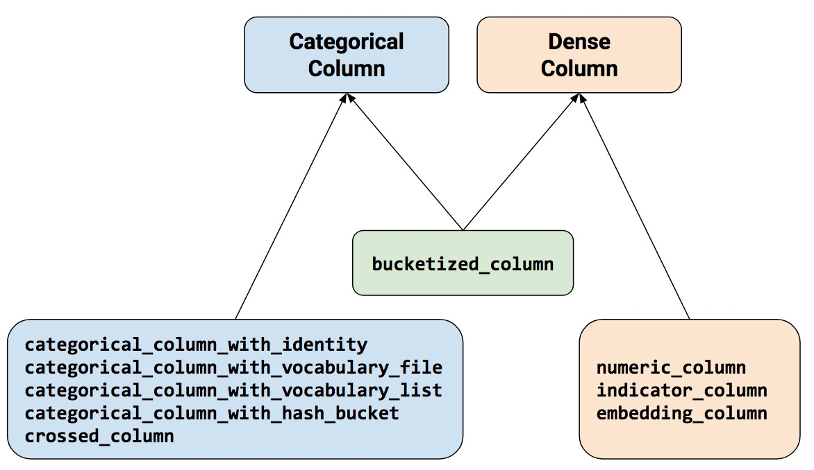
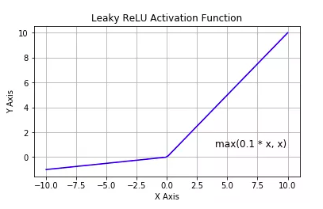
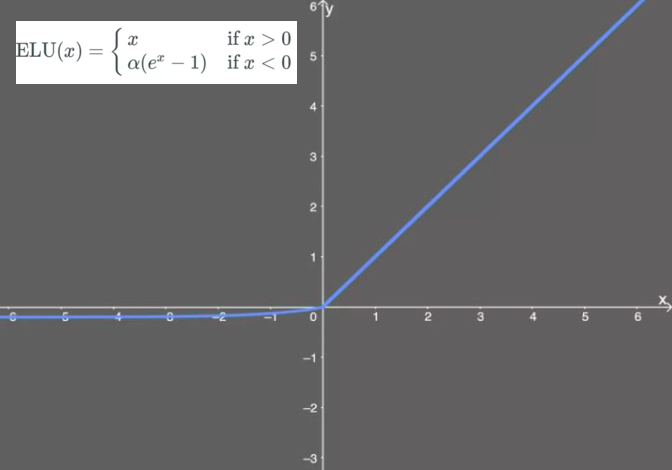
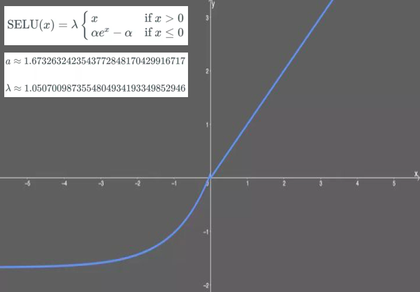

# 一、TensorFlow的建模流程


尽管TensorFlow设计上足够灵活，可以用于进行各种复杂的数值计算。

但通常人们使用TensorFlow来实现机器学习模型，尤其常用于实现神经网络模型。

从原理上说可以使用张量构建计算图来定义神经网络，并通过自动微分机制训练模型。

但为简洁起见，一般推荐使用TensorFlow的高层次keras接口来实现神经网络网模型。

在实践中通常会遇到的数据类型包括结构化数据，图片数据，文本数据，时间序列数据。

分别以titanic生存预测问题，cifar2图片分类问题，imdb电影评论分类问题，国内新冠疫情结束时间预测问题为例，演示应用tensorflow对这四类数据的建模方法。

# 1-1,结构化数据建模流程范例


### 一.准备数据


titanic数据集的目标是根据乘客信息预测他们在Titanic号撞击冰山沉没后能否生存。

结构化数据一般会使用Pandas中的DataFrame进行预处理。


```python
import numpy as np 
import pandas as pd 
import matplotlib.pyplot as plt
import tensorflow as tf 
from tensorflow.keras import models,layers

dftrain_raw = pd.read_csv('./data/titanic/train.csv')
dftest_raw = pd.read_csv('./data/titanic/test.csv')
dftrain_raw.head(10)
```


字段说明：

* Survived:0代表死亡，1代表存活【y标签】
* Pclass:乘客所持票类，有三种值(1,2,3) 【转换成onehot编码】
* Name:乘客姓名 【舍去】
* Sex:乘客性别 【转换成bool特征】
* Age:乘客年龄(有缺失) 【数值特征，添加“年龄是否缺失”作为辅助特征】
* SibSp:乘客兄弟姐妹/配偶的个数(整数值) 【数值特征】
* Parch:乘客父母/孩子的个数(整数值)【数值特征】
* Ticket:票号(字符串)【舍去】
* Fare:乘客所持票的价格(浮点数，0-500不等) 【数值特征】
* Cabin:乘客所在船舱(有缺失) 【添加“所在船舱是否缺失”作为辅助特征】
* Embarked:乘客登船港口:S、C、Q(有缺失)【转换成onehot编码，四维度 S,C,Q,nan】

利用Pandas的数据可视化功能我们可以简单地进行探索性数据分析EDA（Exploratory Data Analysis）。

label分布情况

```python
%matplotlib inline
%config InlineBackend.figure_format = 'png'
ax = dftrain_raw['Survived'].value_counts().plot(kind = 'bar',
     figsize = (12,8),fontsize=15,rot = 0)
ax.set_ylabel('Counts',fontsize = 15)
ax.set_xlabel('Survived',fontsize = 15)
plt.show()
```


年龄分布情况

```python
%matplotlib inline
%config InlineBackend.figure_format = 'png'
ax = dftrain_raw['Age'].plot(kind = 'hist',bins = 20,color= 'purple',
                    figsize = (12,8),fontsize=15)

ax.set_ylabel('Frequency',fontsize = 15)
ax.set_xlabel('Age',fontsize = 15)
plt.show()
```


年龄和label的相关性

```python
%matplotlib inline
%config InlineBackend.figure_format = 'png'
ax = dftrain_raw.query('Survived == 0')['Age'].plot(kind = 'density',
                      figsize = (12,8),fontsize=15)
dftrain_raw.query('Survived == 1')['Age'].plot(kind = 'density',
                      figsize = (12,8),fontsize=15)
ax.legend(['Survived==0','Survived==1'],fontsize = 12)
ax.set_ylabel('Density',fontsize = 15)
ax.set_xlabel('Age',fontsize = 15)
plt.show()
```


下面为正式的数据预处理

```python
def preprocessing(dfdata):
    dfresult= pd.DataFrame()
    #Pclass
    dfPclass = pd.get_dummies(dfdata['Pclass'])
    dfPclass.columns = ['Pclass_' +str(x) for x in dfPclass.columns ]
    dfresult = pd.concat([dfresult,dfPclass],axis = 1)

    #Sex
    dfSex = pd.get_dummies(dfdata['Sex'])
    dfresult = pd.concat([dfresult,dfSex],axis = 1)

    #Age
    dfresult['Age'] = dfdata['Age'].fillna(0)
    dfresult['Age_null'] = pd.isna(dfdata['Age']).astype('int32')

    #SibSp,Parch,Fare
    dfresult['SibSp'] = dfdata['SibSp']
    dfresult['Parch'] = dfdata['Parch']
    dfresult['Fare'] = dfdata['Fare']

    #Carbin
    dfresult['Cabin_null'] =  pd.isna(dfdata['Cabin']).astype('int32')

    #Embarked
    dfEmbarked = pd.get_dummies(dfdata['Embarked'],dummy_na=True)
    dfEmbarked.columns = ['Embarked_' + str(x) for x in dfEmbarked.columns]
    dfresult = pd.concat([dfresult,dfEmbarked],axis = 1)

    return(dfresult)

x_train = preprocessing(dftrain_raw)
y_train = dftrain_raw['Survived'].values

x_test = preprocessing(dftest_raw)
y_test = dftest_raw['Survived'].values

print("x_train.shape =", x_train.shape )
print("x_test.shape =", x_test.shape )

```

> ```
> x_train.shape = (712, 15)
> x_test.shape = (179, 15)
> ```
>

### 二.定义模型


使用Keras接口有以下3种方式构建模型：使用Sequential按层顺序构建模型，使用函数式API构建任意结构模型，继承Model基类构建自定义模型。

此处选择使用最简单的Sequential，按层顺序模型。

```python
tf.keras.backend.clear_session()

model = models.Sequential()
model.add(layers.Dense(20,activation = 'relu',input_shape=(15,)))
model.add(layers.Dense(10,activation = 'relu' ))
model.add(layers.Dense(1,activation = 'sigmoid' ))

model.summary()
```

> ```
> Model: "sequential"
> _________________________________________________________________
> Layer (type)                 Output Shape              Param #   
> =================================================================
> dense (Dense)                (None, 20)                320       
> _________________________________________________________________
> dense_1 (Dense)              (None, 10)                210       
> _________________________________________________________________
> dense_2 (Dense)              (None, 1)                 11        
> =================================================================
> Total params: 541
> Trainable params: 541
> Non-trainable params: 0
> _________________________________________________________________
> ```
>


### 三.训练模型


训练模型通常有3种方法，内置fit方法，内置train_on_batch方法，以及自定义训练循环。此处我们选择最常用也最简单的内置fit方法。

```python
# 二分类问题选择二元交叉熵损失函数
model.compile(optimizer='adam',
            loss='binary_crossentropy',
            metrics=['AUC'])

history = model.fit(x_train,y_train,
                    batch_size= 64,
                    epochs= 30,
                    validation_split=0.2 #分割一部分训练数据用于验证
                   )
```

> ```
> Train on 569 samples, validate on 143 samples
> Epoch 1/30
> 569/569 [==============================] - 1s 2ms/sample - loss: 3.5841 - AUC: 0.4079 - val_loss: 3.4429 - val_AUC: 0.4129
> Epoch 2/30
> 569/569 [==============================] - 0s 102us/sample - loss: 2.6093 - AUC: 0.3967 - val_loss: 2.4886 - val_AUC: 0.4139
> Epoch 3/30
> 569/569 [==============================] - 0s 68us/sample - loss: 1.8375 - AUC: 0.4003 - val_loss: 1.7383 - val_AUC: 0.4223
> Epoch 4/30
> 569/569 [==============================] - 0s 83us/sample - loss: 1.2545 - AUC: 0.4390 - val_loss: 1.1936 - val_AUC: 0.4765
> Epoch 5/30
> 569/569 [==============================] - ETA: 0s - loss: 1.4435 - AUC: 0.375 - 0s 90us/sample - loss: 0.9141 - AUC: 0.5192 - val_loss: 0.8274 - val_AUC: 0.5584
> Epoch 6/30
> 569/569 [==============================] - 0s 110us/sample - loss: 0.7052 - AUC: 0.6290 - val_loss: 0.6596 - val_AUC: 0.6880
> Epoch 7/30
> 569/569 [==============================] - 0s 90us/sample - loss: 0.6410 - AUC: 0.7086 - val_loss: 0.6519 - val_AUC: 0.6845
> Epoch 8/30
> 569/569 [==============================] - 0s 93us/sample - loss: 0.6246 - AUC: 0.7080 - val_loss: 0.6480 - val_AUC: 0.6846
> Epoch 9/30
> 569/569 [==============================] - 0s 73us/sample - loss: 0.6088 - AUC: 0.7113 - val_loss: 0.6497 - val_AUC: 0.6838
> Epoch 10/30
> 569/569 [==============================] - 0s 79us/sample - loss: 0.6051 - AUC: 0.7117 - val_loss: 0.6454 - val_AUC: 0.6873
> Epoch 11/30
> 569/569 [==============================] - 0s 96us/sample - loss: 0.5972 - AUC: 0.7218 - val_loss: 0.6369 - val_AUC: 0.6888
> Epoch 12/30
> 569/569 [==============================] - 0s 92us/sample - loss: 0.5918 - AUC: 0.7294 - val_loss: 0.6330 - val_AUC: 0.6908
> Epoch 13/30
> 569/569 [==============================] - 0s 75us/sample - loss: 0.5864 - AUC: 0.7363 - val_loss: 0.6281 - val_AUC: 0.6948
> Epoch 14/30
> 569/569 [==============================] - 0s 104us/sample - loss: 0.5832 - AUC: 0.7426 - val_loss: 0.6240 - val_AUC: 0.7030
> Epoch 15/30
> 569/569 [==============================] - 0s 74us/sample - loss: 0.5777 - AUC: 0.7507 - val_loss: 0.6200 - val_AUC: 0.7066
> Epoch 16/30
> 569/569 [==============================] - 0s 79us/sample - loss: 0.5726 - AUC: 0.7569 - val_loss: 0.6155 - val_AUC: 0.7132
> Epoch 17/30
> 569/569 [==============================] - 0s 99us/sample - loss: 0.5674 - AUC: 0.7643 - val_loss: 0.6070 - val_AUC: 0.7255
> Epoch 18/30
> 569/569 [==============================] - 0s 97us/sample - loss: 0.5631 - AUC: 0.7721 - val_loss: 0.6061 - val_AUC: 0.7305
> Epoch 19/30
> 569/569 [==============================] - 0s 73us/sample - loss: 0.5580 - AUC: 0.7792 - val_loss: 0.6027 - val_AUC: 0.7332
> Epoch 20/30
> 569/569 [==============================] - 0s 85us/sample - loss: 0.5533 - AUC: 0.7861 - val_loss: 0.5997 - val_AUC: 0.7366
> Epoch 21/30
> 569/569 [==============================] - 0s 87us/sample - loss: 0.5497 - AUC: 0.7926 - val_loss: 0.5961 - val_AUC: 0.7433
> Epoch 22/30
> 569/569 [==============================] - 0s 101us/sample - loss: 0.5454 - AUC: 0.7987 - val_loss: 0.5943 - val_AUC: 0.7438
> Epoch 23/30
> 569/569 [==============================] - 0s 100us/sample - loss: 0.5398 - AUC: 0.8057 - val_loss: 0.5926 - val_AUC: 0.7492
> Epoch 24/30
> 569/569 [==============================] - 0s 79us/sample - loss: 0.5328 - AUC: 0.8122 - val_loss: 0.5912 - val_AUC: 0.7493
> Epoch 25/30
> 569/569 [==============================] - 0s 86us/sample - loss: 0.5283 - AUC: 0.8147 - val_loss: 0.5902 - val_AUC: 0.7509
> Epoch 26/30
> 569/569 [==============================] - 0s 67us/sample - loss: 0.5246 - AUC: 0.8196 - val_loss: 0.5845 - val_AUC: 0.7552
> Epoch 27/30
> 569/569 [==============================] - 0s 72us/sample - loss: 0.5205 - AUC: 0.8271 - val_loss: 0.5837 - val_AUC: 0.7584
> Epoch 28/30
> 569/569 [==============================] - 0s 74us/sample - loss: 0.5144 - AUC: 0.8302 - val_loss: 0.5848 - val_AUC: 0.7561
> Epoch 29/30
> 569/569 [==============================] - 0s 77us/sample - loss: 0.5099 - AUC: 0.8326 - val_loss: 0.5809 - val_AUC: 0.7583
> Epoch 30/30
> 569/569 [==============================] - 0s 80us/sample - loss: 0.5071 - AUC: 0.8349 - val_loss: 0.5816 - val_AUC: 0.7605
> 
> ```
>


### 四.评估模型


我们首先评估一下模型在训练集和验证集上的效果。

```python
%matplotlib inline
%config InlineBackend.figure_format = 'svg'

import matplotlib.pyplot as plt

def plot_metric(history, metric):
    train_metrics = history.history[metric]
    val_metrics = history.history['val_'+metric]
    epochs = range(1, len(train_metrics) + 1)
    plt.plot(epochs, train_metrics, 'bo--')
    plt.plot(epochs, val_metrics, 'ro-')
    plt.title('Training and validation '+ metric)
    plt.xlabel("Epochs")
    plt.ylabel(metric)
    plt.legend(["train_"+metric, 'val_'+metric])
    plt.show()
```

```python
plot_metric(history,"loss")
```


```python
plot_metric(history,"AUC")
```


我们再看一下模型在测试集上的效果.

```python
model.evaluate(x = x_test,y = y_test)
```

> ```
> [0.5191367897907448, 0.8122605]
> ```
>

### 五.使用模型

```python
#预测概率
model.predict(x_test[0:10])
#model(tf.constant(x_test[0:10].values,dtype = tf.float32)) #等价写法
```

> ```
> array([[0.26501188],
>        [0.40970832],
>        [0.44285864],
>        [0.78408605],
>        [0.47650957],
>        [0.43849158],
>        [0.27426785],
>        [0.5962582 ],
>        [0.59476686],
>        [0.17882936]], dtype=float32)
> ```
>

```python
#预测类别
model.predict_classes(x_test[0:10])
```

> ```
> array([[0],
>        [0],
>        [0],
>        [1],
>        [0],
>        [0],
>        [0],
>        [1],
>        [1],
>        [0]], dtype=int32)
> ```
>

### 六.保存模型


可以使用Keras方式保存模型，也可以使用TensorFlow原生方式保存。前者仅仅适合使用Python环境恢复模型，后者则可以跨平台进行模型部署。

推荐使用后一种方式进行保存。

**1.Keras方式保存**

```python
# 保存模型结构及权重

model.save('./data/keras_model.h5')  

del model  #删除现有模型

# identical to the previous one
model = models.load_model('./data/keras_model.h5')
model.evaluate(x_test,y_test)
```

> ```
> [0.5191367897907448, 0.8122605]
> ```
>

```python
# 保存模型结构
json_str = model.to_json()

# 恢复模型结构
model_json = models.model_from_json(json_str)
```

```python
#保存模型权重
model.save_weights('./data/keras_model_weight.h5')

# 恢复模型结构
model_json = models.model_from_json(json_str)
model_json.compile(
        optimizer='adam',
        loss='binary_crossentropy',
        metrics=['AUC']
    )

# 加载权重
model_json.load_weights('./data/keras_model_weight.h5')
model_json.evaluate(x_test,y_test)
```

> ```
> [0.5191367897907448, 0.8122605]
> ```
>

**2.TensorFlow原生方式保存**

```python
# 保存权重，该方式仅仅保存权重张量
model.save_weights('./data/tf_model_weights.ckpt',save_format = "tf")
```

```python
# 保存模型结构与模型参数到文件,该方式保存的模型具有跨平台性便于部署

model.save('./data/tf_model_savedmodel', save_format="tf")
print('export saved model.')

model_loaded = tf.keras.models.load_model('./data/tf_model_savedmodel')
model_loaded.evaluate(x_test,y_test)
```

```
[0.5191365896656527, 0.8122605]
```

# 1-2,图片数据建模流程范例


### 一.准备数据


cifar2数据集为cifar10数据集的子集，只包括前两种类别airplane和automobile。

训练集有airplane和automobile图片各5000张，测试集有airplane和automobile图片各1000张。

cifar2任务的目标是训练一个模型来对飞机airplane和机动车automobile两种图片进行分类。

我们准备的Cifar2数据集的文件结构如下所示。


在tensorflow中准备图片数据的常用方案有两种，第一种是使用tf.keras中的ImageDataGenerator工具构建图片数据生成器。

第二种是使用tf.data.Dataset搭配tf.image中的一些图片处理方法构建数据管道。

第一种方法更为简单，其使用范例可以参考以下文章。

https://zhuanlan.zhihu.com/p/67466552

第二种方法是TensorFlow的原生方法，更加灵活，使用得当的话也可以获得更好的性能。

我们此处介绍第二种方法。


```python
import tensorflow as tf 
from tensorflow.keras import datasets,layers,models

BATCH_SIZE = 100

def load_image(img_path,size = (32,32)):
    label = tf.constant(1,tf.int8) if tf.strings.regex_full_match(img_path,".*/automobile/.*") \
            else tf.constant(0,tf.int8)
    img = tf.io.read_file(img_path)
    img = tf.image.decode_jpeg(img) #注意此处为jpeg格式
    img = tf.image.resize(img,size)/255.0
    return(img,label)
```

```python
#使用并行化预处理num_parallel_calls 和预存数据prefetch来提升性能
ds_train = tf.data.Dataset.list_files("./data/cifar2/train/*/*.jpg") \
           .map(load_image, num_parallel_calls=tf.data.experimental.AUTOTUNE) \
           .shuffle(buffer_size = 1000).batch(BATCH_SIZE) \
           .prefetch(tf.data.experimental.AUTOTUNE)  

ds_test = tf.data.Dataset.list_files("./data/cifar2/test/*/*.jpg") \
           .map(load_image, num_parallel_calls=tf.data.experimental.AUTOTUNE) \
           .batch(BATCH_SIZE) \
           .prefetch(tf.data.experimental.AUTOTUNE)  
```

```python
%matplotlib inline
%config InlineBackend.figure_format = 'svg'

#查看部分样本
from matplotlib import pyplot as plt 

plt.figure(figsize=(8,8)) 
for i,(img,label) in enumerate(ds_train.unbatch().take(9)):
    ax=plt.subplot(3,3,i+1)
    ax.imshow(img.numpy())
    ax.set_title("label = %d"%label)
    ax.set_xticks([])
    ax.set_yticks([]) 
plt.show()
```


```python
for x,y in ds_train.take(1):
    print(x.shape,y.shape)
```

> ```
> (100, 32, 32, 3) (100,)
> ```
>

### 二.定义模型


使用Keras接口有以下3种方式构建模型：使用Sequential按层顺序构建模型，使用函数式API构建任意结构模型，继承Model基类构建自定义模型。

此处选择使用函数式API构建模型。

```python
tf.keras.backend.clear_session() #清空会话

inputs = layers.Input(shape=(32,32,3))
x = layers.Conv2D(32,kernel_size=(3,3))(inputs)
x = layers.MaxPool2D()(x)
x = layers.Conv2D(64,kernel_size=(5,5))(x)
x = layers.MaxPool2D()(x)
x = layers.Dropout(rate=0.1)(x)
x = layers.Flatten()(x)
x = layers.Dense(32,activation='relu')(x)
outputs = layers.Dense(1,activation = 'sigmoid')(x)

model = models.Model(inputs = inputs,outputs = outputs)
model.summary()
```

> ```
> Model: "model"
> _________________________________________________________________
> Layer (type)                 Output Shape              Param #   
> =================================================================
> input_1 (InputLayer)         [(None, 32, 32, 3)]       0         
> _________________________________________________________________
> conv2d (Conv2D)              (None, 30, 30, 32)        896       
> _________________________________________________________________
> max_pooling2d (MaxPooling2D) (None, 15, 15, 32)        0         
> _________________________________________________________________
> conv2d_1 (Conv2D)            (None, 11, 11, 64)        51264     
> _________________________________________________________________
> max_pooling2d_1 (MaxPooling2 (None, 5, 5, 64)          0         
> _________________________________________________________________
> dropout (Dropout)            (None, 5, 5, 64)          0         
> _________________________________________________________________
> flatten (Flatten)            (None, 1600)              0         
> _________________________________________________________________
> dense (Dense)                (None, 32)                51232     
> _________________________________________________________________
> dense_1 (Dense)              (None, 1)                 33        
> =================================================================
> Total params: 103,425
> Trainable params: 103,425
> Non-trainable params: 0
> _________________________________________________________________
> ```
>

### 三.训练模型


训练模型通常有3种方法，内置fit方法，内置train_on_batch方法，以及自定义训练循环。此处我们选择最常用也最简单的内置fit方法。

```python
import datetime

logdir = "./data/keras_model/" + datetime.datetime.now().strftime("%Y%m%d-%H%M%S")
tensorboard_callback = tf.keras.callbacks.TensorBoard(logdir, histogram_freq=1)

model.compile(
        optimizer=tf.keras.optimizers.Adam(learning_rate=0.001),
        loss=tf.keras.losses.binary_crossentropy,
        metrics=["accuracy"]
    )

history = model.fit(ds_train,epochs= 10,validation_data=ds_test,
                    callbacks = [tensorboard_callback],workers = 4)

```

> ```
> Train for 100 steps, validate for 20 steps
> Epoch 1/10
> 100/100 [==============================] - 16s 156ms/step - loss: 0.4830 - accuracy: 0.7697 - val_loss: 0.3396 - val_accuracy: 0.8475
> Epoch 2/10
> 100/100 [==============================] - 14s 142ms/step - loss: 0.3437 - accuracy: 0.8469 - val_loss: 0.2997 - val_accuracy: 0.8680
> Epoch 3/10
> 100/100 [==============================] - 13s 131ms/step - loss: 0.2871 - accuracy: 0.8777 - val_loss: 0.2390 - val_accuracy: 0.9015
> Epoch 4/10
> 100/100 [==============================] - 12s 117ms/step - loss: 0.2410 - accuracy: 0.9040 - val_loss: 0.2005 - val_accuracy: 0.9195
> Epoch 5/10
> 100/100 [==============================] - 13s 130ms/step - loss: 0.1992 - accuracy: 0.9213 - val_loss: 0.1949 - val_accuracy: 0.9180
> Epoch 6/10
> 100/100 [==============================] - 14s 136ms/step - loss: 0.1737 - accuracy: 0.9323 - val_loss: 0.1723 - val_accuracy: 0.9275
> Epoch 7/10
> 100/100 [==============================] - 14s 139ms/step - loss: 0.1531 - accuracy: 0.9412 - val_loss: 0.1670 - val_accuracy: 0.9310
> Epoch 8/10
> 100/100 [==============================] - 13s 134ms/step - loss: 0.1299 - accuracy: 0.9525 - val_loss: 0.1553 - val_accuracy: 0.9340
> Epoch 9/10
> 100/100 [==============================] - 14s 137ms/step - loss: 0.1158 - accuracy: 0.9556 - val_loss: 0.1581 - val_accuracy: 0.9340
> Epoch 10/10
> 100/100 [==============================] - 14s 142ms/step - loss: 0.1006 - accuracy: 0.9617 - val_loss: 0.1614 - val_accuracy: 0.9345
> ```
>

### 四.评估模型

```python
#%load_ext tensorboard
#%tensorboard --logdir ./data/keras_model
```

```python
from tensorboard import notebook
notebook.list() 
```

```python
#在tensorboard中查看模型
notebook.start("--logdir ./data/keras_model")
```


```python
import pandas as pd 
dfhistory = pd.DataFrame(history.history)
dfhistory.index = range(1,len(dfhistory) + 1)
dfhistory.index.name = 'epoch'

dfhistory
```


```python
%matplotlib inline
%config InlineBackend.figure_format = 'svg'

import matplotlib.pyplot as plt

def plot_metric(history, metric):
    train_metrics = history.history[metric]
    val_metrics = history.history['val_'+metric]
    epochs = range(1, len(train_metrics) + 1)
    plt.plot(epochs, train_metrics, 'bo--')
    plt.plot(epochs, val_metrics, 'ro-')
    plt.title('Training and validation '+ metric)
    plt.xlabel("Epochs")
    plt.ylabel(metric)
    plt.legend(["train_"+metric, 'val_'+metric])
    plt.show()
```

```python
plot_metric(history,"loss")
```


```python
plot_metric(history,"accuracy")
```


```python
#可以使用evaluate对数据进行评估
val_loss,val_accuracy = model.evaluate(ds_test,workers=4)
print(val_loss,val_accuracy)

```

> ```
> 0.16139143370091916 0.9345
> ```
>


### 五.使用模型


可以使用model.predict(ds_test)进行预测。

也可以使用model.predict_on_batch(x_test)对一个批量进行预测。

```python
model.predict(ds_test)
```

> ```
> array([[9.9996173e-01],
>        [9.5104784e-01],
>        [2.8648047e-04],
>        ...,
>        [1.1484033e-03],
>        [3.5589080e-02],
>        [9.8537153e-01]], dtype=float32)
> ```
>

```python
for x,y in ds_test.take(1):
    print(model.predict_on_batch(x[0:20]))
```

> ```
> tf.Tensor(
> [[3.8065155e-05]
>  [8.8236779e-01]
>  [9.1433197e-01]
>  [9.9921846e-01]
>  [6.4052093e-01]
>  [4.9970779e-03]
>  [2.6735585e-04]
>  [9.9842811e-01]
>  [7.9198682e-01]
>  [7.4823302e-01]
>  [8.7208226e-03]
>  [9.3951421e-03]
>  [9.9790359e-01]
>  [9.9998581e-01]
>  [2.1642199e-05]
>  [1.7915063e-02]
>  [2.5839690e-02]
>  [9.7538447e-01]
>  [9.7393811e-01]
>  [9.7333014e-01]], shape=(20, 1), dtype=float32)
> ```
>

### 六.保存模型


推荐使用TensorFlow原生方式保存模型。

```python
# 保存权重，该方式仅仅保存权重张量
model.save_weights('./data/tf_model_weights.ckpt',save_format = "tf")
```

```python
# 保存模型结构与模型参数到文件,该方式保存的模型具有跨平台性便于部署
model.save('./data/tf_model_savedmodel', save_format="tf")
print('export saved model.')

model_loaded = tf.keras.models.load_model('./data/tf_model_savedmodel')
model_loaded.evaluate(ds_test)
```

> ```
> [0.16139124035835267, 0.9345]
> ```
>

# 1-3,文本数据建模流程范例


### 一.准备数据


imdb数据集的目标是根据电影评论的文本内容预测评论的情感标签。

训练集有20000条电影评论文本，测试集有5000条电影评论文本，其中正面评论和负面评论都各占一半。

文本数据预处理较为繁琐，包括中文切词（本示例不涉及），构建词典，编码转换，序列填充，构建数据管道等等。

在tensorflow中完成文本数据预处理的常用方案有两种，第一种是利用tf.keras.preprocessing中的Tokenizer词典构建工具和tf.keras.utils.Sequence构建文本数据生成器管道。

第二种是使用tf.data.Dataset搭配.keras.layers.experimental.preprocessing.TextVectorization预处理层。

第一种方法较为复杂，其使用范例可以参考以下文章。

https://zhuanlan.zhihu.com/p/67697840

第二种方法为TensorFlow原生方式，相对也更加简单一些。

我们此处介绍第二种方法。


```python
import numpy as np 
import pandas as pd 
from matplotlib import pyplot as plt
import tensorflow as tf
from tensorflow.keras import models,layers,preprocessing,optimizers,losses,metrics
from tensorflow.keras.layers.experimental.preprocessing import TextVectorization
import re,string

train_data_path = "./data/imdb/train.csv"
test_data_path =  "./data/imdb/test.csv"

MAX_WORDS = 10000  # 仅考虑最高频的10000个词
MAX_LEN = 200  # 每个样本保留200个词的长度
BATCH_SIZE = 20 

#构建管道
def split_line(line):
    arr = tf.strings.split(line,"\t")
    label = tf.expand_dims(tf.cast(tf.strings.to_number(arr[0]),tf.int32),axis = 0)
    text = tf.expand_dims(arr[1],axis = 0)
    return (text,label)

ds_train_raw =  tf.data.TextLineDataset(filenames = [train_data_path]) \
   .map(split_line,num_parallel_calls = tf.data.experimental.AUTOTUNE) \
   .shuffle(buffer_size = 1000).batch(BATCH_SIZE) \
   .prefetch(tf.data.experimental.AUTOTUNE)

ds_test_raw = tf.data.TextLineDataset(filenames = [test_data_path]) \
   .map(split_line,num_parallel_calls = tf.data.experimental.AUTOTUNE) \
   .batch(BATCH_SIZE) \
   .prefetch(tf.data.experimental.AUTOTUNE)

#构建词典
def clean_text(text):
    lowercase = tf.strings.lower(text)
    stripped_html = tf.strings.regex_replace(lowercase, '<br />', ' ')
    cleaned_punctuation = tf.strings.regex_replace(stripped_html,
         '[%s]' % re.escape(string.punctuation),'')
    return cleaned_punctuation

vectorize_layer = TextVectorization(
    standardize=clean_text,
    split = 'whitespace',
    max_tokens=MAX_WORDS-1, #有一个留给占位符
    output_mode='int',
    output_sequence_length=MAX_LEN)

ds_text = ds_train_raw.map(lambda text,label: text)
vectorize_layer.adapt(ds_text)
print(vectorize_layer.get_vocabulary()[0:100])

#单词编码
ds_train = ds_train_raw.map(lambda text,label:(vectorize_layer(text),label)) \
    .prefetch(tf.data.experimental.AUTOTUNE)
ds_test = ds_test_raw.map(lambda text,label:(vectorize_layer(text),label)) \
    .prefetch(tf.data.experimental.AUTOTUNE)
```

> ```
> [b'the', b'and', b'a', b'of', b'to', b'is', b'in', b'it', b'i', b'this', b'that', b'was', b'as', b'for', b'with', b'movie', b'but', b'film', b'on', b'not', b'you', b'his', b'are', b'have', b'be', b'he', b'one', b'its', b'at', b'all', b'by', b'an', b'they', b'from', b'who', b'so', b'like', b'her', b'just', b'or', b'about', b'has', b'if', b'out', b'some', b'there', b'what', b'good', b'more', b'when', b'very', b'she', b'even', b'my', b'no', b'would', b'up', b'time', b'only', b'which', b'story', b'really', b'their', b'were', b'had', b'see', b'can', b'me', b'than', b'we', b'much', b'well', b'get', b'been', b'will', b'into', b'people', b'also', b'other', b'do', b'bad', b'because', b'great', b'first', b'how', b'him', b'most', b'dont', b'made', b'then', b'them', b'films', b'movies', b'way', b'make', b'could', b'too', b'any', b'after', b'characters']
> ```
>

### 二.定义模型


使用Keras接口有以下3种方式构建模型：使用Sequential按层顺序构建模型，使用函数式API构建任意结构模型，继承Model基类构建自定义模型。

此处选择使用继承Model基类构建自定义模型。

```python
# 演示自定义模型范例，实际上应该优先使用Sequential或者函数式API
tf.keras.backend.clear_session()
class CnnModel(models.Model):
    def __init__(self):
        super(CnnModel, self).__init__()
        
    def build(self,input_shape):
        self.embedding = layers.Embedding(MAX_WORDS,7,input_length=MAX_LEN)
        self.conv_1 = layers.Conv1D(16, kernel_size= 5,name = "conv_1",activation = "relu")
        self.pool = layers.MaxPool1D()
        self.conv_2 = layers.Conv1D(128, kernel_size=2,name = "conv_2",activation = "relu")
        self.flatten = layers.Flatten()
        self.dense = layers.Dense(1,activation = "sigmoid")
        super(CnnModel,self).build(input_shape)
    
    def call(self, x):
        x = self.embedding(x)
        x = self.conv_1(x)
        x = self.pool(x)
        x = self.conv_2(x)
        x = self.pool(x)
        x = self.flatten(x)
        x = self.dense(x)
        return(x)
    
model = CnnModel()
model.build(input_shape =(None,MAX_LEN))
model.summary()
```

> ```
> Model: "cnn_model"
> _________________________________________________________________
> Layer (type)                 Output Shape              Param #   
> =================================================================
> embedding (Embedding)        multiple                  70000     
> _________________________________________________________________
> conv_1 (Conv1D)              multiple                  576       
> _________________________________________________________________
> max_pooling1d (MaxPooling1D) multiple                  0         
> _________________________________________________________________
> conv_2 (Conv1D)              multiple                  4224      
> _________________________________________________________________
> flatten (Flatten)            multiple                  0         
> _________________________________________________________________
> dense (Dense)                multiple                  6145      
> =================================================================
> Total params: 80,945
> Trainable params: 80,945
> Non-trainable params: 0
> _________________________________________________________________
> ```
>

### 三.训练模型


训练模型通常有3种方法，内置fit方法，内置train_on_batch方法，以及自定义训练循环。此处我们通过自定义训练循环训练模型。

```python
#打印时间分割线
@tf.function
def printbar():
    ts = tf.timestamp()
    today_ts = ts%(24*60*60)

    hour = tf.cast(today_ts//3600+8,tf.int32)%tf.constant(24)
    minite = tf.cast((today_ts%3600)//60,tf.int32)
    second = tf.cast(tf.floor(today_ts%60),tf.int32)
    
    def timeformat(m):
        if tf.strings.length(tf.strings.format("{}",m))==1:
            return(tf.strings.format("0{}",m))
        else:
            return(tf.strings.format("{}",m))
    
    timestring = tf.strings.join([timeformat(hour),timeformat(minite),
                timeformat(second)],separator = ":")
    tf.print("=========="*8,end = "")
    tf.print(timestring)
```

```python
optimizer = optimizers.Nadam()
loss_func = losses.BinaryCrossentropy()

train_loss = metrics.Mean(name='train_loss')
train_metric = metrics.BinaryAccuracy(name='train_accuracy')

valid_loss = metrics.Mean(name='valid_loss')
valid_metric = metrics.BinaryAccuracy(name='valid_accuracy')

@tf.function
def train_step(model, features, labels):
    with tf.GradientTape() as tape:
        predictions = model(features,training = True)
        loss = loss_func(labels, predictions)
    gradients = tape.gradient(loss, model.trainable_variables)
    optimizer.apply_gradients(zip(gradients, model.trainable_variables))

    train_loss.update_state(loss)
    train_metric.update_state(labels, predictions)

@tf.function
def valid_step(model, features, labels):
    predictions = model(features,training = False)
    batch_loss = loss_func(labels, predictions)
    valid_loss.update_state(batch_loss)
    valid_metric.update_state(labels, predictions)

def train_model(model,ds_train,ds_valid,epochs):
    for epoch in tf.range(1,epochs+1):
        
        for features, labels in ds_train:
            train_step(model,features,labels)

        for features, labels in ds_valid:
            valid_step(model,features,labels)
        
        #此处logs模板需要根据metric具体情况修改
        logs = 'Epoch={},Loss:{},Accuracy:{},Valid Loss:{},Valid Accuracy:{}' 
        
        if epoch%1==0:
            printbar()
            tf.print(tf.strings.format(logs,
            (epoch,train_loss.result(),train_metric.result(),valid_loss.result(),valid_metric.result())))
            tf.print("")
        
        train_loss.reset_states()
        valid_loss.reset_states()
        train_metric.reset_states()
        valid_metric.reset_states()

train_model(model,ds_train,ds_test,epochs = 6)
```

> ```
> ================================================================================13:54:08
> Epoch=1,Loss:0.442317516,Accuracy:0.7695,Valid Loss:0.323672801,Valid Accuracy:0.8614
> 
> ================================================================================13:54:20
> Epoch=2,Loss:0.245737702,Accuracy:0.90215,Valid Loss:0.356488883,Valid Accuracy:0.8554
> 
> ================================================================================13:54:32
> Epoch=3,Loss:0.17360799,Accuracy:0.93455,Valid Loss:0.361132562,Valid Accuracy:0.8674
> 
> ================================================================================13:54:44
> Epoch=4,Loss:0.113476314,Accuracy:0.95975,Valid Loss:0.483677238,Valid Accuracy:0.856
> 
> ================================================================================13:54:57
> Epoch=5,Loss:0.0698405355,Accuracy:0.9768,Valid Loss:0.607856631,Valid Accuracy:0.857
> 
> ================================================================================13:55:15
> Epoch=6,Loss:0.0366807655,Accuracy:0.98825,Valid Loss:0.745884955,Valid Accuracy:0.854
> ```
>


### 四.评估模型


通过自定义训练循环训练的模型没有经过编译，无法直接使用model.evaluate(ds_valid)方法

```python
def evaluate_model(model,ds_valid):
    for features, labels in ds_valid:
         valid_step(model,features,labels)
    logs = 'Valid Loss:{},Valid Accuracy:{}' 
    tf.print(tf.strings.format(logs,(valid_loss.result(),valid_metric.result())))
    
    valid_loss.reset_states()
    train_metric.reset_states()
    valid_metric.reset_states()   
```

```python
evaluate_model(model,ds_test)
```

> ```
> Valid Loss:0.745884418,Valid Accuracy:0.854
> ```
>

### 五.使用模型


可以使用以下方法:

* model.predict(ds_test)
* model(x_test)
* model.call(x_test)
* model.predict_on_batch(x_test)

推荐优先使用model.predict(ds_test)方法，既可以对Dataset，也可以对Tensor使用。

```python
model.predict(ds_test)
```

> ```
> array([[0.7864823 ],
>        [0.9999901 ],
>        [0.99944776],
>        ...,
>        [0.8498302 ],
>        [0.13382755],
>        [1.        ]], dtype=float32)
> ```
>

```python
for x_test,_ in ds_test.take(1):
    print(model(x_test))
    #以下方法等价：
    #print(model.call(x_test))
    #print(model.predict_on_batch(x_test))
```

> ```
> tf.Tensor(
> [[7.8648227e-01]
>  [9.9999011e-01]
>  [9.9944776e-01]
>  [3.7153201e-09]
>  [9.4462049e-01]
>  [2.3522753e-04]
>  [1.2044354e-04]
>  [9.3752089e-07]
>  [9.9996352e-01]
>  [9.3435925e-01]
>  [9.8746723e-01]
>  [9.9908626e-01]
>  [4.1563155e-08]
>  [4.1808244e-03]
>  [8.0184749e-05]
>  [8.3910513e-01]
>  [3.5167937e-05]
>  [7.2113985e-01]
>  [4.5228912e-03]
>  [9.9942589e-01]], shape=(20, 1), dtype=float32)
> ```
>

### 六.保存模型


推荐使用TensorFlow原生方式保存模型。

```python
model.save('./data/tf_model_savedmodel', save_format="tf")
print('export saved model.')

model_loaded = tf.keras.models.load_model('./data/tf_model_savedmodel')
model_loaded.predict(ds_test)
```

> ```
> array([[0.7864823 ],
>        [0.9999901 ],
>        [0.99944776],
>        ...,
>        [0.8498302 ],
>        [0.13382755],
>        [1.        ]], dtype=float32)
> ```
>

# 1-4,时间序列数据建模流程范例

本篇文章将利用TensorFlow2.0建立时间序列RNN模型，对国内的新冠肺炎疫情结束时间进行预测。


### 一.准备数据


本文的数据集取自tushare，获取该数据集的方法参考了以下文章。

《https://zhuanlan.zhihu.com/p/109556102》


```python
import numpy as np
import pandas as pd 
import matplotlib.pyplot as plt
import tensorflow as tf 
from tensorflow.keras import models,layers,losses,metrics,callbacks 
```

```python
%matplotlib inline
%config InlineBackend.figure_format = 'svg'

df = pd.read_csv("./data/covid-19.csv",sep = "\t")
df.plot(x = "date",y = ["confirmed_num","cured_num","dead_num"],figsize=(10,6))
plt.xticks(rotation=60)
```


```python
dfdata = df.set_index("date")
dfdiff = dfdata.diff(periods=1).dropna()
dfdiff = dfdiff.reset_index("date")

dfdiff.plot(x = "date",y = ["confirmed_num","cured_num","dead_num"],figsize=(10,6))
plt.xticks(rotation=60)
dfdiff = dfdiff.drop("date",axis = 1).astype("float32")

```


```python
#用某日前8天窗口数据作为输入预测该日数据
WINDOW_SIZE = 8

def batch_dataset(dataset):
    dataset_batched = dataset.batch(WINDOW_SIZE,drop_remainder=True)
    return dataset_batched

ds_data = tf.data.Dataset.from_tensor_slices(tf.constant(dfdiff.values,dtype = tf.float32)) \
   .window(WINDOW_SIZE,shift=1).flat_map(batch_dataset)

ds_label = tf.data.Dataset.from_tensor_slices(
    tf.constant(dfdiff.values[WINDOW_SIZE:],dtype = tf.float32))

#数据较小，可以将全部训练数据放入到一个batch中，提升性能
ds_train = tf.data.Dataset.zip((ds_data,ds_label)).batch(38).cache()
```

### 二.定义模型


使用Keras接口有以下3种方式构建模型：使用Sequential按层顺序构建模型，使用函数式API构建任意结构模型，继承Model基类构建自定义模型。

此处选择使用函数式API构建任意结构模型。

```python
#考虑到新增确诊，新增治愈，新增死亡人数数据不可能小于0，设计如下结构
class Block(layers.Layer):
    def __init__(self, **kwargs):
        super(Block, self).__init__(**kwargs)
    
    def call(self, x_input,x):
        x_out = tf.maximum((1+x)*x_input[:,-1,:],0.0)
        return x_out
    
    def get_config(self):  
        config = super(Block, self).get_config()
        return config

```

```python
tf.keras.backend.clear_session()
x_input = layers.Input(shape = (None,3),dtype = tf.float32)
x = layers.LSTM(3,return_sequences = True,input_shape=(None,3))(x_input)
x = layers.LSTM(3,return_sequences = True,input_shape=(None,3))(x)
x = layers.LSTM(3,return_sequences = True,input_shape=(None,3))(x)
x = layers.LSTM(3,input_shape=(None,3))(x)
x = layers.Dense(3)(x)

#考虑到新增确诊，新增治愈，新增死亡人数数据不可能小于0，设计如下结构
#x = tf.maximum((1+x)*x_input[:,-1,:],0.0)
x = Block()(x_input,x)
model = models.Model(inputs = [x_input],outputs = [x])
model.summary()
```

> ```
> Model: "model"
> _________________________________________________________________
> Layer (type)                 Output Shape              Param #   
> =================================================================
> input_1 (InputLayer)         [(None, None, 3)]         0         
> _________________________________________________________________
> lstm (LSTM)                  (None, None, 3)           84        
> _________________________________________________________________
> lstm_1 (LSTM)                (None, None, 3)           84        
> _________________________________________________________________
> lstm_2 (LSTM)                (None, None, 3)           84        
> _________________________________________________________________
> lstm_3 (LSTM)                (None, 3)                 84        
> _________________________________________________________________
> dense (Dense)                (None, 3)                 12        
> _________________________________________________________________
> block (Block)                (None, 3)                 0         
> =================================================================
> Total params: 348
> Trainable params: 348
> Non-trainable params: 0
> _________________________________________________________________
> ```
>


### 三.训练模型


训练模型通常有3种方法，内置fit方法，内置train_on_batch方法，以及自定义训练循环。此处我们选择最常用也最简单的内置fit方法。

注：循环神经网络调试较为困难，需要设置多个不同的学习率多次尝试，以取得较好的效果。

```python
#自定义损失函数，考虑平方差和预测目标的比值
class MSPE(losses.Loss):
    def call(self,y_true,y_pred):
        err_percent = (y_true - y_pred)**2/(tf.maximum(y_true**2,1e-7))
        mean_err_percent = tf.reduce_mean(err_percent)
        return mean_err_percent
    
    def get_config(self):
        config = super(MSPE, self).get_config()
        return config

```

```python
import datetime

optimizer = tf.keras.optimizers.Adam(learning_rate=0.01)
model.compile(optimizer=optimizer,loss=MSPE(name = "MSPE"))

logdir = "./data/keras_model/" + datetime.datetime.now().strftime("%Y%m%d-%H%M%S")

tb_callback = tf.keras.callbacks.TensorBoard(logdir, histogram_freq=1)
#如果loss在100个epoch后没有提升，学习率减半。
lr_callback = tf.keras.callbacks.ReduceLROnPlateau(monitor="loss",factor = 0.5, patience = 100)
#当loss在200个epoch后没有提升，则提前终止训练。
stop_callback = tf.keras.callbacks.EarlyStopping(monitor = "loss", patience= 200)
callbacks_list = [tb_callback,lr_callback,stop_callback]

history = model.fit(ds_train,epochs=500,callbacks = callbacks_list)
```

> ```
> Epoch 495/500
> 1/1 [==============================] - 0s 50ms/step - loss: 0.0858
> Epoch 496/500
> 1/1 [==============================] - 0s 69ms/step - loss: 0.0859
> Epoch 497/500
> 1/1 [==============================] - 0s 63ms/step - loss: 0.0857
> Epoch 498/500
> 1/1 [==============================] - 0s 56ms/step - loss: 0.0858
> Epoch 499/500
> 1/1 [==============================] - 0s 54ms/step - loss: 0.0857
> Epoch 500/500
> 1/1 [==============================] - 0s 57ms/step - loss: 0.0858
> ```
>

### 四.评估模型


评估模型一般要设置验证集或者测试集，由于此例数据较少，我们仅仅可视化损失函数在训练集上的迭代情况。

```python
%matplotlib inline
%config InlineBackend.figure_format = 'svg'

import matplotlib.pyplot as plt

def plot_metric(history, metric):
    train_metrics = history.history[metric]
    epochs = range(1, len(train_metrics) + 1)
    plt.plot(epochs, train_metrics, 'bo--')
    plt.title('Training '+ metric)
    plt.xlabel("Epochs")
    plt.ylabel(metric)
    plt.legend(["train_"+metric])
    plt.show()

```

```python
plot_metric(history,"loss")
```


### 五.使用模型


此处我们使用模型预测疫情结束时间，即 新增确诊病例为0 的时间。

```python
#使用dfresult记录现有数据以及此后预测的疫情数据
dfresult = dfdiff[["confirmed_num","cured_num","dead_num"]].copy()
dfresult.tail()
```


```python
#预测此后100天的新增走势,将其结果添加到dfresult中
for i in range(100):
    arr_predict = model.predict(tf.constant(tf.expand_dims(dfresult.values[-38:,:],axis = 0)))

    dfpredict = pd.DataFrame(tf.cast(tf.floor(arr_predict),tf.float32).numpy(),
                columns = dfresult.columns)
    dfresult = dfresult.append(dfpredict,ignore_index=True)
```

```python
dfresult.query("confirmed_num==0").head()
```

```python
dfresult.query("cured_num==0").head()
```

```python
dfresult.query("dead_num==0").head()
```

### 六.保存模型


推荐使用TensorFlow原生方式保存模型。

```python
model.save('./data/tf_model_savedmodel', save_format="tf")
print('export saved model.')
```

```python
model_loaded = tf.keras.models.load_model('./data/tf_model_savedmodel',compile=False)
optimizer = tf.keras.optimizers.Adam(learning_rate=0.001)
model_loaded.compile(optimizer=optimizer,loss=MSPE(name = "MSPE"))
model_loaded.predict(ds_train)
```

# 二、TensorFlow的核心概念

TensorFlow™ 是一个采用 **数据流图**（data flow graphs），用于数值计算的开源软件库。节点（Nodes）在图中表示数学操作，图中的线（edges）则表示在节点间相互联系的多维数据数组，即张量（tensor）。它灵活的架构让你可以**在多种平台上展开计算**，例如台式计算机中的一个或多个CPU（或GPU），服务器，移动设备等等。

TensorFlow 最初由Google大脑小组（隶属于Google机器智能研究机构）的研究员和工程师们开发出来，**用于机器学习和深度神经网络**方面的研究，但这个系统的通用性使其也可**广泛用于其他计算领域**。 


TensorFlow的主要优点：

* 灵活性：支持底层数值计算，C++自定义操作符

* 可移植性：从服务器到PC到手机，从CPU到GPU到TPU

* 分布式计算：分布式并行计算，可指定操作符对应计算设备

Tensorflow底层最核心的概念是张量，计算图以及自动微分。

# 2-1,张量数据结构

程序 = 数据结构+算法。

TensorFlow程序 = 张量数据结构 + 计算图算法语言

张量和计算图是 TensorFlow的核心概念。

Tensorflow的基本数据结构是张量Tensor。张量即多维数组。Tensorflow的张量和numpy中的array很类似。

从行为特性来看，有两种类型的张量，常量constant和变量Variable.

常量的值在计算图中不可以被重新赋值，变量可以在计算图中用assign等算子重新赋值。


### 一.常量张量


张量的数据类型和numpy.array基本一一对应。

```python
import numpy as np
import tensorflow as tf

i = tf.constant(1) # tf.int32 类型常量
l = tf.constant(1,dtype = tf.int64) # tf.int64 类型常量
f = tf.constant(1.23) #tf.float32 类型常量
d = tf.constant(3.14,dtype = tf.double) # tf.double 类型常量
s = tf.constant("hello world") # tf.string类型常量
b = tf.constant(True) #tf.bool类型常量

print(tf.int64 == np.int64) 
print(tf.bool == np.bool)
print(tf.double == np.float64)
print(tf.string == np.unicode) # tf.string类型和np.unicode类型不等价

```

> ```
> True
> True
> True
> False
> ```
>


不同类型的数据可以用不同维度(rank)的张量来表示。

标量为0维张量，向量为1维张量，矩阵为2维张量。

彩色图像有rgb三个通道，可以表示为3维张量。

视频还有时间维，可以表示为4维张量。

```python
scalar = tf.constant(True)  #标量，0维张量

print(tf.rank(scalar))	# 返回张量的秩 : tf.Tensor(0, shape=(), dtype=int32)
print(scalar.numpy().ndim)  # tf.rank的作用和numpy的ndim方法相同 : 0
```

```python
vector = tf.constant([1.0,2.0,3.0,4.0]) #向量，1维张量

print(tf.rank(vector)) # ：tf.Tensor(1, shape=(), dtype=int32)
print(np.ndim(vector.numpy())) # ：1
```

```python
matrix = tf.constant([[1.0,2.0],[3.0,4.0]]) #矩阵, 2维张量

print(tf.rank(matrix).numpy()) # : 2
print(np.ndim(matrix)) # : 2
```

```python
tensor3 = tf.constant([[[1.0,2.0],[3.0,4.0]],[[5.0,6.0],[7.0,8.0]]])  # 3维张量
print(tensor3)
print(tf.rank(tensor3))
```

> ```
> tf.Tensor(
> [[[1. 2.]
>   [3. 4.]]
> 
>  [[5. 6.]
>   [7. 8.]]], shape=(2, 2, 2), dtype=float32)
> <tf.Tensor: shape=(), dtype=int32, numpy=3>
> ```
>

```python
tensor4 = tf.constant([[[[1.0,1.0],[2.0,2.0]],[[3.0,3.0],[4.0,4.0]]],
                        [[[5.0,5.0],[6.0,6.0]],[[7.0,7.0],[8.0,8.0]]]])  # 4维张量
print(tensor4)
print(tf.rank(tensor4))
```

> ```
> tf.Tensor(
> [[[[1. 1.]
>    [2. 2.]]
> 
>   [[3. 3.]
>    [4. 4.]]]
> 
> 
>  [[[5. 5.]
>    [6. 6.]]
> 
>   [[7. 7.]
>    [8. 8.]]]], shape=(2, 2, 2, 2), dtype=float32)
> <tf.Tensor: shape=(), dtype=int32, numpy=4>
> ```
>


可以用tf.cast改变张量的数据类型。

可以用numpy方法将tensorflow中的张量转化成numpy中的张量。

可以用shape方法查看张量的尺寸。

```python
h = tf.constant([123,456],dtype = tf.int32)
f = tf.cast(h,tf.float32)
print(h.dtype, f.dtype)
```

> ```
> <dtype: 'int32'> <dtype: 'float32'>
> ```
>

```python
y = tf.constant([[1.0,2.0],[3.0,4.0]])
print(y.numpy()) #转换成np.array
print(y.shape)
```

> ```
> [[1. 2.]
>  [3. 4.]]
> (2, 2)
> ```
>

```python
u = tf.constant(u"你好 世界")
print(u.numpy())  
print(u.numpy().decode("utf-8"))
```

> ```
> b'\xe4\xbd\xa0\xe5\xa5\xbd \xe4\xb8\x96\xe7\x95\x8c'
> 你好 世界
> ```
>


### 二.变量张量


模型中需要被训练的参数一般被设置成变量。

```python
# 常量值不可以改变，常量的重新赋值相当于创造新的内存空间
c = tf.constant([1.0,2.0])
print(c)
print(id(c))
c = c + tf.constant([1.0,1.0])
print(c)
print(id(c))
```

> ```
> tf.Tensor([1. 2.], shape=(2,), dtype=float32)
> 5276289568
> tf.Tensor([2. 3.], shape=(2,), dtype=float32)
> 5276290240
> ```
>

```python
# 变量的值可以改变，可以通过assign, assign_add等方法给变量重新赋值
v = tf.Variable([1.0,2.0],name = "v")
print(v)
print(id(v))
v.assign_add([1.0,1.0])
print(v)
print(id(v))
```
> ```
> <tf.Variable 'v:0' shape=(2,) dtype=float32, numpy=array([1., 2.], dtype=float32)>
> 5276259888
> <tf.Variable 'v:0' shape=(2,) dtype=float32, numpy=array([2., 3.], dtype=float32)>
> 5276259888
> ```
>

# 2-2,三种计算图


有三种计算图的构建方式：静态计算图，动态计算图，以及Autograph.

在TensorFlow1.0时代，采用的是静态计算图，需要先使用TensorFlow的各种算子创建计算图，然后再开启一个会话Session，显式执行计算图。

而在TensorFlow2.0时代，采用的是动态计算图，即每使用一个算子后，该算子会被动态加入到隐含的默认计算图中立即执行得到结果，而无需开启Session。

使用动态计算图即**Eager Excution**的好处是方便调试程序，它会让TensorFlow代码的表现和Python原生代码的表现一样，写起来就像写numpy一样，各种日志打印，控制流全部都是可以使用的。

使用动态计算图的缺点是运行效率相对会低一些。因为使用动态图会有许多次Python进程和TensorFlow的C++进程之间的通信。而静态计算图构建完成之后几乎全部在TensorFlow内核上使用C++代码执行，效率更高。此外静态图会对计算步骤进行一定的优化，剪去和结果无关的计算步骤。

如果需要在TensorFlow2.0中使用静态图，可以使用@tf.function装饰器将普通Python函数转换成对应的TensorFlow计算图构建代码。运行该函数就相当于在TensorFlow1.0中用Session执行代码。使用tf.function构建静态图的方式叫做 **Autograph**.


### 一.计算图简介


计算图由节点(nodes)和线(edges)组成。

节点表示操作符Operator，或者称之为算子，线表示计算间的依赖。

实线表示有数据传递依赖，传递的数据即张量。

虚线通常可以表示控制依赖，即执行先后顺序。


### 二.静态计算图


在TensorFlow1.0中，使用静态计算图分两步，第一步定义计算图，第二步在会话中执行计算图。


**TensorFlow 1.0静态计算图范例**

```python
#!tensorflow1.0
import tensorflow as tf

#定义计算图
g = tf.Graph()
with g.as_default():
    #placeholder为占位符，执行会话时候指定填充对象
    x = tf.placeholder(name='x', shape=[], dtype=tf.string)  
    y = tf.placeholder(name='y', shape=[], dtype=tf.string)
    z = tf.string_join([x,y],name = 'join',separator=' ')

#执行计算图
with tf.Session(graph = g) as sess:
    print(sess.run(fetches = z,feed_dict = {x:"hello",y:"world"}))
   
```


**TensorFlow2.0 怀旧版静态计算图**

TensorFlow2.0为了确保对老版本tensorflow项目的兼容性，在tf.compat.v1子模块中保留了对TensorFlow1.0那种静态计算图构建风格的支持。可称之为怀旧版静态计算图，已经不推荐使用了。

```python
import tensorflow as tf

g = tf.compat.v1.Graph()
with g.as_default():
    x = tf.compat.v1.placeholder(name='x', shape=[], dtype=tf.string)
    y = tf.compat.v1.placeholder(name='y', shape=[], dtype=tf.string)
    z = tf.strings.join([x,y],name = "join",separator = " ")

with tf.compat.v1.Session(graph = g) as sess:
    # fetches的结果非常像一个函数的返回值，而feed_dict中的占位符相当于函数的参数序列。
    result = sess.run(fetches = z,feed_dict = {x:"hello",y:"world"})
    print(result)
```

> ```
> b'hello world'
> ```
>


### 三.动态计算图


在TensorFlow2.0中，使用的是动态计算图和Autograph.

在TensorFlow1.0中，使用静态计算图分两步，第一步定义计算图，第二步在会话中执行计算图。

动态计算图已经不区分计算图的定义和执行了，而是定义后立即执行。因此称之为 Eager Excution.

Eager这个英文单词的原意是"迫不及待的"，也就是立即执行的意思。


```python
# 动态计算图在每个算子处都进行构建，构建后立即执行

x = tf.constant("hello")
y = tf.constant("world")
z = tf.strings.join([x,y],separator=" ")

tf.print(z)
```

> ```
> hello world
> ```
>

```python
# 可以将动态计算图代码的输入和输出关系封装成函数
def strjoin(x,y):
    z =  tf.strings.join([x,y],separator = " ")
    tf.print(z)
    return z

result = strjoin(tf.constant("hello"),tf.constant("world"))
print(result)
```

> ```
> hello world
> tf.Tensor(b'hello world', shape=(), dtype=string)
> ```
>


### 四.Autograph


动态计算图运行效率相对较低。可以用**@tf.function**装饰器将普通Python函数转换成和TensorFlow1.0对应的静态计算图构建代码。

在TensorFlow1.0中，使用计算图分两步，第一步定义计算图，第二步在会话中执行计算图。

在TensorFlow2.0中，如果采用Autograph的方式使用计算图，第一步定义计算图变成了定义函数，第二步执行计算图变成了调用函数。不需要使用会话了，一些都像原始的Python语法一样自然。

实践中，我们一般会先用动态计算图调试代码，然后在需要提高性能的的地方利用@tf.function切换成Autograph获得更高的效率。当然，@tf.function的使用需要遵循一定的规范，我们后面章节将重点介绍。


```python
import tensorflow as tf
# 使用autograph构建静态图
@tf.function
def strjoin(x,y):
    z =  tf.strings.join([x,y],separator = " ")
    tf.print(z)
    return z

result = strjoin(tf.constant("hello"),tf.constant("world"))

print(result)
```

> ```
> hello world
> tf.Tensor(b'hello world', shape=(), dtype=string)
> ```
>

# 2-3,自动微分机制


神经网络通常依赖反向传播求梯度来更新网络参数，求梯度过程通常是一件非常复杂而容易出错的事情。

而深度学习框架可以帮助我们自动地完成这种求梯度运算。

Tensorflow一般使用梯度磁带**tf.GradientTape**来记录正向运算过程，然后反播磁带自动得到梯度值。

这种利用tf.GradientTape求微分的方法叫做Tensorflow的自动微分机制。


### 一.利用梯度磁带求导数

```python
import tensorflow as tf
import numpy as np 

# f(x) = a*x**2 + b*x + c的导数

x = tf.Variable(0.0,name = "x",dtype = tf.float32)
a = tf.constant(1.0)
b = tf.constant(-2.0)
c = tf.constant(1.0)

with tf.GradientTape() as tape:
    y = a*tf.pow(x,2) + b*x + c
    
dy_dx = tape.gradient(y,x)
print(dy_dx)
```

> ```
> tf.Tensor(-2.0, shape=(), dtype=float32)
> ```
>

```python
# 对常量张量也可以求导，需要增加watch
with tf.GradientTape() as tape:
    tape.watch([a,b,c])
    y = a*tf.pow(x,2) + b*x + c
    
dy_dx,dy_da,dy_db,dy_dc = tape.gradient(y,[x,a,b,c])
print(dy_da)
print(dy_dc)
```

> ```
> tf.Tensor(0.0, shape=(), dtype=float32)
> tf.Tensor(1.0, shape=(), dtype=float32)
> ```
>

```python
# 可以求二阶导数
with tf.GradientTape() as tape2:
    with tf.GradientTape() as tape1:   
        y = a*tf.pow(x,2) + b*x + c
    dy_dx = tape1.gradient(y,x)   
  
dy2_dx2 = tape2.gradient(dy_dx,x)
print(dy2_dx2)
```

> ```
> tf.Tensor(2.0, shape=(), dtype=float32)
> ```
>

```python
# 可以在autograph中使用
@tf.function
def f(x):   
    a = tf.constant(1.0)
    b = tf.constant(-2.0)
    c = tf.constant(1.0)
    # 自变量转换成tf.float32
    x = tf.cast(x,tf.float32)
    with tf.GradientTape() as tape:
        tape.watch(x)
        y = a*tf.pow(x,2)+b*x+c
    dy_dx = tape.gradient(y,x) 
    
    return((dy_dx,y))

tf.print(f(tf.constant(0.0)))
tf.print(f(tf.constant(1.0)))
```

> ```
> (-2, 1)
> (0, 0)
> ```
>

### 二.利用梯度磁带和优化器求最小值

```python
# 求f(x) = a*x**2 + b*x + c的最小值
# 使用optimizer.apply_gradients
x = tf.Variable(0.0,name = "x",dtype = tf.float32)
a = tf.constant(1.0)
b = tf.constant(-2.0)
c = tf.constant(1.0)

optimizer = tf.keras.optimizers.SGD(learning_rate=0.01)
for _ in range(1000):
    with tf.GradientTape() as tape:
        y = a*tf.pow(x,2) + b*x + c
    dy_dx = tape.gradient(y,x)
    optimizer.apply_gradients(grads_and_vars=[(dy_dx,x)])
    
tf.print("y =",y,"; x =",x)
```

> ```
> y = 0 ; x = 0.999998569
> ```
>

```python
# 求f(x) = a*x**2 + b*x + c的最小值
# 使用optimizer.minimize
# optimizer.minimize相当于先用tape求gradient,再apply_gradient

x = tf.Variable(0.0,name = "x",dtype = tf.float32)

#注意f()无参数
def f():   
    a = tf.constant(1.0)
    b = tf.constant(-2.0)
    c = tf.constant(1.0)
    y = a*tf.pow(x,2)+b*x+c
    return(y)

optimizer = tf.keras.optimizers.SGD(learning_rate=0.01)   
for _ in range(1000):
    optimizer.minimize(f,[x])   
    
tf.print("y =",f(),"; x =",x)
```

> ```
> y = 0 ; x = 0.999998569
> ```
>

```python
# 在autograph中完成最小值求解
# 使用optimizer.apply_gradients
x = tf.Variable(0.0,name = "x",dtype = tf.float32)
optimizer = tf.keras.optimizers.SGD(learning_rate=0.01)

@tf.function
def minimizef():
    a = tf.constant(1.0)
    b = tf.constant(-2.0)
    c = tf.constant(1.0)
    
    for _ in tf.range(1000): #注意autograph时使用tf.range(1000)而不是range(1000)
        with tf.GradientTape() as tape:
            y = a*tf.pow(x,2) + b*x + c
        dy_dx = tape.gradient(y,x)
        optimizer.apply_gradients(grads_and_vars=[(dy_dx,x)])
        
    y = a*tf.pow(x,2) + b*x + c
    return y

tf.print(minimizef())
tf.print(x)
```

> ```
> 0
> 0.999998569
> ```
>

```python
# 在autograph中完成最小值求解
# 使用optimizer.minimize

x = tf.Variable(0.0,name = "x",dtype = tf.float32)
optimizer = tf.keras.optimizers.SGD(learning_rate=0.01)   

@tf.function
def f():   
    a = tf.constant(1.0)
    b = tf.constant(-2.0)
    c = tf.constant(1.0)
    y = a*tf.pow(x,2)+b*x+c
    return(y)

@tf.function
def train(epoch):  
    for _ in tf.range(epoch):  
        optimizer.minimize(f,[x])
    return(f())


tf.print(train(1000))
tf.print(x)

```

> ```
> 0
> 0.999998569
> ```
>


# 三、TensorFlow的层次结构


本章我们介绍TensorFlow中5个不同的层次结构：即硬件层，内核层，低阶API，中阶API，高阶API。并以线性回归为例，直观对比展示在不同层级实现模型的特点。

TensorFlow的层次结构从低到高可以分成如下五层。

最底层为硬件层，TensorFlow支持CPU、GPU或TPU加入计算资源池。

第二层为C++实现的内核，kernel可以跨平台分布运行。

第三层为Python实现的操作符，提供了封装C++内核的低级API指令，主要包括各种张量操作算子、计算图、自动微分。如tf.Variable,tf.constant,tf.function,tf.GradientTape,tf.nn.softmax...如果把模型比作一个房子，那么第三层API就是【模型之砖】。

第四层为Python实现的模型组件，对低级API进行了函数封装，主要包括各种模型层，损失函数，优化器，数据管道，特征列等等。
如tf.keras.layers,tf.keras.losses,tf.keras.metrics,tf.keras.optimizers,tf.data.DataSet,tf.feature_column...
如果把模型比作一个房子，那么第四层API就是【模型之墙】。

第五层为Python实现的模型成品，一般为按照OOP方式封装的高级API，主要为tf.keras.models提供的模型的类接口。如果把模型比作一个房子，那么第五层API就是模型本身，即【模型之屋】。


# 3-1,低阶API示范

下面的范例使用TensorFlow的低阶API实现线性回归模型。

低阶API主要包括张量操作，计算图和自动微分。

```python
import tensorflow as tf

#打印时间分割线
@tf.function
def printbar():
    ts = tf.timestamp()
    today_ts = ts%(24*60*60)

    hour = tf.cast(today_ts//3600+8,tf.int32)%tf.constant(24)
    minite = tf.cast((today_ts%3600)//60,tf.int32)
    second = tf.cast(tf.floor(today_ts%60),tf.int32)
    
    def timeformat(m):
        if tf.strings.length(tf.strings.format("{}",m))==1:
            return(tf.strings.format("0{}",m))
        else:
            return(tf.strings.format("{}",m))
    
    timestring = tf.strings.join([timeformat(hour),timeformat(minite),
                timeformat(second)],separator = ":")
    tf.print("=========="*8,end = "")
    tf.print(timestring)
```

```python
#样本数量
n = 400
# 生成测试用数据集
X = tf.random.uniform([n,2],minval=-10,maxval=10) 
w0 = tf.constant([[2.0],[-1.0]])
b0 = tf.constant(3.0)
Y = X@w0 + b0 + tf.random.normal([n,1],mean = 0.0,stddev= 2.0)  # @表示矩阵乘法,增加正态扰动
```

```python
#使用动态图调试
w = tf.Variable(tf.random.normal(w0.shape))
b = tf.Variable(0.0)
def train(epoches):
    for epoch in tf.range(1,epoches+1):
        with tf.GradientTape() as tape:
            #正向传播求损失
            Y_hat = X@w + b
            loss = tf.squeeze(tf.transpose(Y-Y_hat)@(Y-Y_hat))/(2.0*n)   

        # 反向传播求梯度
        dloss_dw,dloss_db = tape.gradient(loss,[w,b])
        # 梯度下降法更新参数
        w.assign(w - 0.001*dloss_dw)
        b.assign(b - 0.001*dloss_db)
        if epoch%1000 == 0:
            printbar()
            tf.print("epoch =",epoch," loss =",loss,)
            tf.print("w =",w)
            tf.print("b =",b)
            tf.print("")
            
train(5000)
```


```python
##使用autograph机制转换成静态图加速
w = tf.Variable(tf.random.normal(w0.shape))
b = tf.Variable(0.0)

@tf.function
def train(epoches):
    for epoch in tf.range(1,epoches+1):
        with tf.GradientTape() as tape:
            #正向传播求损失
            Y_hat = X@w + b
            loss = tf.squeeze(tf.transpose(Y-Y_hat)@(Y-Y_hat))/(2.0*n)   

        # 反向传播求梯度
        dloss_dw,dloss_db = tape.gradient(loss,[w,b])
        # 梯度下降法更新参数
        w.assign(w - 0.001*dloss_dw)
        b.assign(b - 0.001*dloss_db)
        if epoch%1000 == 0:
            printbar()
            tf.print("epoch =",epoch," loss =",loss,)
            tf.print("w =",w)
            tf.print("b =",b)
            tf.print("")
train(5000)
```


# 3-2,中阶API示范

下面的范例使用TensorFlow的中阶API实现线性回归模型。

TensorFlow的中阶API主要包括各种模型层，损失函数，优化器，数据管道，特征列等等。

```python
import tensorflow as tf
from tensorflow.keras import layers,losses,metrics,optimizers

#打印时间分割线
@tf.function
def printbar():
    ts = tf.timestamp()
    today_ts = ts%(24*60*60)

    hour = tf.cast(today_ts//3600+8,tf.int32)%tf.constant(24)
    minite = tf.cast((today_ts%3600)//60,tf.int32)
    second = tf.cast(tf.floor(today_ts%60),tf.int32)
    
    def timeformat(m):
        if tf.strings.length(tf.strings.format("{}",m))==1:
            return(tf.strings.format("0{}",m))
        else:
            return(tf.strings.format("{}",m))
    
    timestring = tf.strings.join([timeformat(hour),timeformat(minite),
                timeformat(second)],separator = ":")
    tf.print("=========="*8,end = "")
    tf.print(timestring)
```

```python
#样本数量
n = 800
# 生成测试用数据集
X = tf.random.uniform([n,2],minval=-10,maxval=10) 
w0 = tf.constant([[2.0],[-1.0]])
b0 = tf.constant(3.0)
Y = X@w0 + b0 + tf.random.normal([n,1],mean = 0.0,stddev= 2.0)  # @表示矩阵乘法,增加正态扰动

#构建输入数据管道
ds = tf.data.Dataset.from_tensor_slices((X,Y)) \
     .shuffle(buffer_size = 1000).batch(100) \
     .prefetch(tf.data.experimental.AUTOTUNE)  
#定义优化器
optimizer = optimizers.SGD(learning_rate=0.001)
```

```python
linear = layers.Dense(units = 1)
linear.build(input_shape = (2,)) 

@tf.function
def train(epoches):
    for epoch in tf.range(1,epoches+1):
        L = tf.constant(0.0) #使用L记录loss值
        for X_batch,Y_batch in ds:
            with tf.GradientTape() as tape:
                Y_hat = linear(X_batch)
                loss = losses.mean_squared_error(tf.reshape(Y_hat,[-1]),tf.reshape(Y_batch,[-1]))
            grads = tape.gradient(loss,linear.variables)
            optimizer.apply_gradients(zip(grads,linear.variables))
            L = loss
        
        if(epoch%100==0):
            printbar()
            tf.print("epoch =",epoch,"loss =",L)
            tf.print("w =",linear.kernel)
            tf.print("b =",linear.bias)
            tf.print("")

train(500)
```


# 3-3,高阶API示范

下面的范例使用TensorFlow的高阶API实现线性回归模型。

TensorFlow的高阶API主要为tf.keras.models提供的模型的类接口。


使用Keras接口有以下3种方式构建模型：使用Sequential按层顺序构建模型，使用函数式API构建任意结构模型，继承Model基类构建自定义模型。

此处分别演示使用Sequential按层顺序构建模型以及继承Model基类构建自定义模型。


### 一.使用Sequential按层顺序构建模型【面向新手】

```python
import tensorflow as tf
from tensorflow.keras import models,layers,optimizers

#样本数量
n = 800

# 生成测试用数据集
X = tf.random.uniform([n,2],minval=-10,maxval=10) 
w0 = tf.constant([[2.0],[-1.0]])
b0 = tf.constant(3.0)

Y = X@w0 + b0 + tf.random.normal([n,1],mean = 0.0,stddev= 2.0)  # @表示矩阵乘法,增加正态扰动
```

```python
tf.keras.backend.clear_session()

linear = models.Sequential()
linear.add(layers.Dense(1,input_shape =(2,)))
linear.summary()
```


```python
### 使用fit方法进行训练
linear.compile(optimizer="adam",loss="mse",metrics=["mae"])
linear.fit(X,Y,batch_size = 20,epochs = 200)  

tf.print("w = ",linear.layers[0].kernel)
tf.print("b = ",linear.layers[0].bias)
```


```python

```

### 二.继承Model基类构建自定义模型【面向专家】

```python
import tensorflow as tf
from tensorflow.keras import models,layers,optimizers,losses,metrics
#打印时间分割线
@tf.function
def printbar():
    ts = tf.timestamp()
    today_ts = ts%(24*60*60)

    hour = tf.cast(today_ts//3600+8,tf.int32)%tf.constant(24)
    minite = tf.cast((today_ts%3600)//60,tf.int32)
    second = tf.cast(tf.floor(today_ts%60),tf.int32)
    
    def timeformat(m):
        if tf.strings.length(tf.strings.format("{}",m))==1:
            return(tf.strings.format("0{}",m))
        else:
            return(tf.strings.format("{}",m))
    
    timestring = tf.strings.join([timeformat(hour),timeformat(minite),
                timeformat(second)],separator = ":")
    tf.print("=========="*8,end = "")
    tf.print(timestring)  
```

```python
#样本数量
n = 800
# 生成测试用数据集
X = tf.random.uniform([n,2],minval=-10,maxval=10) 
w0 = tf.constant([[2.0],[-1.0]])
b0 = tf.constant(3.0)
Y = X@w0 + b0 + tf.random.normal([n,1],mean = 0.0,stddev= 2.0)  # @表示矩阵乘法,增加正态扰动

ds_train = tf.data.Dataset.from_tensor_slices((X[0:n*3//4,:],Y[0:n*3//4,:])) \
     .shuffle(buffer_size = 1000).batch(20) \
     .prefetch(tf.data.experimental.AUTOTUNE) \
     .cache()

ds_valid = tf.data.Dataset.from_tensor_slices((X[n*3//4:,:],Y[n*3//4:,:])) \
     .shuffle(buffer_size = 1000).batch(20) \
     .prefetch(tf.data.experimental.AUTOTUNE) \
     .cache()
```

```python
tf.keras.backend.clear_session()

class MyModel(models.Model):
    def __init__(self):
        super(MyModel, self).__init__()
        
    def build(self,input_shape):
        self.dense1 = layers.Dense(1)   
        super(MyModel,self).build(input_shape)
    
    def call(self, x):
        y = self.dense1(x)
        return(y)

model = MyModel()
model.build(input_shape =(None,2))
model.summary()
```


```python
### 自定义训练循环(专家教程)
optimizer = optimizers.Adam()
loss_func = losses.MeanSquaredError()

train_loss = tf.keras.metrics.Mean(name='train_loss')
train_metric = tf.keras.metrics.MeanAbsoluteError(name='train_mae')

valid_loss = tf.keras.metrics.Mean(name='valid_loss')
valid_metric = tf.keras.metrics.MeanAbsoluteError(name='valid_mae')

@tf.function
def train_step(model, features, labels):
    with tf.GradientTape() as tape:
        predictions = model(features)
        loss = loss_func(labels, predictions)
    gradients = tape.gradient(loss, model.trainable_variables)
    optimizer.apply_gradients(zip(gradients, model.trainable_variables))

    train_loss.update_state(loss)
    train_metric.update_state(labels, predictions)

@tf.function
def valid_step(model, features, labels):
    predictions = model(features)
    batch_loss = loss_func(labels, predictions)
    valid_loss.update_state(batch_loss)
    valid_metric.update_state(labels, predictions)
    

@tf.function
def train_model(model,ds_train,ds_valid,epochs):
    for epoch in tf.range(1,epochs+1):
        for features, labels in ds_train:
            train_step(model,features,labels)

        for features, labels in ds_valid:
            valid_step(model,features,labels)

        logs = 'Epoch={},Loss:{},MAE:{},Valid Loss:{},Valid MAE:{}'
        
        if  epoch%100 ==0:
            printbar()
            tf.print(tf.strings.format(logs,
            (epoch,train_loss.result(),train_metric.result(),valid_loss.result(),valid_metric.result())))
            tf.print("w=",model.layers[0].kernel)
            tf.print("b=",model.layers[0].bias)
            tf.print("")
        
        train_loss.reset_states()
        valid_loss.reset_states()
        train_metric.reset_states()
        valid_metric.reset_states()

train_model(model,ds_train,ds_valid,400)
```


# 四、TensorFlow的低阶API

TensorFlow的低阶API主要包括张量操作，计算图和自动微分。

在低阶API层次上，可以把TensorFlow当做一个增强版的numpy来使用。TensorFlow提供的方法比numpy更全面，运算速度更快，如果需要的话，还可以使用GPU进行加速。

前面几章我们对低阶API已经有了一个整体的认识，本章我们将重点详细介绍张量操作和Autograph计算图。

**张量的操作**主要包括张量的结构操作和张量的数学运算。

- 张量结构操作诸如：张量创建，索引切片，维度变换，合并分割。

- 张量数学运算主要有：标量运算，向量运算，矩阵运算。另外我们会介绍张量运算的广播机制。


**Autograph计算图**我们将介绍使用Autograph的规范建议，Autograph的机制原理，Autograph和tf.Module.

# 4-1,张量的结构操作


### 一.创建张量


张量创建的许多方法和numpy中创建array的方法很像。

```python
import tensorflow as tf
import numpy as np 
```

```python
a = tf.constant([1,2,3],dtype = tf.float32)
tf.print(a)
```

> ```
> [1 2 3]
> ```
>

```python
b = tf.range(1,10,delta = 2)
tf.print(b)
```

> ```
> [1 3 5 7 9]
> ```
>

```python
c = tf.linspace(0.0,2*3.14,100)
tf.print(c)
```

> ```
> [0 0.0634343475 0.126868695 ... 6.15313148 6.21656609 6.28]
> ```
>

```python
d = tf.zeros([3,3])
tf.print(d)
```

> ```
> [[0 0 0]
>  [0 0 0]
>  [0 0 0]]
> ```
>

```python
a = tf.ones([3,3])
b = tf.zeros_like(a,dtype= tf.float32)
tf.print(a)
tf.print(b)
```

> ```
> [[1 1 1]
>  [1 1 1]
>  [1 1 1]]
> [[0 0 0]
>  [0 0 0]
>  [0 0 0]]
> ```
>

```python
b = tf.fill([3,2],5)
tf.print(b)
```

> ```
> [[5 5]
>  [5 5]
>  [5 5]]
> ```
>

```python
#均匀分布随机
tf.random.set_seed(1.0)
a = tf.random.uniform([5],minval=0,maxval=10)
tf.print(a)
```

> ```
> [1.65130854 9.01481247 6.30974197 4.34546089 2.9193902]
> ```
>

```python
#正态分布随机
b = tf.random.normal([3,3],mean=0.0,stddev=1.0)
tf.print(b)
```

> ```
> [[0.403087884 -1.0880208 -0.0630953535]
>  [1.33655667 0.711760104 -0.489286453]
>  [-0.764221311 -1.03724861 -1.25193381]]
> ```
>

```python
#正态分布随机，剔除2倍方差以外数据重新生成
c = tf.random.truncated_normal((5,5), mean=0.0, stddev=1.0, dtype=tf.float32)
tf.print(c)
```

> ```
> [[-0.457012236 -0.406867266 0.728577733 -0.892977774 -0.369404584]
>  [0.323488563 1.19383323 0.888299048 1.25985599 -1.95951891]
>  [-0.202244401 0.294496894 -0.468728036 1.29494202 1.48142183]
>  [0.0810953453 1.63843894 0.556645 0.977199793 -1.17777884]
>  [1.67368948 0.0647980496 -0.705142677 -0.281972528 0.126546144]]
> ```
>

```python
# 特殊矩阵
I = tf.eye(3,3) #单位矩阵
tf.print(I)
tf.print(" ")
t = tf.linalg.diag([1,2,3]) #对角阵
tf.print(t)
```

> ```
> [[1 0 0]
>  [0 1 0]
>  [0 0 1]]
>  
> [[1 0 0]
>  [0 2 0]
>  [0 0 3]]
> ```
>

### 二.索引切片


张量的索引切片方式和numpy几乎是一样的。切片时支持缺省参数和省略号。

对于tf.Variable,可以通过**索引和切片**对部分元素进行修改。

对于提取张量的连续子区域，也可以使用tf.slice。

此外，对于不规则的切片提取,可以使用tf.gather,tf.gather_nd,tf.boolean_mask。

tf.boolean_mask功能最为强大，它可以实现tf.gather,tf.gather_nd的功能，并且tf.boolean_mask还可以实现布尔索引。

如果要通过修改张量的某些元素得到新的张量，可以使用tf.where，tf.scatter_nd。

```python
tf.random.set_seed(3)
t = tf.random.uniform([5,5],minval=0,maxval=10,dtype=tf.int32)
tf.print(t)
```

> ```
> [[4 7 4 2 9]
>  [9 1 2 4 7]
>  [7 2 7 4 0]
>  [9 6 9 7 2]
>  [3 7 0 0 3]]
> ```
>

```python
#第0行
tf.print(t[0])
```

> ```
> [4 7 4 2 9]
> ```
>

```python
#倒数第一行
tf.print(t[-1])
```

> ```
> [3 7 0 0 3]
> ```
>

```python
#第1行第3列
tf.print(t[1,3])
tf.print(t[1][3])
```

> ```
> 4
> 4
> ```
>

```python
#第1行至第3行
tf.print(t[1:4,:])
tf.print(tf.slice(t,[1,0],[3,5])) #tf.slice(input,begin_vector,size_vector)
```

> ```
> [[9 1 2 4 7]
>  [7 2 7 4 0]
>  [9 6 9 7 2]]
> [[9 1 2 4 7]
>  [7 2 7 4 0]
>  [9 6 9 7 2]]
> ```
>

```python
#第1行至最后一行，第0列到最后一列每隔两列取一列
tf.print(t[1:4,:4:2])
```

> ```
> [[9 2]
>  [7 7]
>  [9 9]]
> ```
>

```python
#对变量来说，还可以使用索引和切片修改部分元素
x = tf.Variable([[1,2],[3,4]],dtype = tf.float32)
x[1,:].assign(tf.constant([0.0,0.0]))
tf.print(x)
```

> ```
> [[1 2]
>  [0 0]]
> ```
>

```python
a = tf.random.uniform([3,3,3],minval=0,maxval=10,dtype=tf.int32)
tf.print(a)
```

> ```
> [[[7 3 9]
>   [9 0 7]
>   [9 6 7]]
> 
>  [[1 3 3]
>   [0 8 1]
>   [3 1 0]]
> 
>  [[4 0 6]
>   [6 2 2]
>   [7 9 5]]]
> ```
>

```python
#省略号可以表示多个冒号
tf.print(a[...,1])
```

> ```
> [[3 0 6]
>  [3 8 1]
>  [0 2 9]]
> ```
>


以上切片方式相对规则，对于不规则的切片提取,可以使用tf.gather,tf.gather_nd,tf.boolean_mask。

考虑班级成绩册的例子，有4个班级，每个班级10个学生，每个学生7门科目成绩。可以用一个4,*10*,7的张量来表示。

```python
scores = tf.random.uniform((4,10,7),minval=0,maxval=100,dtype=tf.int32)
tf.print(scores)
```

> ```
> [[[52 82 66 ... 17 86 14]
>   [8 36 94 ... 13 78 41]
>   [77 53 51 ... 22 91 56]
>   ...
>   [11 19 26 ... 89 86 68]
>   [60 72 0 ... 11 26 15]
>   [24 99 38 ... 97 44 74]]
> 
>  [[79 73 73 ... 35 3 81]
>   [83 36 31 ... 75 38 85]
>   [54 26 67 ... 60 68 98]
>   ...
>   [20 5 18 ... 32 45 3]
>   [72 52 81 ... 88 41 20]
>   [0 21 89 ... 53 10 90]]
> 
>  [[52 80 22 ... 29 25 60]
>   [78 71 54 ... 43 98 81]
>   [21 66 53 ... 97 75 77]
>   ...
>   [6 74 3 ... 53 65 43]
>   [98 36 72 ... 33 36 81]
>   [61 78 70 ... 7 59 21]]
> 
>  [[56 57 45 ... 23 15 3]
>   [35 8 82 ... 11 59 97]
>   [44 6 99 ... 81 60 27]
>   ...
>   [76 26 35 ... 51 8 17]
>   [33 52 53 ... 78 37 31]
>   [71 27 44 ... 0 52 16]]]
> ```
>

```python
#抽取每个班级第0个学生，第5个学生，第9个学生的全部成绩
p = tf.gather(scores,[0,5,9],axis=1)
tf.print(p)
```

> ```
> [[[52 82 66 ... 17 86 14]
>   [24 80 70 ... 72 63 96]
>   [24 99 38 ... 97 44 74]]
> 
>  [[79 73 73 ... 35 3 81]
>   [46 10 94 ... 23 18 92]
>   [0 21 89 ... 53 10 90]]
> 
>  [[52 80 22 ... 29 25 60]
>   [19 12 23 ... 87 86 25]
>   [61 78 70 ... 7 59 21]]
> 
>  [[56 57 45 ... 23 15 3]
>   [6 41 79 ... 97 43 13]
>   [71 27 44 ... 0 52 16]]]
> ```
>

```python
#抽取每个班级第0个学生，第5个学生，第9个学生的第1门课程，第3门课程，第6门课程成绩
q = tf.gather(tf.gather(scores,[0,5,9],axis=1),[1,3,6],axis=2)
tf.print(q)
```

> ```
> [[[82 55 14]
>   [80 46 96]
>   [99 58 74]]
> 
>  [[73 48 81]
>   [10 38 92]
>   [21 86 90]]
> 
>  [[80 57 60]
>   [12 34 25]
>   [78 71 21]]
> 
>  [[57 75 3]
>   [41 47 13]
>   [27 96 16]]]
> ```
>

```python
# 抽取第0个班级第0个学生，第2个班级的第4个学生，第3个班级的第6个学生的全部成绩
#indices的长度为采样样本的个数，每个元素为采样位置的坐标
s = tf.gather_nd(scores,indices = [(0,0),(2,4),(3,6)])
s
```

> ```
> <tf.Tensor: shape=(3, 7), dtype=int32, numpy=
> array([[52, 82, 66, 55, 17, 86, 14],
>        [99, 94, 46, 70,  1, 63, 41],
>        [46, 83, 70, 80, 90, 85, 17]], dtype=int32)>
> ```
>


以上tf.gather和tf.gather_nd的功能也可以用tf.boolean_mask来实现。

```python
#抽取每个班级第0个学生，第5个学生，第9个学生的全部成绩
p = tf.boolean_mask(scores,[True,False,False,False,False,
                            True,False,False,False,True],axis=1)
tf.print(p)
```

> ```
> [[[52 82 66 ... 17 86 14]
>   [24 80 70 ... 72 63 96]
>   [24 99 38 ... 97 44 74]]
> 
>  [[79 73 73 ... 35 3 81]
>   [46 10 94 ... 23 18 92]
>   [0 21 89 ... 53 10 90]]
> 
>  [[52 80 22 ... 29 25 60]
>   [19 12 23 ... 87 86 25]
>   [61 78 70 ... 7 59 21]]
> 
>  [[56 57 45 ... 23 15 3]
>   [6 41 79 ... 97 43 13]
>   [71 27 44 ... 0 52 16]]]
> ```
>

```python
#抽取第0个班级第0个学生，第2个班级的第4个学生，第3个班级的第6个学生的全部成绩
s = tf.boolean_mask(scores,
    [[True,False,False,False,False,False,False,False,False,False],
     [False,False,False,False,False,False,False,False,False,False],
     [False,False,False,False,True,False,False,False,False,False],
     [False,False,False,False,False,False,True,False,False,False]])
tf.print(s)
```

> ```
> [[52 82 66 ... 17 86 14]
>  [99 94 46 ... 1 63 41]
>  [46 83 70 ... 90 85 17]]
> ```
>

```python
#利用tf.boolean_mask可以实现布尔索引
#找到矩阵中小于0的元素
c = tf.constant([[-1,1,-1],[2,2,-2],[3,-3,3]],dtype=tf.float32)
tf.print(c,"\n")

tf.print(tf.boolean_mask(c,c<0),"\n") 
tf.print(c[c<0]) #布尔索引，为boolean_mask的语法糖形式
```

> ```
> [[-1 1 -1]
>  [2 2 -2]
>  [3 -3 3]] 
> 
> [-1 -1 -2 -3] 
> 
> [-1 -1 -2 -3]
> ```
>

以上这些方法仅能提取张量的部分元素值，但不能更改张量的部分元素值得到新的张量。

如果要通过修改张量的部分元素值得到新的张量，可以使用tf.where和tf.scatter_nd。

tf.where可以理解为if的张量版本，此外它还可以用于找到满足条件的所有元素的位置坐标。

tf.scatter_nd的作用和tf.gather_nd有些相反，tf.gather_nd用于收集张量的给定位置的元素，

而tf.scatter_nd可以将某些值插入到一个给定shape的全0的张量的指定位置处。

```python
#找到张量中小于0的元素,将其换成np.nan得到新的张量
#tf.where和np.where作用类似，可以理解为if的张量版本

c = tf.constant([[-1,1,-1],[2,2,-2],[3,-3,3]],dtype=tf.float32)
d = tf.where(c<0,tf.fill(c.shape,np.nan),c) 
d
```

> ```
> <tf.Tensor: shape=(3, 3), dtype=float32, numpy=
> array([[nan,  1., nan],
>        [ 2.,  2., nan],
>        [ 3., nan,  3.]], dtype=float32)>
> ```
>

```python
#如果where只有一个参数，将返回所有满足条件的位置坐标
indices = tf.where(c<0)
indices
```

> ```
> <tf.Tensor: shape=(4, 2), dtype=int64, numpy=
> array([[0, 0],
>        [0, 2],
>        [1, 2],
>        [2, 1]])>
> ```
>

```python
#将张量的第[0,0]和[2,1]两个位置元素替换为0得到新的张量
d = c - tf.scatter_nd([[0,0],[2,1]],[c[0,0],c[2,1]],c.shape)
d
```

> ```
> <tf.Tensor: shape=(3, 3), dtype=float32, numpy=
> array([[ 0.,  1., -1.],
>        [ 2.,  2., -2.],
>        [ 3.,  0.,  3.]], dtype=float32)>
> 
> ```
>

```python
#scatter_nd的作用和gather_nd有些相反
#可以将某些值插入到一个给定shape的全0的张量的指定位置处。
indices = tf.where(c<0)
tf.scatter_nd(indices,tf.gather_nd(c,indices),c.shape)
```

> ```
> <tf.Tensor: shape=(3, 3), dtype=float32, numpy=
> array([[-1.,  0., -1.],
>        [ 0.,  0., -2.],
>        [ 0., -3.,  0.]], dtype=float32)>
> ```
>

### 三.维度变换


维度变换相关函数主要有 tf.reshape, tf.squeeze, tf.expand_dims, tf.transpose.

tf.reshape 可以改变张量的形状。

tf.squeeze 可以减少维度。

tf.expand_dims 可以增加维度。

tf.transpose 可以交换维度。

```python
a = tf.random.uniform(shape=[1,3,3,2],
                      minval=0,maxval=255,dtype=tf.int32)
tf.print(a.shape)
tf.print(a)
```

> ```
> TensorShape([1, 3, 3, 2])
> [[[[135 178]
>    [26 116]
>    [29 224]]
> 
>   [[179 219]
>    [153 209]
>    [111 215]]
> 
>   [[39 7]
>    [138 129]
>    [59 205]]]]
> ```
>

```python
# 改成 （3,6）形状的张量
b = tf.reshape(a,[3,6])
tf.print(b.shape)
tf.print(b)
```

> ```
> TensorShape([3, 6])
> [[135 178 26 116 29 224]
>  [179 219 153 209 111 215]
>  [39 7 138 129 59 205]]
> ```
>


```python
# 改回成 [1,3,3,2] 形状的张量
c = tf.reshape(b,[1,3,3,2])
tf.print(c)
```

> ```
> [[[[135 178]
>    [26 116]
>    [29 224]]
> 
>   [[179 219]
>    [153 209]
>    [111 215]]
> 
>   [[39 7]
>    [138 129]
>    [59 205]]]]
> ```
>

如果张量在某个维度上只有一个元素，利用tf.squeeze可以消除这个维度。

和tf.reshape相似，它本质上不会改变张量元素的存储顺序。

张量的各个元素在内存中是线性存储的，其一般规律是，同一层级中的相邻元素的物理地址也相邻。

```python
s = tf.squeeze(a)
tf.print(s.shape)
tf.print(s)
```

> ```
> TensorShape([3, 3, 2])
> [[[135 178]
>   [26 116]
>   [29 224]]
> 
>  [[179 219]
>   [153 209]
>   [111 215]]
> 
>  [[39 7]
>   [138 129]
>   [59 205]]]
> ```
>

```python
d = tf.expand_dims(s,axis=0) #在第0维插入长度为1的一个维度
d
```

> ```
> <tf.Tensor: shape=(1, 3, 3, 2), dtype=int32, numpy=
> array([[[[135, 178],
>          [ 26, 116],
>          [ 29, 224]],
> 
>         [[179, 219],
>          [153, 209],
>          [111, 215]],
> 
>         [[ 39,   7],
>          [138, 129],
>          [ 59, 205]]]], dtype=int32)>
> ```
>


tf.transpose可以交换张量的维度，与tf.reshape不同，它会**改变张量元素的存储顺序**。

tf.transpose常用于图片存储格式的变换上。

```python
# Batch,Height,Width,Channel
a = tf.random.uniform(shape=[100,600,600,4],minval=0,maxval=255,dtype=tf.int32)
tf.print(a.shape)

# 转换成 Channel,Height,Width,Batch
s= tf.transpose(a,perm=[3,1,2,0])
tf.print(s.shape)
```

> ```
> TensorShape([100, 600, 600, 4])
> TensorShape([4, 600, 600, 100])
> ```
>

### 四.合并分割


和numpy类似，可以用tf.concat和tf.stack方法对多个张量进行合并，可以用tf.split方法把一个张量分割成多个张量。

tf.concat和tf.stack有略微的区别，**tf.concat是连接**，不会增加维度，而**tf.stack是堆叠**，会增加维度。

```python
a = tf.constant([[1.0,2.0],[3.0,4.0]])
b = tf.constant([[5.0,6.0],[7.0,8.0]])
c = tf.constant([[9.0,10.0],[11.0,12.0]])

tf.concat([a,b,c],axis = 0)
```

> ```
> <tf.Tensor: shape=(6, 2), dtype=float32, numpy=
> array([[ 1.,  2.],
>        [ 3.,  4.],
>        [ 5.,  6.],
>        [ 7.,  8.],
>        [ 9., 10.],
>        [11., 12.]], dtype=float32)>
> ```
>

```python
tf.concat([a,b,c],axis = 1)
```

> ```
> <tf.Tensor: shape=(2, 6), dtype=float32, numpy=
> array([[ 1.,  2.,  5.,  6.,  9., 10.],
>        [ 3.,  4.,  7.,  8., 11., 12.]], dtype=float32)>
> ```
>

```python
tf.stack([a,b,c])
```

> ```
> <tf.Tensor: shape=(3, 2, 2), dtype=float32, numpy=
> array([[[ 1.,  2.],
>         [ 3.,  4.]],
> 
>        [[ 5.,  6.],
>         [ 7.,  8.]],
> 
>        [[ 9., 10.],
>         [11., 12.]]], dtype=float32)>
> ```
>

```python
tf.stack([a,b,c],axis=1)
```

> ```
> <tf.Tensor: shape=(2, 3, 2), dtype=float32, numpy=
> array([[[ 1.,  2.],
>         [ 5.,  6.],
>         [ 9., 10.]],
> 
>        [[ 3.,  4.],
>         [ 7.,  8.],
>         [11., 12.]]], dtype=float32)>
> ```
>

```python
a = tf.constant([[1.0,2.0],[3.0,4.0]])
b = tf.constant([[5.0,6.0],[7.0,8.0]])
c = tf.constant([[9.0,10.0],[11.0,12.0]])

c = tf.concat([a,b,c],axis = 0)
```

tf.split是tf.concat的逆运算，可以指定分割份数平均分割，也可以通过指定每份的记录数量进行分割。

```python
#tf.split(value,num_or_size_splits,axis)
tf.split(c,3,axis = 0)  #指定分割份数，平均分割
```

> ```
> [<tf.Tensor: shape=(2, 2), dtype=float32, numpy=
>  array([[1., 2.],
>         [3., 4.]], dtype=float32)>,
>  <tf.Tensor: shape=(2, 2), dtype=float32, numpy=
>  array([[5., 6.],
>         [7., 8.]], dtype=float32)>,
>  <tf.Tensor: shape=(2, 2), dtype=float32, numpy=
>  array([[ 9., 10.],
>         [11., 12.]], dtype=float32)>]
> ```
>

```python
tf.split(c,[2,2,2],axis = 0) #指定每份的记录数量
```

> ```
> [<tf.Tensor: shape=(2, 2), dtype=float32, numpy=
>  array([[1., 2.],
>         [3., 4.]], dtype=float32)>,
>  <tf.Tensor: shape=(2, 2), dtype=float32, numpy=
>  array([[5., 6.],
>         [7., 8.]], dtype=float32)>,
>  <tf.Tensor: shape=(2, 2), dtype=float32, numpy=
>  array([[ 9., 10.],
>         [11., 12.]], dtype=float32)>]
> ```
>

# 4-2,张量的数学运算

### 一.标量运算


张量的数学运算符可以分为标量运算符、向量运算符、以及矩阵运算符。

加减乘除乘方，以及三角函数，指数，对数等常见函数，逻辑比较运算符等都是标量运算符。

标量运算符的特点是对张量实施逐元素运算。

有些标量运算符对常用的数学运算符进行了重载。并且支持类似numpy的广播特性。

许多标量运算符都在 tf.math模块下。

```python
import tensorflow as tf 
import numpy as np 
```

```python
a = tf.constant([[1.0,2],[-3,4.0]])
b = tf.constant([[5.0,6],[7.0,8.0]])
a+b  #运算符重载
```

> ```
> <tf.Tensor: shape=(2, 2), dtype=float32, numpy=
> array([[ 6.,  8.],
>        [ 4., 12.]], dtype=float32)>
> ```
>

```python
a-b 
```

> ```
> <tf.Tensor: shape=(2, 2), dtype=float32, numpy=
> array([[ -4.,  -4.],
>        [-10.,  -4.]], dtype=float32)>
> ```
>

```python
a*b 
```

> ```
> <tf.Tensor: shape=(2, 2), dtype=float32, numpy=
> array([[  5.,  12.],
>        [-21.,  32.]], dtype=float32)>
> ```
>

```python
a/b
```

> ```
> <tf.Tensor: shape=(2, 2), dtype=float32, numpy=
> array([[ 0.2       ,  0.33333334],
>        [-0.42857143,  0.5       ]], dtype=float32)>
> ```
>

```python
a**2
```

> ```
> <tf.Tensor: shape=(2, 2), dtype=float32, numpy=
> array([[ 1.,  4.],
>        [ 9., 16.]], dtype=float32)>
> ```
>

```python
a**(0.5)
```

> ```
> <tf.Tensor: shape=(2, 2), dtype=float32, numpy=
> array([[1.       , 1.4142135],
>        [      nan, 2.       ]], dtype=float32)>
> ```
>

```python
a%3 #mod的运算符重载，等价于m = tf.math.mod(a,3)
```

> ```
> <tf.Tensor: shape=(3,), dtype=int32, numpy=array([1, 2, 0], dtype=int32)>
> ```
>

```python
a//3  #地板除法
```

> ```
> <tf.Tensor: shape=(2, 2), dtype=float32, numpy=
> array([[ 0.,  0.],
>        [-1.,  1.]], dtype=float32)>
> ```
>

```python
(a>=2)
```

> ```
> <tf.Tensor: shape=(2, 2), dtype=bool, numpy=
> array([[False,  True],
>        [False,  True]])>
> ```
>

```python
(a>=2)&(a<=3)
```

> ```
> <tf.Tensor: shape=(2, 2), dtype=bool, numpy=
> array([[False,  True],
>        [False, False]])>
> ```
>

```python
(a>=2)|(a<=3)
```

> ```
> <tf.Tensor: shape=(2, 2), dtype=bool, numpy=
> array([[ True,  True],
>        [ True,  True]])>
> ```
>

```python
a==5 #tf.equal(a,5)
```

> ```
> <tf.Tensor: shape=(3,), dtype=bool, numpy=array([False, False, False])>
> ```
>

```python
tf.sqrt(a)
```

> ```
> <tf.Tensor: shape=(2, 2), dtype=float32, numpy=
> array([[1.       , 1.4142135],
>        [      nan, 2.       ]], dtype=float32)>
> ```
>

```python
a = tf.constant([1.0,8.0])
b = tf.constant([5.0,6.0])
c = tf.constant([6.0,7.0])
tf.add_n([a,b,c])
```

> ```
> <tf.Tensor: shape=(2,), dtype=float32, numpy=array([12., 21.], dtype=float32)>
> ```
>

```python
tf.print(tf.maximum(a,b))
```

> ```
> [5 8]
> ```
>

```python
tf.print(tf.minimum(a,b))
```

> ```
> [1 6]
> ```
>

### 二.向量运算

向量运算符只在一个特定轴上运算，将一个向量映射到一个标量或者另外一个向量。
许多向量运算符都以**reduce**开头。

```python
#向量reduce
a = tf.range(1,10) 
# ：<tf.Tensor: shape=(9,), dtype=int32, numpy=array([1, 2, 3, 4, 5, 6, 7, 8, 9], dtype=int32)>
tf.print(tf.reduce_sum(a)) # ：45
tf.print(tf.reduce_mean(a)) # ：5
tf.print(tf.reduce_max(a)) # ：9
tf.print(tf.reduce_min(a)) # ：1
tf.print(tf.reduce_prod(a)) # 乘积 ：362880
```

```python
#张量指定维度进行reduce
b = tf.reshape(a,(3,3))
tf.print(tf.reduce_sum(b, axis=1, keepdims=True)) # 行相加
tf.print(tf.reduce_sum(b, axis=0, keepdims=True)) # 列相加
```

> ```
> [[6]
>  [15]
>  [24]]
> [[12 15 18]]
> ```
>

```python
#bool类型的reduce
p = tf.constant([True,False,False])
q = tf.constant([False,False,True])
tf.print(tf.reduce_all(p)) # 逻辑与 ：0
tf.print(tf.reduce_any(q)) # 逻辑或 ：1
```

```python
#利用tf.foldr实现tf.reduce_sum
s = tf.foldr(lambda a,b:a+b,tf.range(10)) 
tf.print(s) # ：45
```

```python
#cum扫描累积
a = tf.range(1,10)
tf.print(tf.math.cumsum(a)) # 累积和
tf.print(tf.math.cumprod(a)) # 累积乘
```

> ```
> [1 3 6 ... 28 36 45]
> [1 2 6 ... 5040 40320 362880]
> ```
>

```python
#arg最大最小值索引
a = tf.range(1,10)
tf.print(tf.argmax(a)) # ：8
tf.print(tf.argmin(a)) # ：0
```

```python
#tf.math.top_k可以用于对张量排序
a = tf.constant([1,3,7,5,4,8])

values,indices = tf.math.top_k(a,3,sorted=True)
tf.print(values)
tf.print(indices) # 返回索引

#利用tf.math.top_k可以在TensorFlow中实现KNN算法
```

> ```
> [8 7 5]
> [5 2 3]
> ```
>

### 三.矩阵运算


矩阵必须是二维的。类似tf.constant([1,2,3])这样的不是矩阵。

矩阵运算包括：矩阵乘法，矩阵转置，矩阵逆，矩阵求迹，矩阵范数，矩阵行列式，矩阵求特征值，矩阵分解等运算。除了一些常用的运算外，大部分和矩阵有关的运算都在tf.linalg子包中。

```python
#矩阵乘法
a = tf.constant([[1,2],[3,4]])
b = tf.constant([[2,0],[0,2]])
a@b  #等价于tf.matmul(a,b)
```

> ```
> <tf.Tensor: shape=(2, 2), dtype=int32, numpy=
> array([[2, 4],
>        [6, 8]], dtype=int32)>
> ```
>

```python
#矩阵转置
a = tf.constant([[1.0,2],[3,4]])
tf.transpose(a)
```

> ```
> <tf.Tensor: shape=(2, 2), dtype=float32, numpy=
> array([[1., 3.],
>        [2., 4.]], dtype=float32)>
> ```
>

```python
#矩阵逆，必须为tf.float32或tf.double类型
a = tf.constant([[1.0,2],[3.0,4]],dtype = tf.float32)
tf.linalg.inv(a)
```

> ```
> <tf.Tensor: shape=(2, 2), dtype=float32, numpy=
> array([[-2.0000002 ,  1.0000001 ],
>        [ 1.5000001 , -0.50000006]], dtype=float32)>
> ```
>

```python
#矩阵求trace 对角线之和
a = tf.constant([[1.0,2],[3,4]])
tf.linalg.trace(a)
```

> ```
> <tf.Tensor: shape=(), dtype=float32, numpy=5.0>
> ```
>

```python
#矩阵求范数
a = tf.constant([[1.0,2],[3,4]])
tf.linalg.norm(a)
```

> ```
> <tf.Tensor: shape=(), dtype=float32, numpy=5.477226>
> ```
>

```python
#矩阵行列式
a = tf.constant([[1.0,2],[3,4]])
tf.linalg.det(a)
```

> ```
> <tf.Tensor: shape=(), dtype=float32, numpy=-2.0>
> ```
>

```python
#矩阵特征值
tf.linalg.eigvalsh(a)
```

> ```
> <tf.Tensor: shape=(2,), dtype=float32, numpy=array([-0.8541021,  5.854102 ], dtype=float32)>
> ```
>

```python
#矩阵qr分解
a  = tf.constant([[1.0,2.0],[3.0,4.0]],dtype = tf.float32)
q,r = tf.linalg.qr(a)
tf.print(q)
tf.print(r)
tf.print(q@r)
```

> ```
> [[-0.316227794 -0.948683321]
>  [-0.948683321 0.316227734]]
> [[-3.1622777 -4.4271884]
>  [0 -0.632455349]]
> [[1.00000012 1.99999976]
>  [3 4]]
> ```
>

```python
#矩阵svd分解
a  = tf.constant([[1.0,2.0],[3.0,4.0]],dtype = tf.float32)
v,s,d = tf.linalg.svd(a)
tf.matmul(tf.matmul(s,tf.linalg.diag(v)),d)
#利用svd分解可以在TensorFlow中实现主成分分析降维
```

> ```
> <tf.Tensor: shape=(2, 2), dtype=float32, numpy=
> array([[0.9999996, 1.9999996],
>        [2.9999998, 4.       ]], dtype=float32)>
> ```
>


### 四.广播机制


TensorFlow的广播规则和numpy是一样的:

* 1、如果张量的维度不同，将维度较小的张量进行扩展，直到两个张量的维度都一样。
* 2、如果两个张量在某个维度上的长度是相同的，或者其中一个张量在该维度上的长度为1，那么我们就说这两个张量在该维度上是**相容**的。
* 3、如果两个张量在所有维度上都是相容的，它们就能使用广播。
* 4、广播之后，每个维度的长度将取两个张量在该维度长度的较大值。
* 5、在任何一个维度上，如果一个张量的长度为1，另一个张量长度大于1，那么在该维度上，就好像是对第一个张量进行了复制。

tf.broadcast_to 以显式的方式按照广播机制扩展张量的维度。

```python
a = tf.constant([1,2,3])
b = tf.constant([[0,0,0],[1,1,1],[2,2,2]])
b + a  #等价于 b + tf.broadcast_to(a,b.shape)
```

> ```
> <tf.Tensor: shape=(3, 3), dtype=int32, numpy=
> array([[1, 2, 3],
>        [2, 3, 4],
>        [3, 4, 5]], dtype=int32)>
> ```
>

```python
tf.broadcast_to(a,b.shape)
```

> ```
> <tf.Tensor: shape=(3, 3), dtype=int32, numpy=
> array([[1, 2, 3],
>        [1, 2, 3],
>        [1, 2, 3]], dtype=int32)>
> ```
>

```python
#计算广播后计算结果的形状，静态形状，TensorShape类型参数
tf.broadcast_static_shape(a.shape,b.shape)
```

> ```
> TensorShape([3, 3])
> ```
>

```python
#计算广播后计算结果的形状，动态形状，Tensor类型参数
c = tf.constant([1,2,3])
d = tf.constant([[1],[2],[3]])
tf.broadcast_dynamic_shape(tf.shape(c),tf.shape(d))
```

> ```
> <tf.Tensor: shape=(2,), dtype=int32, numpy=array([3, 3], dtype=int32)>
> ```
>

```python
#广播效果
c+d #等价于 tf.broadcast_to(c,[3,3]) + tf.broadcast_to(d,[3,3])
```

> ```
> <tf.Tensor: shape=(2, 2), dtype=float32, numpy=
> array([[6.5760484, 7.8174157],
>        [6.8174157, 6.4239516]], dtype=float32)>
> ```
>


# 4-3,AutoGraph的使用规范

有三种计算图的构建方式：静态计算图，动态计算图，以及Autograph。

TensorFlow 2.0主要使用的是动态计算图和Autograph。

动态计算图易于调试，编码效率较高，但执行效率偏低。

静态计算图执行效率很高，但较难调试。

而Autograph机制可以将动态图转换成静态计算图，兼收执行效率和编码效率之利。

当然Autograph机制能够转换的代码并不是没有任何约束的，有一些编码规范需要遵循，否则可能会转换失败或者不符合预期。我们将着重介绍Autograph的编码规范和Autograph转换成静态图的原理。并介绍使用`tf.Module`来更好地构建Autograph。

### 一.Autograph编码规范


被`@tf.function`修饰的函数应尽可能使用TensorFlow中的函数而不是Python中的其他函数。例如使用`tf.print`而不是print，使用`tf.range`而不是range，使用`tf.constant(True)`而不是True.

```python
import numpy as np
import tensorflow as tf

@tf.function
def np_random():
    a = np.random.randn(3,3)
    tf.print(a)
    
@tf.function
def tf_random():
    a = tf.random.normal((3,3))
    tf.print(a)
```

```python
#np_random每次执行都是一样的结果。
np_random()
np_random()
```

> ```
> array([[ 0.22619201, -0.4550123 , -0.42587565],
>        [ 0.05429906,  0.2312667 , -1.44819738],
>        [ 0.36571796,  1.45578986, -1.05348983]])
> array([[ 0.22619201, -0.4550123 , -0.42587565],
>        [ 0.05429906,  0.2312667 , -1.44819738],
>        [ 0.36571796,  1.45578986, -1.05348983]])
> ```
>

```python
#tf_random每次执行都会有重新生成随机数。
tf_random()
tf_random()
```

> ```
> [[-1.38956189 -0.394843668 0.420657277]
>  [2.87235498 -1.33740318 -0.533843279]
>  [0.918233037 0.118598573 -0.399486482]]
> [[-0.858178258 1.67509317 0.511889517]
>  [-0.545829177 -2.20118237 -0.968222201]
>  [0.733958483 -0.61904633 0.77440238]]
> ```
>

避免在`@tf.function`修饰的函数内部定义`tf.Variable`. 

```python
# 避免在@tf.function修饰的函数内部定义tf.Variable.
x = tf.Variable(1.0,dtype=tf.float32)
@tf.function
def outer_var():
    x.assign_add(1.0)
    tf.print(x)
    return(x)

outer_var() 
outer_var()
```

```python
@tf.function
def inner_var():
    x = tf.Variable(1.0,dtype = tf.float32)
    x.assign_add(1.0)
    tf.print(x)
    return(x)

#执行将报错
#inner_var()
#inner_var()
```


被`@tf.function`修饰的函数不可修改该函数外部的Python列表或字典等数据结构变量。

```python
tensor_list = []

#@tf.function #切换成Autograph结果将不符合预期！！！
def append_tensor(x):
    tensor_list.append(x)
    return tensor_list

append_tensor(tf.constant(5.0))
append_tensor(tf.constant(6.0))
print(tensor_list)
```

> ```
> [<tf.Tensor: shape=(), dtype=float32, numpy=5.0>, <tf.Tensor: shape=(), dtype=float32, numpy=6.0>]
> 
> #@tf.function #切换成Autograph结果将不符合预期！！！
> [<tf.Tensor 'x:0' shape=() dtype=float32>]
> ```
>

# 4-4,Autograph的机制原理

### 一.Autograph的机制原理

**当我们使用`@tf.function`装饰一个函数的时候,在Python堆栈中记录了这样一个函数的签名。**

```python
import tensorflow as tf
import numpy as np 

@tf.function(autograph=True)
def myadd(a,b):
    for i in tf.range(3):
        tf.print(i)
    c = a+b
    print("tracing")
    return c
```

**当我们第一次调用这个被`@tf.function`装饰的函数时发生了2件事情**

```python
myadd(tf.constant("hello"),tf.constant("world"))
```

> ```
> tracing
> 0
> 1
> 2
> <tf.Tensor: shape=(), dtype=string, numpy=b'helloworld'>
> ```
>

第一件事情是**创建计算图**。

即创建一个静态计算图，跟踪执行一遍函数体中的Python代码，确定各个变量的Tensor类型，并根据执行顺序将算子添加到计算图中。
在这个过程中，如果开启了`autograph=True`(默认开启),会将Python控制流转换成TensorFlow图内控制流。
主要是将if语句转换成 `tf.cond`算子表达，将while和for循环语句转换成`tf.while_loop`算子表达，并在必要的时候添加`tf.control_dependencies`指定执行顺序依赖关系。

相当于在 TensorFlow 1.0执行了类似下面的语句：

```python
g = tf.Graph()
with g.as_default():
    a = tf.placeholder(shape=[],dtype=tf.string)
    b = tf.placeholder(shape=[],dtype=tf.string)
    cond = lambda i: i<tf.constant(3)
    def body(i):
        tf.print(i)
        return(i+1)
    loop = tf.while_loop(cond,body,loop_vars=[0])
    loop
    with tf.control_dependencies(loop):
        c = tf.strings.join([a,b])
    print("tracing")
```

第二件事情是**执行计算图**。

相当于在 TensorFlow 1.0中执行了下面的语句：

```python
with tf.Session(graph=g) as sess:
    sess.run(c,feed_dict={a:tf.constant("hello"),b:tf.constant("world")})
```

因此我们先看到的是第一个步骤的结果：即Python调用标准输出流打印"tracing"语句。

然后看到第二个步骤的结果：TensorFlow调用标准输出流打印1,2,3。

**当我们再次用相同的输入参数类型调用这个被`@tf.function`装饰的函数时**

```python
myadd(tf.constant("good"),tf.constant("morning"))
```

> ```
> 0
> 1
> 2
> ```
>


只会发生一件事情，那就是上面步骤的第二步，执行计算图。

**当我们再次用不同的的输入参数类型调用这个被`@tf.function`装饰的函数时**

```python
myadd(tf.constant(1),tf.constant(2))
```

> ```
> tracing
> 0
> 1
> 2
> ```
>


由于输入参数的类型已经发生变化，已经创建的计算图不能够再次使用。

需要重新做2件事情：创建新的计算图、执行计算图。

### 二.重新理解Autograph的编码规范

1，被`@tf.function`修饰的函数应尽量使用TensorFlow中的函数而不是Python中的其他函数。例如使用`tf.print`而不是print.

解释：Python中的函数仅仅会在跟踪执行函数以创建静态图的阶段使用，**普通Python函数是无法嵌入到静态计算图中的**，所以在计算图构建好之后再次调用的时候，这些Python函数并没有被计算，而TensorFlow中的函数则可以嵌入到计算图中。使用普通的Python函数会导致被`@tf.function`修饰前【eager执行】和被`@tf.function`修饰后【静态图执行】的输出不一致。

2，避免在`@tf.function`修饰的函数内部定义`tf.Variable.` 

解释：如果函数内部定义了`tf.Variable`,那么在【eager执行】时，这种创建`tf.Variable`的行为在每次函数调用时候都会发生。但是在【静态图执行】时，这种创建`tf.Variable`的行为只会发生在第一步跟踪Python代码逻辑创建计算图时，这会导致被`@tf.function`修饰前【eager执行】和被`@tf.function`修饰后【静态图执行】的输出不一致。实际上，TensorFlow在这种情况下一般会报错。

3，被`@tf.function`修饰的函数不可修改该函数外部的Python列表或字典等数据结构变量。

解释：静态计算图是被编译成C++代码在TensorFlow内核中执行的。Python中的列表和字典等数据结构变量是无法嵌入到计算图中，它们仅仅能够在创建计算图时被读取，在执行计算图时是无法修改Python中的列表或字典这样的数据结构变量的。

# 4-5,Autograph和`tf.Module`


### 一.Autograph和`tf.Module`概述


前面在介绍Autograph的编码规范时提到构建Autograph时应该避免在`@tf.function`修饰的函数内部定义`tf.Variable`. 

但是如果在函数外部定义`tf.Variable`的话，又会显得这个函数有外部变量依赖，封装不够完美。

TensorFlow提供了一个基类`tf.Module`，通过继承它构建子类，可以非常方便地管理变量，还可以非常方便地管理它引用的其它Module，最重要的是，我们能够利用`tf.saved_model`保存模型并实现跨平台部署使用。

实际上，`tf.keras.models.Model`,`tf.keras.layers.Layer` 都是继承自`tf.Module`的，提供了方便的变量管理和所引用的子模块管理的功能。

**因此，利用`tf.Module`提供的封装，再结合TensorFlow丰富的低阶API，实际上我们能够基于TensorFlow开发任意机器学习模型(而非仅仅是神经网络模型)，并实现跨平台部署使用。**

### 二.应用`tf.Module`封装Autograph


定义一个简单的function。

```python
import tensorflow as tf 
x = tf.Variable(1.0,dtype=tf.float32)
#在tf.function中用input_signature限定输入张量的签名类型：shape和dtype
@tf.function(input_signature=[tf.TensorSpec(shape = [], dtype = tf.float32)])    
def add_print(a):
    x.assign_add(a)
    tf.print(x)
    return(x)
```

```python
add_print(tf.constant(3.0))
#add_print(tf.constant(3)) #输入不符合张量签名的参数将报错
```

> ```
> 4
> ```
>


下面利用tf.Module的子类化将其封装一下。

```python
class DemoModule(tf.Module):
    def __init__(self,init_value = tf.constant(0.0),name=None):
        super(DemoModule, self).__init__(name=name)
        with self.name_scope:  #相当于with tf.name_scope("demo_module")
            self.x = tf.Variable(init_value,dtype = tf.float32,trainable=True)
     
    @tf.function(input_signature=[tf.TensorSpec(shape = [], dtype = tf.float32)])  
    def addprint(self,a):
        with self.name_scope:
            self.x.assign_add(a)
            tf.print(self.x)
            return(self.x)
```

```python
#执行
demo = DemoModule(init_value = tf.constant(1.0))
result = demo.addprint(tf.constant(5.0))
```

> ```
> 6
> ```
>

```python
#查看模块中的全部变量和全部可训练变量
print(demo.variables)
print(demo.trainable_variables)
```

> ```
> (<tf.Variable 'demo_module/Variable:0' shape=() dtype=float32, numpy=6.0>,)
> (<tf.Variable 'demo_module/Variable:0' shape=() dtype=float32, numpy=6.0>,)
> ```
>

```python
#查看模块中的全部子模块
demo.submodules
```

```python
#使用tf.saved_model 保存模型，并指定需要跨平台部署的方法
tf.saved_model.save(demo,"./data/demo/1",signatures = {"serving_default":demo.addprint})
```

```python
#加载模型
demo2 = tf.saved_model.load("./data/demo/1")
demo2.addprint(tf.constant(5.0))
```

> ```
> 11
> ```
>

```python
# 查看模型文件相关信息
# https://www.tensorflow.org/guide/saved_model?hl=zh-cn#savedmodel_%E5%91%BD%E4%BB%A4%E8%A1%8C%E7%95%8C%E9%9D%A2%E8%AF%A6%E8%A7%A3
!saved_model_cli show --dir ./data/demo/1 --all
```

在tensorboard中查看计算图，模块会被添加模块名demo_module,方便层次化呈现计算图结构。

```python
import datetime

# 创建日志
stamp = datetime.datetime.now().strftime("%Y%m%d-%H%M%S")
logdir = './data/demomodule/%s' % stamp
writer = tf.summary.create_file_writer(logdir)

#开启autograph跟踪
tf.summary.trace_on(graph=True, profiler=True) 

#执行autograph
demo = DemoModule(init_value = tf.constant(0.0))
result = demo.addprint(tf.constant(5.0))

#将计算图信息写入日志
with writer.as_default():
    tf.summary.trace_export(
        name="demomodule",
        step=0,
        profiler_outdir=logdir)
```

```python
#启动 tensorboard在jupyter中的魔法命令
%reload_ext tensorboard
```

```python
from tensorboard import notebook
notebook.list() 
```

```python
notebook.start("--logdir ./data/demomodule/")
```

除了利用tf.Module的子类化实现封装，我们也可以通过给tf.Module添加属性的方法进行封装。

```python
mymodule = tf.Module()
mymodule.x = tf.Variable(0.0)

@tf.function(input_signature=[tf.TensorSpec(shape = [], dtype = tf.float32)])  
def addprint(a):
    mymodule.x.assign_add(a)
    tf.print(mymodule.x)
    return (mymodule.x)

mymodule.addprint = addprint
```

```python
mymodule.addprint(tf.constant(1.0)).numpy()
```

> ```
> 1.0
> ```
>

```python
print(mymodule.variables)
```

> ```
> (<tf.Variable 'Variable:0' shape=() dtype=float32, numpy=0.0>,)
> ```
>

```python
#使用tf.saved_model 保存模型
tf.saved_model.save(mymodule,"./data/mymodule",
    signatures = {"serving_default":mymodule.addprint})

#加载模型
mymodule2 = tf.saved_model.load("./data/mymodule")
mymodule2.addprint(tf.constant(5.0))
```

> ```
> INFO:tensorflow:Assets written to: ./data/mymodule/assets
> 5
> ```
>

### 三.`tf.Module`和`tf.keras`

`tf.keras`中的模型和层都是继承`tf.Module`实现的，也具有变量管理和子模块管理功能。

```python
import tensorflow as tf
from tensorflow.keras import models,layers,losses,metrics
```

```python
print(issubclass(tf.keras.Model,tf.Module))
print(issubclass(tf.keras.layers.Layer,tf.Module))
print(issubclass(tf.keras.Model,tf.keras.layers.Layer))
```

> ```
> True
> True
> True
> ```
>

```python
tf.keras.backend.clear_session() 

model = models.Sequential()
model.add(layers.Dense(4,input_shape = (10,)))
model.add(layers.Dense(2))
model.add(layers.Dense(1))
model.summary()
```

> ```
> Model: "sequential"
> _________________________________________________________________
> Layer (type)                 Output Shape              Param #   
> =================================================================
> dense (Dense)                (None, 4)                 44        
> _________________________________________________________________
> dense_1 (Dense)              (None, 2)                 10        
> _________________________________________________________________
> dense_2 (Dense)              (None, 1)                 3         
> =================================================================
> Total params: 57
> Trainable params: 57
> Non-trainable params: 0
> _________________________________________________________________
> ```
>

```python
model.variables
```

> ```
> [<tf.Variable 'dense/kernel:0' shape=(10, 4) dtype=float32, numpy=
>  array([[-0.06741005,  0.45534766,  0.5190817 , -0.01806331],
>         [-0.14258742, -0.49711505,  0.26030976,  0.18607801],
>         [-0.62806034,  0.5327399 ,  0.42206633,  0.29201728],
>         [-0.16602087, -0.18901917,  0.55159235, -0.01091868],
>         [ 0.04533798,  0.326845  , -0.582667  ,  0.19431782],
>         [ 0.6494713 , -0.16174704,  0.4062966 ,  0.48760796],
>         [ 0.58400524, -0.6280886 , -0.11265379, -0.6438277 ],
>         [ 0.26642334,  0.49275804,  0.20793378, -0.43889117],
>         [ 0.4092741 ,  0.09871006, -0.2073121 ,  0.26047975],
>         [ 0.43910992,  0.00199282, -0.07711256, -0.27966842]],
>        dtype=float32)>,
>  <tf.Variable 'dense/bias:0' shape=(4,) dtype=float32, numpy=array([0., 0., 0., 0.], dtype=float32)>,
>  <tf.Variable 'dense_1/kernel:0' shape=(4, 2) dtype=float32, numpy=
>  array([[ 0.5022683 , -0.0507431 ],
>         [-0.61540484,  0.9369011 ],
>         [-0.14412141, -0.54607415],
>         [ 0.2027781 , -0.4651153 ]], dtype=float32)>,
>  <tf.Variable 'dense_1/bias:0' shape=(2,) dtype=float32, numpy=array([0., 0.], dtype=float32)>,
>  <tf.Variable 'dense_2/kernel:0' shape=(2, 1) dtype=float32, numpy=
>  array([[-0.244825 ],
>         [-1.2101456]], dtype=float32)>,
>  <tf.Variable 'dense_2/bias:0' shape=(1,) dtype=float32, numpy=array([0.], dtype=float32)>]
> ```
>

```python
model.layers[0].trainable = False #冻结第0层的变量,使其不可训练
model.trainable_variables
```

> ```
> [<tf.Variable 'dense_1/kernel:0' shape=(4, 2) dtype=float32, numpy=
>  array([[ 0.5022683 , -0.0507431 ],
>         [-0.61540484,  0.9369011 ],
>         [-0.14412141, -0.54607415],
>         [ 0.2027781 , -0.4651153 ]], dtype=float32)>,
>  <tf.Variable 'dense_1/bias:0' shape=(2,) dtype=float32, numpy=array([0., 0.], dtype=float32)>,
>  <tf.Variable 'dense_2/kernel:0' shape=(2, 1) dtype=float32, numpy=
>  array([[-0.244825 ],
>         [-1.2101456]], dtype=float32)>,
>  <tf.Variable 'dense_2/bias:0' shape=(1,) dtype=float32, numpy=array([0.], dtype=float32)>]
> ```
>

```python
model.submodules
```

> ```
> (<tensorflow.python.keras.engine.input_layer.InputLayer at 0x144d8c080>,
>  <tensorflow.python.keras.layers.core.Dense at 0x144daada0>,
>  <tensorflow.python.keras.layers.core.Dense at 0x144d8c5c0>,
>  <tensorflow.python.keras.layers.core.Dense at 0x144d7aa20>)
> ```
>

```python
model.layers
```

> ```
> [<tensorflow.python.keras.layers.core.Dense at 0x144daada0>,
>  <tensorflow.python.keras.layers.core.Dense at 0x144d8c5c0>,
>  <tensorflow.python.keras.layers.core.Dense at 0x144d7aa20>]
> ```
>

```python
print(model.name)
print(model.name_scope())
```

> ```
> sequential
> sequential
> ```
>

# 五、TensorFlow的中阶API

TensorFlow的中阶API主要包括: 

* 数据管道(`tf.data`)

* 特征列(`tf.feature_column`)

* 激活函数(`tf.nn`)

* 模型层(`tf.keras.layers`)

* 损失函数(`tf.keras.losses`)

* 评估函数(`tf.keras.metrics`)

* 优化器(`tf.keras.optimizers`)

* 回调函数(`tf.keras.callbacks`)

# 5-1,数据管道`Dataset`

如果需要训练的数据大小不大，例如不到1 G，那么可以直接全部读入内存中进行训练，这样一般效率最高。

但如果需要训练的数据很大，例如超过10 G，无法一次载入内存，那么通常需要在训练的过程中分批逐渐读入。使用 `tf.data` 可以构建数据输入管道，轻松处理大量的数据，不同的数据格式，以及不同的数据转换。

### 一.构建数据管道


可以从 Numpy array、Pandas DataFrame、Python generator、csv文件、文本文件、文件路径、tfrecords文件等方式构建数据管道。

其中通过Numpy array、Pandas DataFrame、文件路径构建数据管道是最常用的方法。

通过tfrecords文件方式构建数据管道较为复杂，需要对样本构建`tf.Example`后压缩成字符串写到tfrecords文件，读取后再解析成`tf.Example`。但tfrecords文件的优点是压缩后文件较小，便于网络传播，加载速度较快。

#### **1.从Numpy array构建数据管道**

```python
# 从Numpy array构建数据管道

import tensorflow as tf
import numpy as np 
from sklearn import datasets 
iris = datasets.load_iris()

ds1 = tf.data.Dataset.from_tensor_slices((iris["data"],iris["target"]))
for features,label in ds1.take(5):
    print(features,label)
```

> ```
> tf.Tensor([5.1 3.5 1.4 0.2], shape=(4,), dtype=float64) tf.Tensor(0, shape=(), dtype=int64)
> tf.Tensor([4.9 3.  1.4 0.2], shape=(4,), dtype=float64) tf.Tensor(0, shape=(), dtype=int64)
> tf.Tensor([4.7 3.2 1.3 0.2], shape=(4,), dtype=float64) tf.Tensor(0, shape=(), dtype=int64)
> tf.Tensor([4.6 3.1 1.5 0.2], shape=(4,), dtype=float64) tf.Tensor(0, shape=(), dtype=int64)
> tf.Tensor([5.  3.6 1.4 0.2], shape=(4,), dtype=float64) tf.Tensor(0, shape=(), dtype=int64)
> ```
>

#### **2.从 Pandas DataFrame构建数据管道**

```python
# 从 Pandas DataFrame构建数据管道
import tensorflow as tf
from sklearn import datasets 
import pandas as pd
iris = datasets.load_iris()
dfiris = pd.DataFrame(iris["data"],columns = iris.feature_names)
ds2 = tf.data.Dataset.from_tensor_slices((dfiris.to_dict("list"),iris["target"]))

for features,label in ds2.take(3):
    print(features,label)
```

> ```
> {'sepal length (cm)': <tf.Tensor: shape=(), dtype=float32, numpy=5.1>, 'sepal width (cm)': <tf.Tensor: shape=(), dtype=float32, numpy=3.5>, 'petal length (cm)': <tf.Tensor: shape=(), dtype=float32, numpy=1.4>, 'petal width (cm)': <tf.Tensor: shape=(), dtype=float32, numpy=0.2>} tf.Tensor(0, shape=(), dtype=int64)
> {'sepal length (cm)': <tf.Tensor: shape=(), dtype=float32, numpy=4.9>, 'sepal width (cm)': <tf.Tensor: shape=(), dtype=float32, numpy=3.0>, 'petal length (cm)': <tf.Tensor: shape=(), dtype=float32, numpy=1.4>, 'petal width (cm)': <tf.Tensor: shape=(), dtype=float32, numpy=0.2>} tf.Tensor(0, shape=(), dtype=int64)
> {'sepal length (cm)': <tf.Tensor: shape=(), dtype=float32, numpy=4.7>, 'sepal width (cm)': <tf.Tensor: shape=(), dtype=float32, numpy=3.2>, 'petal length (cm)': <tf.Tensor: shape=(), dtype=float32, numpy=1.3>, 'petal width (cm)': <tf.Tensor: shape=(), dtype=float32, numpy=0.2>} tf.Tensor(0, shape=(), dtype=int64)
> ```
>

#### **3.从Python generator构建数据管道**

```python
# 从Python generator构建数据管道
import tensorflow as tf
from matplotlib import pyplot as plt 
from tensorflow.keras.preprocessing.image import ImageDataGenerator

# 定义一个从文件中读取图片的generator
image_generator = ImageDataGenerator(rescale=1.0/255).flow_from_directory(
                    "./data/cifar2/test/",
                    target_size=(32, 32),
                    batch_size=20,
                    class_mode='binary')

classdict = image_generator.class_indices
print(classdict)

def generator():
    for features,label in image_generator:
        yield (features,label)

ds3 = tf.data.Dataset.from_generator(generator,output_types=(tf.float32,tf.int32))
```

```python
%matplotlib inline
%config InlineBackend.figure_format = 'svg'
plt.figure(figsize=(6,6)) 
for i,(img,label) in enumerate(ds3.unbatch().take(9)):
    ax=plt.subplot(3,3,i+1)
    ax.imshow(img.numpy())
    ax.set_title("label = %d"%label)
    ax.set_xticks([])
    ax.set_yticks([]) 
plt.show()
```


#### **4.从csv文件构建数据管道**

```python
# 从csv文件构建数据管道
ds4 = tf.data.experimental.make_csv_dataset(
      file_pattern = ["./data/titanic/train.csv","./data/titanic/test.csv"],
      batch_size=3, 
      label_name="Survived",
      na_value="",
      num_epochs=1,
      ignore_errors=True)

for data,label in ds4.take(2):
    print(data,label)
```

> ```
> OrderedDict([('PassengerId', <tf.Tensor: shape=(3,), dtype=int32, numpy=array([540,  58, 764], dtype=int32)>), ('Pclass', <tf.Tensor: shape=(3,), dtype=int32, numpy=array([1, 3, 1], dtype=int32)>), ('Name', <tf.Tensor: shape=(3,), dtype=string, numpy=
> array([b'Frolicher, Miss. Hedwig Margaritha', b'Novel, Mr. Mansouer',
>        b'Carter, Mrs. William Ernest (Lucile Polk)'], dtype=object)>), ('Sex', <tf.Tensor: shape=(3,), dtype=string, numpy=array([b'female', b'male', b'female'], dtype=object)>), ('Age', <tf.Tensor: shape=(3,), dtype=float32, numpy=array([22. , 28.5, 36. ], dtype=float32)>), ('SibSp', <tf.Tensor: shape=(3,), dtype=int32, numpy=array([0, 0, 1], dtype=int32)>), ('Parch', <tf.Tensor: shape=(3,), dtype=int32, numpy=array([2, 0, 2], dtype=int32)>), ('Ticket', <tf.Tensor: shape=(3,), dtype=string, numpy=array([b'13568', b'2697', b'113760'], dtype=object)>), ('Fare', <tf.Tensor: shape=(3,), dtype=float32, numpy=array([ 49.5   ,   7.2292, 120.    ], dtype=float32)>), ('Cabin', <tf.Tensor: shape=(3,), dtype=string, numpy=array([b'B39', b'', b'B96 B98'], dtype=object)>), ('Embarked', <tf.Tensor: shape=(3,), dtype=string, numpy=array([b'C', b'C', b'S'], dtype=object)>)]) tf.Tensor([1 0 1], shape=(3,), dtype=int32)
> OrderedDict([('PassengerId', <tf.Tensor: shape=(3,), dtype=int32, numpy=array([845,  66, 390], dtype=int32)>), ('Pclass', <tf.Tensor: shape=(3,), dtype=int32, numpy=array([3, 3, 2], dtype=int32)>), ('Name', <tf.Tensor: shape=(3,), dtype=string, numpy=
> array([b'Culumovic, Mr. Jeso', b'Moubarek, Master. Gerios',
>        b'Lehmann, Miss. Bertha'], dtype=object)>), ('Sex', <tf.Tensor: shape=(3,), dtype=string, numpy=array([b'male', b'male', b'female'], dtype=object)>), ('Age', <tf.Tensor: shape=(3,), dtype=float32, numpy=array([17.,  0., 17.], dtype=float32)>), ('SibSp', <tf.Tensor: shape=(3,), dtype=int32, numpy=array([0, 1, 0], dtype=int32)>), ('Parch', <tf.Tensor: shape=(3,), dtype=int32, numpy=array([0, 1, 0], dtype=int32)>), ('Ticket', <tf.Tensor: shape=(3,), dtype=string, numpy=array([b'315090', b'2661', b'SC 1748'], dtype=object)>), ('Fare', <tf.Tensor: shape=(3,), dtype=float32, numpy=array([ 8.6625, 15.2458, 12.    ], dtype=float32)>), ('Cabin', <tf.Tensor: shape=(3,), dtype=string, numpy=array([b'', b'', b''], dtype=object)>), ('Embarked', <tf.Tensor: shape=(3,), dtype=string, numpy=array([b'S', b'C', b'C'], dtype=object)>)]) tf.Tensor([0 1 1], shape=(3,), dtype=int32)
> ```
>

#### **5.从文本文件构建数据管道**

```python
# 从文本文件构建数据管道

ds5 = tf.data.TextLineDataset(
    filenames = ["./data/titanic/train.csv","./data/titanic/test.csv"]
    ).skip(1) #略去第一行header

for line in ds5.take(5):
    print(line)
```

> ```
> tf.Tensor(b'493,0,1,"Molson, Mr. Harry Markland",male,55.0,0,0,113787,30.5,C30,S', shape=(), dtype=string)
> tf.Tensor(b'53,1,1,"Harper, Mrs. Henry Sleeper (Myna Haxtun)",female,49.0,1,0,PC 17572,76.7292,D33,C', shape=(), dtype=string)
> tf.Tensor(b'388,1,2,"Buss, Miss. Kate",female,36.0,0,0,27849,13.0,,S', shape=(), dtype=string)
> tf.Tensor(b'192,0,2,"Carbines, Mr. William",male,19.0,0,0,28424,13.0,,S', shape=(), dtype=string)
> tf.Tensor(b'687,0,3,"Panula, Mr. Jaako Arnold",male,14.0,4,1,3101295,39.6875,,S', shape=(), dtype=string)
> ```
>

#### **6.从文件路径构建数据管道**

```python
ds6 = tf.data.Dataset.list_files("./data/cifar2/train/*/*.jpg")
for file in ds6.take(5):
    print(file)
```

> ```
> tf.Tensor(b'./data/cifar2/train/automobile/1263.jpg', shape=(), dtype=string)
> tf.Tensor(b'./data/cifar2/train/airplane/2837.jpg', shape=(), dtype=string)
> tf.Tensor(b'./data/cifar2/train/airplane/4264.jpg', shape=(), dtype=string)
> tf.Tensor(b'./data/cifar2/train/automobile/4241.jpg', shape=(), dtype=string)
> tf.Tensor(b'./data/cifar2/train/automobile/192.jpg', shape=(), dtype=string)
> ```
>

```python
from matplotlib import pyplot as plt 
def load_image(img_path,size = (32,32)):
    label = 1 if tf.strings.regex_full_match(img_path,".*/automobile/.*") else 0
    img = tf.io.read_file(img_path)
    img = tf.image.decode_jpeg(img) #注意此处为jpeg格式
    img = tf.image.resize(img,size)
    return(img,label)

%matplotlib inline
%config InlineBackend.figure_format = 'svg'
for i,(img,label) in enumerate(ds6.map(load_image).take(2)):
    plt.figure(i)
    plt.imshow((img/255.0).numpy())
    plt.title("label = %d"%label)
    plt.xticks([])
    plt.yticks([])
```


#### **7.从tfrecords文件构建数据管道**

```python
import os
import numpy as np

# inpath：原始数据路径 outpath:TFRecord文件输出路径
def create_tfrecords(inpath,outpath): 
    writer = tf.io.TFRecordWriter(outpath)
    dirs = os.listdir(inpath)
    for index, name in enumerate(dirs):
        class_path = inpath +"/"+ name+"/"
        for img_name in os.listdir(class_path):
            img_path = class_path + img_name
            img = tf.io.read_file(img_path)
            #img = tf.image.decode_image(img)
            #img = tf.image.encode_jpeg(img) #统一成jpeg格式压缩
            example = tf.train.Example(
               features=tf.train.Features(feature={
                    'label': tf.train.Feature(int64_list=tf.train.Int64List(value=[index])),
                    'img_raw': tf.train.Feature(bytes_list=tf.train.BytesList(value=[img.numpy()]))
               }))
            writer.write(example.SerializeToString())
    writer.close()
    
create_tfrecords("./data/cifar2/test/","./data/cifar2_test.tfrecords/")

```

```python
from matplotlib import pyplot as plt 

def parse_example(proto):
    description ={ 'img_raw' : tf.io.FixedLenFeature([], tf.string),
                   'label': tf.io.FixedLenFeature([], tf.int64)} 
    example = tf.io.parse_single_example(proto, description)
    img = tf.image.decode_jpeg(example["img_raw"])   #注意此处为jpeg格式
    img = tf.image.resize(img, (32,32))
    label = example["label"]
    return(img,label)

ds7 = tf.data.TFRecordDataset("./data/cifar2_test.tfrecords").map(parse_example).shuffle(3000)

%matplotlib inline
%config InlineBackend.figure_format = 'svg'
plt.figure(figsize=(6,6)) 
for i,(img,label) in enumerate(ds7.take(9)):
    ax=plt.subplot(3,3,i+1)
    ax.imshow((img/255.0).numpy())
    ax.set_title("label = %d"%label)
    ax.set_xticks([])
    ax.set_yticks([]) 
plt.show()
```


### 二.Dataset数据转换


Dataset数据结构应用非常灵活，因为它本质上是一个Sequence序列，其每个元素可以是各种类型，例如可以是张量，列表，字典，也可以是Dataset。

Dataset包含了非常丰富的数据转换功能。

* map: 将转换函数映射到数据集每一个元素。

* flat_map: 将转换函数映射到数据集的每一个元素，并将嵌套的Dataset压平。

* interleave: 效果类似flat_map,但可以将不同来源的数据夹在一起。

* filter: 过滤掉某些元素。

* zip: 将两个长度相同的Dataset横向铰合。

* concatenate: 将两个Dataset纵向连接。

* reduce: 执行归并操作。

* batch : 构建批次，每次放一个批次。比原始数据增加一个维度。 其逆操作为unbatch。

* padded_batch: 构建批次，类似batch, 但可以填充到相同的形状。

* window :构建滑动窗口，返回Dataset of Dataset.

* shuffle: 数据顺序洗牌。

* repeat: 重复数据若干次，不带参数时，重复无数次。

* shard: 采样，从某个位置开始隔固定距离采样一个元素。

* take: 采样，从开始位置取前几个元素。


```python
#map:将转换函数映射到数据集每一个元素

ds = tf.data.Dataset.from_tensor_slices(["hello world","hello China","hello Beijing"])
ds_map = ds.map(lambda x:tf.strings.split(x," "))
for x in ds_map:
    print(x)
```

> ```
> tf.Tensor([b'hello' b'world'], shape=(2,), dtype=string)
> tf.Tensor([b'hello' b'China'], shape=(2,), dtype=string)
> tf.Tensor([b'hello' b'Beijing'], shape=(2,), dtype=string)
> ```
>

```python
#flat_map:将转换函数映射到数据集的每一个元素，并将嵌套的Dataset压平。

ds = tf.data.Dataset.from_tensor_slices(["hello world","hello China","hello Beijing"])
ds_flatmap = ds.flat_map(lambda x:tf.data.Dataset.from_tensor_slices(tf.strings.split(x," ")))
for x in ds_flatmap:
    print(x)
```

> ```
> tf.Tensor(b'hello', shape=(), dtype=string)
> tf.Tensor(b'world', shape=(), dtype=string)
> tf.Tensor(b'hello', shape=(), dtype=string)
> tf.Tensor(b'China', shape=(), dtype=string)
> tf.Tensor(b'hello', shape=(), dtype=string)
> tf.Tensor(b'Beijing', shape=(), dtype=string)
> ```
>

```python
# interleave: 效果类似flat_map,但可以将不同来源的数据夹在一起。

ds = tf.data.Dataset.from_tensor_slices(["hello world","hello China","hello Beijing"])
ds_interleave = ds.interleave(lambda x:tf.data.Dataset.from_tensor_slices(tf.strings.split(x," ")))
for x in ds_interleave:
    print(x)
    
```

> ```
> tf.Tensor(b'hello', shape=(), dtype=string)
> tf.Tensor(b'hello', shape=(), dtype=string)
> tf.Tensor(b'hello', shape=(), dtype=string)
> tf.Tensor(b'world', shape=(), dtype=string)
> tf.Tensor(b'China', shape=(), dtype=string)
> tf.Tensor(b'Beijing', shape=(), dtype=string)
> ```
>

```python
#filter:过滤掉某些元素。

ds = tf.data.Dataset.from_tensor_slices(["hello world","hello China","hello Beijing"])
#找出含有字母a或B的元素
ds_filter = ds.filter(lambda x: tf.strings.regex_full_match(x, ".*[a|B].*"))
for x in ds_filter:
    print(x)
    
```

> ```
> tf.Tensor(b'hello China', shape=(), dtype=string)
> tf.Tensor(b'hello Beijing', shape=(), dtype=string)
> ```
>

```python
#zip:将两个长度相同的Dataset横向铰合。

ds1 = tf.data.Dataset.range(0,3)
ds2 = tf.data.Dataset.range(3,6)
ds3 = tf.data.Dataset.range(6,9)
ds_zip = tf.data.Dataset.zip((ds1,ds2,ds3))
for x,y,z in ds_zip:
    print(x.numpy(),y.numpy(),z.numpy())

```

> ```
> 0 3 6
> 1 4 7
> 2 5 8
> ```
>

```python
#condatenate:将两个Dataset纵向连接。

ds1 = tf.data.Dataset.range(0,3)
ds2 = tf.data.Dataset.range(3,6)
ds_concat = tf.data.Dataset.concatenate(ds1,ds2)
for x in ds_concat:
    print(x)
```

> ```
> tf.Tensor(0, shape=(), dtype=int64)
> tf.Tensor(1, shape=(), dtype=int64)
> tf.Tensor(2, shape=(), dtype=int64)
> tf.Tensor(3, shape=(), dtype=int64)
> tf.Tensor(4, shape=(), dtype=int64)
> tf.Tensor(5, shape=(), dtype=int64)
> ```
>

```python
#reduce:执行归并操作。

ds = tf.data.Dataset.from_tensor_slices([1,2,3,4,5.0])
result = ds.reduce(0.0,lambda x,y:tf.add(x,y))
result
```

> ```
> <tf.Tensor: shape=(), dtype=float32, numpy=15.0>
> ```
>

```python
#batch:构建批次，每次放一个批次。比原始数据增加一个维度。 其逆操作为unbatch。 

ds = tf.data.Dataset.range(12)
ds_batch = ds.batch(4)
for x in ds_batch:
    print(x)
```

> ```
> tf.Tensor([0 1 2 3], shape=(4,), dtype=int64)
> tf.Tensor([4 5 6 7], shape=(4,), dtype=int64)
> tf.Tensor([ 8  9 10 11], shape=(4,), dtype=int64)
> ```
>

```python
#padded_batch:构建批次，类似batch, 但可以填充到相同的形状。

elements = [[1, 2],[3, 4, 5],[6, 7],[8]]
ds = tf.data.Dataset.from_generator(lambda: iter(elements), tf.int32)

ds_padded_batch = ds.padded_batch(2,padded_shapes = [4,])
for x in ds_padded_batch:
    print(x)    
```

> ```
> tf.Tensor(
> [[1 2 0 0]
>  [3 4 5 0]], shape=(2, 4), dtype=int32)
> tf.Tensor(
> [[6 7 0 0]
>  [8 0 0 0]], shape=(2, 4), dtype=int32)
> ```
>

```python
#window:构建滑动窗口，返回Dataset of Dataset.

ds = tf.data.Dataset.range(12)
#window返回的是Dataset of Dataset,可以用flat_map压平
ds_window = ds.window(3, shift=1).flat_map(lambda x: x.batch(3,drop_remainder=True)) 
for x in ds_window:
    print(x)
```

> ```
> tf.Tensor([0 1 2], shape=(3,), dtype=int64)
> tf.Tensor([1 2 3], shape=(3,), dtype=int64)
> tf.Tensor([2 3 4], shape=(3,), dtype=int64)
> tf.Tensor([3 4 5], shape=(3,), dtype=int64)
> tf.Tensor([4 5 6], shape=(3,), dtype=int64)
> tf.Tensor([5 6 7], shape=(3,), dtype=int64)
> tf.Tensor([6 7 8], shape=(3,), dtype=int64)
> tf.Tensor([7 8 9], shape=(3,), dtype=int64)
> tf.Tensor([ 8  9 10], shape=(3,), dtype=int64)
> tf.Tensor([ 9 10 11], shape=(3,), dtype=int64)
> ```
>

```python
#shuffle:数据顺序洗牌。用来打乱数据集中数据顺序,shuffle是防止数据过拟合的重要手段.
# Dataset会取所有数据的前buffer_size数据项，填充 buffer,然后，从buffer中随机选择一条数据输出,然后，从Dataset中顺序选择最新的一条数据填充到buffer中.

ds = tf.data.Dataset.range(12)
ds_shuffle = ds.shuffle(buffer_size = 5)
for x in ds_shuffle:
    print(x)
```

> ```
> tf.Tensor(1, shape=(), dtype=int64)
> tf.Tensor(4, shape=(), dtype=int64)
> tf.Tensor(0, shape=(), dtype=int64)
> tf.Tensor(6, shape=(), dtype=int64)
> tf.Tensor(5, shape=(), dtype=int64)
> tf.Tensor(2, shape=(), dtype=int64)
> tf.Tensor(7, shape=(), dtype=int64)
> tf.Tensor(11, shape=(), dtype=int64)
> tf.Tensor(3, shape=(), dtype=int64)
> tf.Tensor(9, shape=(), dtype=int64)
> tf.Tensor(10, shape=(), dtype=int64)
> tf.Tensor(8, shape=(), dtype=int64)
> ```
>

```python
#repeat:重复数据若干次，不带参数时，重复无数次。

ds = tf.data.Dataset.range(3)
ds_repeat = ds.repeat(3)
for x in ds_repeat:
    print(x)
```

> ```
> tf.Tensor(0, shape=(), dtype=int64)
> tf.Tensor(1, shape=(), dtype=int64)
> tf.Tensor(2, shape=(), dtype=int64)
> tf.Tensor(0, shape=(), dtype=int64)
> tf.Tensor(1, shape=(), dtype=int64)
> tf.Tensor(2, shape=(), dtype=int64)
> tf.Tensor(0, shape=(), dtype=int64)
> tf.Tensor(1, shape=(), dtype=int64)
> tf.Tensor(2, shape=(), dtype=int64)
> ```
>

```python
#shard:采样，从某个位置开始隔固定距离采样一个元素。

ds = tf.data.Dataset.range(12)
ds_shard = ds.shard(3,index = 1)

for x in ds_shard:
    print(x)
```

> ```
> tf.Tensor(1, shape=(), dtype=int64)
> tf.Tensor(4, shape=(), dtype=int64)
> tf.Tensor(7, shape=(), dtype=int64)
> tf.Tensor(10, shape=(), dtype=int64)
> ```
>

```python
#take:采样，从开始位置取前几个元素。

ds = tf.data.Dataset.range(12)
ds_take = ds.take(3)

list(ds_take.as_numpy_iterator())

```

> ```
> [0, 1, 2]
> ```
>

### 三.提升管道性能


训练深度学习模型常常会非常耗时。

模型训练的耗时主要来自于两个部分，一部分来自**数据准备**，另一部分来自**参数迭代**。

参数迭代过程的耗时通常依赖于GPU来提升。

而数据准备过程的耗时则可以通过构建高效的数据管道进行提升。

以下是一些构建高效数据管道的建议。

* 使用 **prefetch** 方法让数据准备和参数迭代两个过程相互**并行**。

* 使用 **interleave** 方法可以让**数据读取**过程**多进程执行,**并将不同来源数据夹在一起。

* 使用 **map** 时设置num_parallel_calls 让**数据转换**过程**多进程执**行。

* 使用 **cache** 方法让数据在第一个epoch后缓存到内存中，仅限于数据集不大情形。

* 使用 **map**转换时，先batch, 然后采用**向量化**的转换方法对每个batch进行转换。

**1.使用 `ds.prefetch` 方法让数据准备和参数迭代两个过程相互并行。**

`ds.prefetch(buffer_size = tf.data.experimental.AUTOTUNE)`

```python
import tensorflow as tf
#打印时间分割线
@tf.function
def printbar():
    ts = tf.timestamp()
    today_ts = ts%(24*60*60)

    hour = tf.cast(today_ts//3600+8,tf.int32)%tf.constant(24)
    minite = tf.cast((today_ts%3600)//60,tf.int32)
    second = tf.cast(tf.floor(today_ts%60),tf.int32)
    
    def timeformat(m):
        if tf.strings.length(tf.strings.format("{}",m))==1:
            return(tf.strings.format("0{}",m))
        else:
            return(tf.strings.format("{}",m))
    
    timestring = tf.strings.join([timeformat(hour),timeformat(minite),
                timeformat(second)],separator = ":")
    tf.print("=========="*8,end = "")
    tf.print(timestring)
```

```python
import time
# 数据准备和参数迭代两个过程默认情况下是串行的。

# 模拟数据准备
def generator():
    for i in range(10):
        #假设每次准备数据需要2s
        time.sleep(2) 
        yield i 
ds = tf.data.Dataset.from_generator(generator,output_types = (tf.int32))

# 模拟参数迭代
def train_step():
    #假设每一步训练需要1s
    time.sleep(1) 
```

```python
# 训练过程预计耗时 10*2+10*1+ = 30s
printbar()
tf.print(tf.constant("start training..."))
for x in ds:
    train_step()  
printbar()
tf.print(tf.constant("end training..."))
```

```python
# 使用 prefetch 方法让数据准备和参数迭代两个过程相互并行。
# 训练过程预计耗时 max(10*2,10*1) = 20s

printbar()
tf.print(tf.constant("start training with prefetch..."))

# tf.data.experimental.AUTOTUNE 可以让程序自动选择合适的参数
for x in ds.prefetch(buffer_size = tf.data.experimental.AUTOTUNE):
    train_step()  
    
printbar()
tf.print(tf.constant("end training..."))
```

**2.使用 interleave 方法可以让数据读取过程多进程执行,并将不同来源数据夹在一起。**

```python
ds_files = tf.data.Dataset.list_files("./data/titanic/*.csv")
ds = ds_files.flat_map(lambda x:tf.data.TextLineDataset(x).skip(1))
for line in ds.take(4):
    print(line)
```

> ```
> tf.Tensor(b'493,0,1,"Molson, Mr. Harry Markland",male,55.0,0,0,113787,30.5,C30,S', shape=(), dtype=string)
> tf.Tensor(b'53,1,1,"Harper, Mrs. Henry Sleeper (Myna Haxtun)",female,49.0,1,0,PC 17572,76.7292,D33,C', shape=(), dtype=string)
> tf.Tensor(b'388,1,2,"Buss, Miss. Kate",female,36.0,0,0,27849,13.0,,S', shape=(), dtype=string)
> tf.Tensor(b'192,0,2,"Carbines, Mr. William",male,19.0,0,0,28424,13.0,,S', shape=(), dtype=string)
> ```
>

```python
ds_files = tf.data.Dataset.list_files("./data/titanic/*.csv")
ds = ds_files.interleave(lambda x:tf.data.TextLineDataset(x).skip(1))
for line in ds.take(8):
    print(line)
```

> ```
> tf.Tensor(b'181,0,3,"Sage, Miss. Constance Gladys",female,,8,2,CA. 2343,69.55,,S', shape=(), dtype=string)
> tf.Tensor(b'493,0,1,"Molson, Mr. Harry Markland",male,55.0,0,0,113787,30.5,C30,S', shape=(), dtype=string)
> tf.Tensor(b'405,0,3,"Oreskovic, Miss. Marija",female,20.0,0,0,315096,8.6625,,S', shape=(), dtype=string)
> tf.Tensor(b'53,1,1,"Harper, Mrs. Henry Sleeper (Myna Haxtun)",female,49.0,1,0,PC 17572,76.7292,D33,C', shape=(), dtype=string)
> tf.Tensor(b'635,0,3,"Skoog, Miss. Mabel",female,9.0,3,2,347088,27.9,,S', shape=(), dtype=string)
> tf.Tensor(b'388,1,2,"Buss, Miss. Kate",female,36.0,0,0,27849,13.0,,S', shape=(), dtype=string)
> tf.Tensor(b'701,1,1,"Astor, Mrs. John Jacob (Madeleine Talmadge Force)",female,18.0,1,0,PC 17757,227.525,C62 C64,C', shape=(), dtype=string)
> tf.Tensor(b'192,0,2,"Carbines, Mr. William",male,19.0,0,0,28424,13.0,,S', shape=(), dtype=string)
> ```
>

**3.使用 map 时设置num_parallel_calls 让数据转换过程多进程执行。**

`ds.map(load_image,num_parallel_calls = tf.data.experimental.AUTOTUNE)`

```python
ds = tf.data.Dataset.list_files("./data/cifar2/train/*/*.jpg")
def load_image(img_path,size = (32,32)):
    label = 1 if tf.strings.regex_full_match(img_path,".*/automobile/.*") else 0
    img = tf.io.read_file(img_path)
    img = tf.image.decode_jpeg(img) #注意此处为jpeg格式
    img = tf.image.resize(img,size)
    return(img,label)
```

```python
#单进程转换
printbar()
tf.print(tf.constant("start transformation..."))

ds_map = ds.map(load_image)
for _ in ds_map:
    pass

printbar()
tf.print(tf.constant("end transformation..."))
```

```python
#多进程转换
printbar()
tf.print(tf.constant("start parallel transformation..."))

ds_map_parallel = ds.map(load_image,num_parallel_calls = tf.data.experimental.AUTOTUNE)
for _ in ds_map_parallel:
    pass

printbar()
tf.print(tf.constant("end parallel transformation..."))
```

**4.使用 cache 方法让数据在第一个epoch后缓存到内存中，仅限于数据集不大情形。**

`ds = tf.data.Dataset.from_generator(generator,output_types = (tf.int32)).cache()`

```python
#计算函数运行时间-装饰器  
def print_run_time(func):  
    def wrapper(*args, **kw):  
        local_time = time.time()  
        func(*args, **kw) 
        print('current Function [%s] run time is %.2f s' % (func.__name__ ,time.time() - local_time))  
    return wrapper
```

```python
import time
# 模拟数据准备
def generator():
    for i in range(5):
        #假设每次准备数据需要2s
        time.sleep(2) 
        yield i 
ds = tf.data.Dataset.from_generator(generator,output_types = (tf.int32))

# 模拟参数迭代
def train_step():
    #假设每一步训练需要0s
    pass

@print_run_time()
def train():
    for epoch in tf.range(3):
        for x in ds:
            train_step()  
        tf.print("epoch =",epoch," ended")
        
# 训练过程预计耗时 (5*2+5*0)*3 = 30s        
train()
```

```python
# 使用 cache 方法让数据在第一个epoch后缓存到内存中，仅限于数据集不大情形。
ds = tf.data.Dataset.from_generator(generator,output_types = (tf.int32)).cache()
# 训练过程预计耗时10s       
train()
```

**5.使用 map转换时，先batch后map, map采用向量化的转换方法对每个batch进行转换。**

```python
#先map后batch
ds = tf.data.Dataset.range(100000)
ds_map_batch = ds.map(lambda x:x**2).batch(20)

@print_run_time
def main():
    for _ in ds_map_batch:
        pass
main() # 2.72s
```

```python
#先batch后map
ds = tf.data.Dataset.range(100000)
ds_batch_map = ds.batch(20).map(lambda x:x**2)

@print_run_time
def main():
    for _ in ds_batch_map:
        pass
main() # 0.73s
```

# 5-2,特征列`feature_column`

特征列通常用于对**结构化数据**实施特征工程时候使用，图像或者文本数据一般不会用到特征列。


### 一.特征列用法概述


使用特征列可以将类别特征转换为**one-hot编码特征**，将连续特征构建**分桶特征**，以及对多个特征生成**交叉特征**等等。


要创建特征列，请调用 `tf.feature_column` 模块的函数。该模块中常用的九个函数如下图所示，所有九个函数都会返回一个 Categorical-Column 或一个 Dense-Column 对象，但却不会返回 bucketized_column，后者继承自这两个类。

注意：所有的Catogorical Column类型最终都要通过indicator_column转换成Dense Column类型才能传入模型！





* numeric_column 数值列，最常用。


* bucketized_column 分桶列，由数值列生成，可以由一个数值列出多个特征，one-hot编码。


* categorical_column_with_identity 分类标识列，one-hot编码，相当于分桶列每个桶为1个整数的情况。


* categorical_column_with_vocabulary_list 分类词汇列，one-hot编码，由list指定词典。


* categorical_column_with_vocabulary_file 分类词汇列，由文件file指定词典。


* categorical_column_with_hash_bucket 哈希列，整数或词典较大时采用。


* indicator_column 指标列，由Categorical Column生成，one-hot编码


* embedding_column 嵌入列，由Categorical Column生成，嵌入矢量分布参数需要学习。嵌入矢量维数建议取类别数量的 4 次方根。


* crossed_column 交叉列，可以由除categorical_column_with_hash_bucket的任意分类列构成。


### 二.特征列使用范例


以下是一个使用特征列解决Titanic生存问题的完整范例。

```python
import datetime
import numpy as np
import pandas as pd
from matplotlib import pyplot as plt
import tensorflow as tf
from tensorflow.keras import layers,models

#打印日志
def printlog(info):
    nowtime = datetime.datetime.now().strftime('%Y-%m-%d %H:%M:%S')
    print("\n"+"=========="*8 + "%s"%nowtime)
    print(info+'...\n\n') 
```

```python
#================================================================================
# 一，构建数据管道
#================================================================================
printlog("step1: prepare dataset...")

dftrain_raw = pd.read_csv("./data/titanic/train.csv")
dftest_raw = pd.read_csv("./data/titanic/test.csv")

dfraw = pd.concat([dftrain_raw,dftest_raw])

def prepare_dfdata(dfraw):
    dfdata = dfraw.copy()
    dfdata.columns = [x.lower() for x in dfdata.columns]
    dfdata = dfdata.rename(columns={'survived':'label'})
    dfdata = dfdata.drop(['passengerid','name'],axis = 1)
    for col,dtype in dict(dfdata.dtypes).items():
        # 判断是否包含缺失值
        if dfdata[col].hasnans:
            # 添加标识是否缺失列
            dfdata[col + '_nan'] = pd.isna(dfdata[col]).astype('int32')
            # 填充
            if dtype not in [np.object,np.str,np.unicode]:
                dfdata[col].fillna(dfdata[col].mean(),inplace = True)
            else:
                dfdata[col].fillna('',inplace = True)
    return(dfdata)

dfdata = prepare_dfdata(dfraw)
dftrain = dfdata.iloc[0:len(dftrain_raw),:]
dftest = dfdata.iloc[len(dftrain_raw):,:]

# 从 dataframe 导入数据 
def df_to_dataset(df, shuffle=True, batch_size=32):
    dfdata = df.copy()
    if 'label' not in dfdata.columns:
        ds = tf.data.Dataset.from_tensor_slices(dfdata.to_dict(orient = 'list'))
    else: 
        labels = dfdata.pop('label')
        ds = tf.data.Dataset.from_tensor_slices((dfdata.to_dict(orient = 'list'), labels))  
    if shuffle:
        ds = ds.shuffle(buffer_size=len(dfdata))
    ds = ds.batch(batch_size)
    return ds

ds_train = df_to_dataset(dftrain)
ds_test = df_to_dataset(dftest)
```

```python
#================================================================================
# 二，定义特征列
#================================================================================
printlog("step2: make feature columns...")

feature_columns = []

# numeric_column 数值列，最常用。
for col in ['age','fare','parch','sibsp'] + [c for c in dfdata.columns if c.endswith('_nan')]:
    feature_columns.append(tf.feature_column.numeric_column(col))

# bucketized_column 分桶列，由数值列生成，可以由一个数值列出多个特征，one-hot编码。
age = tf.feature_column.numeric_column('age')
age_buckets = tf.feature_column.bucketized_column(age, 
             boundaries=[18, 25, 30, 35, 40, 45, 50, 55, 60, 65])
feature_columns.append(age_buckets)

# 类别列
# categorical_column_with_identity 分类标识列，one-hot编码，相当于分桶列每个桶为1个整数的情况。
# 注意：所有的Catogorical Column类型最终都要通过indicator_column转换成Dense Column类型才能传入模型！！
# categorical_column_with_vocabulary_list 分类词汇列，one-hot编码，由list指定词典。
sex = tf.feature_column.indicator_column(
      tf.feature_column.categorical_column_with_vocabulary_list(
      key='sex',vocabulary_list=["male", "female"]))
feature_columns.append(sex)

pclass = tf.feature_column.indicator_column(
      tf.feature_column.categorical_column_with_vocabulary_list(
      key='pclass',vocabulary_list=[1,2,3]))
feature_columns.append(pclass)

# categorical_column_with_hash_bucket 哈希列，整数或词典较大时采用。
ticket = tf.feature_column.indicator_column(
     tf.feature_column.categorical_column_with_hash_bucket('ticket',3))
feature_columns.append(ticket)

embarked = tf.feature_column.indicator_column(
      tf.feature_column.categorical_column_with_vocabulary_list(
      key='embarked',vocabulary_list=['S','C','B']))
feature_columns.append(embarked)

# embedding_column 嵌入列，由Categorical Column生成，嵌入矢量分布参数需要学习。嵌入矢量维数建议取类别数量的 4 次方根。
cabin = tf.feature_column.embedding_column(
    tf.feature_column.categorical_column_with_hash_bucket('cabin',32),2)
feature_columns.append(cabin)

# crossed_column 交叉列，可以由除categorical_column_with_hash_bucket的任意分类列构成。
pclass_cate = tf.feature_column.categorical_column_with_vocabulary_list(
          key='pclass',vocabulary_list=[1,2,3])

crossed_feature = tf.feature_column.indicator_column(
    tf.feature_column.crossed_column([age_buckets, pclass_cate],hash_bucket_size=15))

feature_columns.append(crossed_feature)
```

```python
#================================================================================
# 三，定义模型
#================================================================================
printlog("step3: define model...")

tf.keras.backend.clear_session()
model = tf.keras.Sequential([
  layers.DenseFeatures(feature_columns), #将特征列放入到tf.keras.layers.DenseFeatures中!!!
  layers.Dense(64, activation='relu'),
  layers.Dense(64, activation='relu'),
  layers.Dense(1, activation='sigmoid')
])
```

```python
#================================================================================
# 四，训练模型
#================================================================================
printlog("step4: train model...")

model.compile(optimizer='adam',
              loss='binary_crossentropy',
              metrics=['accuracy'])

history = model.fit(ds_train,
          validation_data=ds_test,
          epochs=10)
```

```python
#================================================================================
# 五，评估模型
#================================================================================
printlog("step5: eval model...")

model.summary()

%matplotlib inline
%config InlineBackend.figure_format = 'svg'

import matplotlib.pyplot as plt

def plot_metric(history, metric):
    train_metrics = history.history[metric]
    val_metrics = history.history['val_'+metric]
    epochs = range(1, len(train_metrics) + 1)
    plt.plot(epochs, train_metrics, 'bo--')
    plt.plot(epochs, val_metrics, 'ro-')
    plt.title('Training and validation '+ metric)
    plt.xlabel("Epochs")
    plt.ylabel(metric)
    plt.legend(["train_"+metric, 'val_'+metric])
    plt.show()

plot_metric(history,"accuracy")
```

> ```
> Model: "sequential"
> _________________________________________________________________
> Layer (type)                 Output Shape              Param #   
> =================================================================
> dense_features (DenseFeature multiple                  64        
> _________________________________________________________________
> dense (Dense)                multiple                  3008      
> _________________________________________________________________
> dense_1 (Dense)              multiple                  4160      
> _________________________________________________________________
> dense_2 (Dense)              multiple                  65        
> =================================================================
> Total params: 7,297
> Trainable params: 7,297
> Non-trainable params: 0
> _________________________________________________________________
> ```
>


# 5-3,激活函数activation

激活函数决定是否传递信号，非线性激活函数给网络赋予了非线性，从而使得神经网络能够拟合任意复杂的函数。神经网络用于实现复杂的函数，非线性激活函数可以使神经网络随意逼近复杂函数。没有激活函数带来的非线性，多层神经网络和单层无异。

https://zhuanlan.zhihu.com/p/98863801

### 一.常用激活函数


* `tf.nn.sigmoid`：将实数压缩到0到1之间，该函数将大的负数转换成 0，将大的正数转换成 1。

  一般只在二分类的最后输出层使用。

  主要缺陷：

  - 存在梯度消失问题：神经网络使用 Sigmoid 激活函数进行反向传播时，输出接近 0 或 1 的神经元其梯度趋近于 0。这些神经元叫作饱和神经元。因此，这些神经元的权重不会更新。此外，与此类神经元相连的神经元的权重也更新得很慢。
  - exp() 函数与其他非线性激活函数相比，计算成本高昂
  - 输出不以0为中心。


* `tf.nn.softmax`：sigmoid的多分类扩展，一般只在多分类问题的最后输出层使用。


* `tf.nn.tanh`：将实数压缩到-1到1之间，输出期望为0。主要缺陷为存在梯度消失问题，计算复杂度高。

  输出不以0为中心，在实践中，tanh 函数的使用优先性高于 sigmoid 函数。


* `tf.nn.relu`：整流线性单元，最流行的激活函数。一般隐藏层使用。

  当输入 x<0 时，输出为 0，当 x> 0 时，输出为 x。该激活函数使网络更快速地收敛。至少在正区域（x> 0 时）它不会饱和，即它可以对抗梯度消失问题。

  主要缺陷是：输出不以0为中心，输入小于0时存在梯度消失问题(dead relu)。


* `tf.nn.leaky_relu`：对修正线性单元的改进(当 x < 0 时，得到 0.1 的正梯度)，解决了dead relu问题。



* `tf.nn.elu`：指数线性单元。对relu的改进(引入了一个超参数，常见的取值是在 0.1 到 0.3 之间)，能够缓解dead relu问题。



* `tf.nn.selu`：扩展型指数线性单元。在权重用`tf.keras.initializers.lecun_normal`初始化前提下能够对神经网络进行自归一化（self-normalizing）。不可能出现梯度爆炸或者梯度消失问题。Dropout需要使用Dropout的变种`AlphaDropout`。

  归一化首先是减去均值，然后除以标准差。因此，经过归一化之后，网络的组件（权重、偏置和激活）的均值为 0，标准差为 1。而这正是 selu 激活函数的输出值，内部归一化的速度比外部归一化快，这意味着网络能更快收敛。



* `tf.nn.swish`：自门控激活函数。谷歌发布，相关研究指出用swish替代relu将获得轻微效果提升。

  Swish 激活函数的输出可能下降，即使在输入值增大的情况下。大多数激活函数是单调的，即输入值增大的情况下，输出值不可能下降。


* `tf.nn.gelu`：高斯误差线性单元激活函数在最近的 Transformer 模型（谷歌的 BERT 和 Open AI 的 GPT-2）中得到了应用。似乎是NLP 领域的当前最佳；尤其在 Transformer 模型中表现最好。能避免梯度消失问题


### 二.在模型中使用激活函数


在keras模型中使用激活函数一般有两种方式，一种是作为某些层的activation参数指定，另一种是显式添加layers.Activation激活层。

```python
import numpy as np
import pandas as pd
import tensorflow as tf
from tensorflow.keras import layers,models
tf.keras.backend.clear_session()

model = models.Sequential()
model.add(layers.Dense(32,input_shape = (None,16),activation = tf.nn.relu)) #通过activation参数指定
model.add(layers.Dense(10))
model.add(layers.Activation(tf.nn.softmax))  # 显式添加layers.Activation激活层
model.summary()
```

# 5-4,模型层layers

深度学习模型一般由各种模型层组合而成。

`tf.keras.layers`内置了非常丰富的各种功能的模型层。例如，

`layers.Dense,layers.Flatten,layers.Input,layers.DenseFeature,layers.Dropout`

`layers.Conv2D,layers.MaxPooling2D,layers.Conv1D`

`layers.Embedding,layers.GRU,layers.LSTM,layers.Bidirectional`等等。

如果这些内置模型层不能够满足需求，我们也可以通过编写`tf.keras.Lambda`匿名模型层或继承`tf.keras.layers.Layer`基类构建自定义的模型层。其中`tf.keras.Lambda`匿名模型层只适用于构造没有学习参数的模型层。

### 一.内置模型层

**基础层**

* Dense：密集连接层。参数个数 = 输入层特征数× 输出层特征数(weight)＋ 输出层特征数(bias)

* Activation：激活函数层。一般放在Dense层后面，等价于在Dense层中指定activation。

* Dropout：随机置零层。训练期间以一定几率将输入置0，一种正则化手段。

* BatchNormalization：批标准化层。通过线性变换将输入批次缩放平移到稳定的均值和标准差。可以增强模型对输入不同分布的适应性，加快模型训练速度，有轻微正则化效果。一般在激活函数之前使用。

* SpatialDropout2D：空间随机置零层。训练期间以一定几率将整个特征图置0，一种正则化手段，有利于避免特征图之间过高的相关性。

* Input：输入层。通常使用Functional API方式构建模型时作为第一层。

* DenseFeature：特征列接入层，用于接收一个特征列列表并产生一个密集连接层。

* Flatten：压平层，用于将多维张量压成一维。

* Reshape：形状重塑层，改变输入张量的形状。

* Concatenate：拼接层，将多个张量在某个维度上拼接。

* Add：加法层。

* Subtract： 减法层。

* Maximum：取最大值层。

* Minimum：取最小值层。


**卷积网络相关层**

* Conv1D：普通一维卷积，常用于文本。参数个数 = 输入通道数×卷积核尺寸(如3)×卷积核个数

* Conv2D：普通二维卷积，常用于图像。参数个数 = 输入通道数×卷积核尺寸(如3乘3)×卷积核个数

* Conv3D：普通三维卷积，常用于视频。参数个数 = 输入通道数×卷积核尺寸(如3乘3乘3)×卷积核个数

* SeparableConv2D：二维深度可分离卷积层。不同于普通卷积同时对区域和通道操作，深度可分离卷积先操作区域，再操作通道。即先对每个通道做独立卷即先操作区域，再用1乘1卷积跨通道组合即再操作通道。参数个数 = 输入通道数×卷积核尺寸 + 输入通道数×1×1×输出通道数。深度可分离卷积的参数数量一般远小于普通卷积，效果一般也更好。

* DepthwiseConv2D：二维深度卷积层。仅有SeparableConv2D前半部分操作，即只操作区域，不操作通道，一般输出通道数和输入通道数相同，但也可以通过设置depth_multiplier让输出通道为输入通道的若干倍数。输出通道数 = 输入通道数 × depth_multiplier。参数个数 = 输入通道数×卷积核尺寸× depth_multiplier。

* Conv2DTranspose：二维卷积转置层，俗称反卷积层。并非卷积的逆操作，但在卷积核相同的情况下，当其输入尺寸是卷积操作输出尺寸的情况下，卷积转置的输出尺寸恰好是卷积操作的输入尺寸。

* LocallyConnected2D: 二维局部连接层。类似Conv2D，唯一的差别是没有空间上的权值共享，所以其参数个数远高于二维卷积。

* MaxPooling2D: 二维最大池化层。也称作下采样层。池化层无参数，主要作用是降维。

* AveragePooling2D: 二维平均池化层。

* GlobalMaxPool2D: 全局最大池化层。每个通道仅保留一个值。一般从卷积层过渡到全连接层时使用，是Flatten的替代方案。

* GlobalAvgPool2D: 全局平均池化层。每个通道仅保留一个值。


**循环网络相关层**

* Embedding：嵌入层。一种比Onehot更加有效的对离散特征进行编码的方法。一般用于将输入中的单词映射为稠密向量。嵌入层的参数需要学习。

* LSTM：长短记忆循环网络层。最普遍使用的循环网络层。具有携带轨道，遗忘门，更新门，输出门。可以较为有效地缓解梯度消失问题，从而能够适用长期依赖问题。设置return_sequences = True时可以返回各个中间步骤输出，否则只返回最终输出。

* GRU：门控循环网络层。LSTM的低配版，不具有携带轨道，参数数量少于LSTM，训练速度更快。

* SimpleRNN：简单循环网络层。容易存在梯度消失，不能够适用长期依赖问题。一般较少使用。

* ConvLSTM2D：卷积长短记忆循环网络层。结构上类似LSTM，但对输入的转换操作和对状态的转换操作都是卷积运算。

* Bidirectional：双向循环网络包装器。可以将LSTM，GRU等层包装成双向循环网络。从而增强特征提取能力。

* RNN：RNN基本层。接受一个循环网络单元或一个循环单元列表，通过调用tf.keras.backend.rnn函数在序列上进行迭代从而转换成循环网络层。

* LSTMCell：LSTM单元。和LSTM在整个序列上迭代相比，它仅在序列上迭代一步。可以简单理解LSTM即RNN基本层包裹LSTMCell。

* GRUCell：GRU单元。和GRU在整个序列上迭代相比，它仅在序列上迭代一步。

* SimpleRNNCell：SimpleRNN单元。和SimpleRNN在整个序列上迭代相比，它仅在序列上迭代一步。

* AbstractRNNCell：抽象RNN单元。通过对它的子类化用户可以自定义RNN单元，再通过RNN基本层的包裹实现用户自定义循环网络层。

* Attention：Dot-product类型注意力机制层。可以用于构建注意力模型。

* AdditiveAttention：Additive类型注意力机制层。可以用于构建注意力模型。

* TimeDistributed：时间分布包装器。包装后可以将Dense、Conv2D等作用到每一个时间片段上。

### 二.自定义模型层


如果自定义模型层没有需要被训练的参数，一般推荐使用Lamda层实现。

Lamda层由于没有需要被训练的参数，只需要定义正向传播逻辑即可，使用比Layer基类子类化更加简单。

Lamda层的正向逻辑可以使用Python的lambda函数来表达，也可以用def关键字定义函数来表达。

```python
import tensorflow as tf
from tensorflow.keras import layers,models,regularizers

mypower = layers.Lambda(lambda x:tf.math.pow(x,2))
mypower(tf.range(5))
```

> ```
> <tf.Tensor: shape=(5,), dtype=int32, numpy=array([ 0,  1,  4,  9, 16], dtype=int32)>
> ```
>

如果自定义模型层有需要被训练的参数，则可以通过对Layer基类子类化实现。

Layer的子类化一般需要重新实现初始化方法，Build方法和Call方法。下面是一个简化的线性层的范例，类似Dense.

```python
class Linear(layers.Layer):
    def __init__(self, units=32, **kwargs):
        super(Linear, self).__init__(**kwargs)
        self.units = units

    #build方法一般定义Layer需要被训练的参数。    
    def build(self, input_shape): 
        self.w = self.add_weight(shape=(input_shape[-1], self.units),
                                 initializer='random_normal',
                                 trainable=True)
        self.b = self.add_weight(shape=(self.units,),
                                 initializer='random_normal',
                                 trainable=True)
        super(Linear,self).build(input_shape) # 相当于设置self.built = True

    #call方法一般定义正向传播运算逻辑，__call__方法调用了它。    
    def call(self, inputs): 
        return tf.matmul(inputs, self.w) + self.b
    
    #如果要让自定义的Layer通过Functional API 组合成模型时可以序列化，需要自定义get_config方法。
    def get_config(self):  
        config = super(Linear, self).get_config()
        config.update({'units': self.units})
        return config
```

```python
linear = Linear(units = 8)
print(linear.built)
#指定input_shape，显式调用build方法，第0维代表样本数量，用None填充
linear.build(input_shape = (None,16)) 
print(linear.built)
print(linear.compute_output_shape(input_shape = (None,16)))
```

> ```
> False
> True
> (None, 8)
> ```
>

```python
linear = Linear(units = 16)
print(linear.built)
#如果built = False，调用__call__时会先调用build方法, 再调用call方法。
linear(tf.random.uniform((100,64))) 
print(linear.built)
config = linear.get_config()
print(config)
```

> ```
> False
> True
> {'name': 'linear_3', 'trainable': True, 'dtype': 'float32', 'units': 16}
> ```
>

```python
tf.keras.backend.clear_session()
model = models.Sequential()
#注意该处的input_shape会被模型加工，无需使用None代表样本数量维
model.add(Linear(units = 16,input_shape = (64,)))  
print("model.input_shape: ",model.input_shape)
print("model.output_shape: ",model.output_shape)
model.summary()
```

> ```
> model.input_shape:  (None, 64)
> model.output_shape:  (None, 16)
> Model: "sequential"
> _________________________________________________________________
> Layer (type)                 Output Shape              Param #   
> =================================================================
> linear (Linear)              (None, 16)                1040      
> =================================================================
> Total params: 1,040
> Trainable params: 1,040
> Non-trainable params: 0
> ```
>

# 5-5,损失函数losses

神经网络训练目标就是找到**使训练集上的损失函数最小化的权重矩阵和偏置向量**。

损失函数关于梯度的偏导数是某个位置的梯度。沿偏导数预测的方向移动，使损失函数最小化。使用函数的偏导数迭代地寻找局部极小值的方法叫作**梯度下降**。

一般来说，监督学习的目标函数由**损失函数和正则化项**组成。（Objective = Loss + Regularization）

对于keras模型，目标函数中的**正则化项**一般在各层中指定，例如使用Dense的 kernel_regularizer 和 bias_regularizer等参数指定权重使用L1或者L2正则化项，此外还可以用kernel_constraint 和 bias_constraint等参数约束权重的取值范围，这也是一种正则化手段。

early stop可看做是时间维度上的正则化。随着迭代次数的增加，如梯度下降这样的训练算法倾向于学习愈加复杂的模型。在实践维度上进行正则化有助于控制模型复杂度，提升泛化能力。

**损失函数**在模型编译时候指定。

对于回归模型，通常使用的损失函数是**平方损失函数**mean_squared_error。

对于二分类模型，通常使用的是**二元交叉熵损失函数** binary_crossentropy。

对于多分类模型，如果label是类别序号编码的，则使用**类别交叉熵损失函数** categorical_crossentropy。如果label进行了one-hot编码，则需要使用**稀疏类别交叉熵损失函数** sparse_categorical_crossentropy。

如果有需要，也可以自定义损失函数，自定义损失函数需要接收两个张量y_true,y_pred作为输入参数，并输出一个标量作为损失函数值。


```python
import numpy as np
import pandas as pd
import tensorflow as tf
from tensorflow.keras import layers,models,losses,regularizers,constraints
```

### 一.损失函数和正则化项

```python
tf.keras.backend.clear_session()

model = models.Sequential()
model.add(layers.Dense(64, input_dim=64,
                kernel_regularizer=regularizers.l2(0.01), 
                activity_regularizer=regularizers.l1(0.01),
                kernel_constraint = constraints.MaxNorm(max_value=2, axis=0))) 
model.add(layers.Dense(10,
        kernel_regularizer=regularizers.l1_l2(0.01,0.01),activation = "sigmoid"))
model.compile(optimizer = "rmsprop",
        loss = "sparse_categorical_crossentropy",metrics = ["AUC"])
model.summary()
```

> ```
> Model: "sequential"
> _________________________________________________________________
> Layer (type)                 Output Shape              Param #   
> =================================================================
> dense (Dense)                (None, 64)                4160      
> _________________________________________________________________
> dense_1 (Dense)              (None, 10)                650       
> =================================================================
> Total params: 4,810
> Trainable params: 4,810
> Non-trainable params: 0
> _________________________________________________________________
> ```
>


### 二.内置损失函数


内置的损失函数一般有类的实现和函数的实现两种形式。

如：CategoricalCrossentropy 和 categorical_crossentropy 都是类别交叉熵损失函数，前者是类的实现形式，后者是函数的实现形式。

常用的一些内置损失函数说明如下。

* mean_squared_error（平方差误差损失，用于回归，简写为 mse, 类实现形式为 MeanSquaredError 和 MSE）

* mean_absolute_error (绝对值误差损失，用于回归，简写为 mae, 类实现形式为 MeanAbsoluteError 和 MAE)

* mean_absolute_percentage_error (平均百分比误差损失，用于回归，简写为 mape, 类实现形式为 MeanAbsolutePercentageError 和 MAPE)

* Huber(Huber损失，只有类实现形式，用于回归，介于mse和mae之间，对异常值比较鲁棒，相对mse有一定的优势)

* binary_crossentropy(二元交叉熵，用于二分类，类实现形式为 BinaryCrossentropy)

* categorical_crossentropy(类别交叉熵，用于多分类，要求label为onehot编码，类实现形式为 CategoricalCrossentropy)

* sparse_categorical_crossentropy(稀疏类别交叉熵，用于多分类，要求label为序号编码形式，类实现形式为 SparseCategoricalCrossentropy)

* hinge(合页损失函数，用于二分类，最著名的应用是作为支持向量机SVM的损失函数，类实现形式为 Hinge)

* kld(相对熵损失，也叫KL散度，常用于最大期望算法EM的损失函数，两个概率分布差异的一种信息度量。类实现形式为 KLDivergence 或 KLD)

* cosine_similarity(余弦相似度，可用于多分类，类实现形式为 CosineSimilarity)

### 三.自定义损失函数


自定义损失函数接收两个张量y_true,y_pred作为输入参数，并输出一个标量作为损失函数值。

也可以对tf.keras.losses.Loss进行子类化，重写call方法实现损失的计算逻辑，从而得到损失函数的类的实现。

下面是一个Focal Loss的自定义实现示范。Focal Loss是一种对binary_crossentropy的改进损失函数形式。

在类别不平衡和存在难以训练样本的情形下相对于二元交叉熵能够取得更好的效果。

```python
def focal_loss(gamma=2., alpha=.25):   
    def focal_loss_fixed(y_true, y_pred):
        pt_1 = tf.where(tf.equal(y_true, 1), y_pred, tf.ones_like(y_pred))
        pt_0 = tf.where(tf.equal(y_true, 0), y_pred, tf.zeros_like(y_pred))
        loss = -tf.sum(alpha * tf.pow(1. - pt_1, gamma) * tf.log(1e-07+pt_1)) \
           -tf.sum((1-alpha) * tf.pow( pt_0, gamma) * tf.log(1. - pt_0 + 1e-07))
        return loss
    return focal_loss_fixed
```

```python
class FocalLoss(losses.Loss):   
    def __init__(self,gamma=2.0,alpha=0.25):
        self.gamma = gamma
        self.alpha = alpha

    def call(self,y_true,y_pred):     
        pt_1 = tf.where(tf.equal(y_true, 1), y_pred, tf.ones_like(y_pred))
        pt_0 = tf.where(tf.equal(y_true, 0), y_pred, tf.zeros_like(y_pred))
        loss = -tf.sum(self.alpha * tf.pow(1. - pt_1, self.gamma) * tf.log(1e-07+pt_1)) \
           -tf.sum((1-self.alpha) * tf.pow( pt_0, self.gamma) * tf.log(1. - pt_0 + 1e-07))
        return loss
```

# 5-6,评估指标metrics

损失函数除了作为模型训练时候的优化目标，也能够作为模型好坏的一种评价指标。但通常人们还会从其它角度评估模型的好坏。

这就是评估指标。通常损失函数都可以作为评估指标，如MAE,MSE,CategoricalCrossentropy等也是常用的评估指标。

但评估指标不一定可以作为损失函数，例如AUC,Accuracy,Precision。因为评估指标不要求连续可导，而损失函数通常要求连续可导。

编译模型时，可以通过列表形式指定多个评估指标。

如果有需要，也可以自定义评估指标。

自定义评估指标需要接收两个张量y_true,y_pred作为输入参数，并输出一个标量作为评估值。

也可以对tf.keras.metrics.Metric进行子类化，重写初始化方法, update_state方法, result方法实现评估指标的计算逻辑，从而得到评估指标的类的实现形式。

由于训练的过程通常是分批次训练的，而评估指标要跑完一个epoch才能够得到整体的指标结果。因此，类形式的评估指标更为常见。即需要编写初始化方法以创建与计算指标结果相关的一些中间变量，编写update_state方法在每个batch后更新相关中间变量的状态，编写result方法输出最终指标结果。

如果编写函数形式的评估指标，则只能取epoch中各个batch计算的评估指标结果的平均值作为整个epoch上的评估指标结果，这个结果通常会偏离拿整个epoch数据一次计算的结果。


### 一.常用的内置评估指标


* MeanSquaredError（平方差误差，用于回归，可以简写为MSE，函数形式为mse）

* MeanAbsoluteError (绝对值误差，用于回归，可以简写为MAE，函数形式为mae)

* MeanAbsolutePercentageError (平均百分比误差，用于回归，可以简写为MAPE，函数形式为mape)

* RootMeanSquaredError (均方根误差，用于回归)

* Accuracy (准确率，用于分类，可以用字符串"Accuracy"表示，Accuracy=(TP+TN)/(TP+TN+FP+FN)，要求y_true和y_pred都为类别序号编码)

* Precision (精确率，用于二分类，Precision = TP/(TP+FP))

* Recall (召回率，用于二分类，Recall = TP/(TP+FN))

* TruePositives (真正例，用于二分类)

* TrueNegatives (真负例，用于二分类)

* FalsePositives (假正例，用于二分类)

* FalseNegatives (假负例，用于二分类)

* AUC(ROC曲线(TPR vs FPR)下的面积，用于二分类，直观解释为随机抽取一个正样本和一个负样本，正样本的预测值大于负样本的概率)

* CategoricalAccuracy（分类准确率，与Accuracy含义相同，要求y_true(label)为onehot编码形式）

* SparseCategoricalAccuracy (稀疏分类准确率，与Accuracy含义相同，要求y_true(label)为序号编码形式)

* MeanIoU (Intersection-Over-Union，常用于图像分割)

* TopKCategoricalAccuracy (多分类TopK准确率，要求y_true(label)为onehot编码形式)

* SparseTopKCategoricalAccuracy (稀疏多分类TopK准确率，要求y_true(label)为序号编码形式)

* Mean (平均值)

* Sum (求和)

### 二.自定义评估指标


以金融风控领域常用的KS指标为例，示范自定义评估指标。

KS指标适合二分类问题，其计算方式为 KS=max(TPR-FPR).其中TPR=TP/(TP+FN) , FPR = FP/(FP+TN) 

TPR曲线实际上就是正样本的累积分布曲线(CDF)，FPR曲线实际上就是负样本的累积分布曲线(CDF)。

KS指标就是正样本和负样本累积分布曲线差值的最大值。


```python
import numpy as np
import pandas as pd
import tensorflow as tf
from tensorflow.keras import layers,models,losses,metrics

#函数形式的自定义评估指标
@tf.function
def ks(y_true,y_pred):
    y_true = tf.reshape(y_true,(-1,))
    y_pred = tf.reshape(y_pred,(-1,))
    length = tf.shape(y_true)[0]
    t = tf.math.top_k(y_pred,k = length,sorted = False)
    y_pred_sorted = tf.gather(y_pred,t.indices)
    y_true_sorted = tf.gather(y_true,t.indices)
    cum_positive_ratio = tf.truediv(
        tf.cumsum(y_true_sorted),tf.reduce_sum(y_true_sorted))
    cum_negative_ratio = tf.truediv(
        tf.cumsum(1 - y_true_sorted),tf.reduce_sum(1 - y_true_sorted))
    ks_value = tf.reduce_max(tf.abs(cum_positive_ratio - cum_negative_ratio)) 
    return ks_value
```

```python
y_true = tf.constant([[1],[1],[1],[0],[1],[1],[1],[0],[0],[0],[1],[0],[1],[0]])
y_pred = tf.constant([[0.6],[0.1],[0.4],[0.5],[0.7],[0.7],[0.7],
                      [0.4],[0.4],[0.5],[0.8],[0.3],[0.5],[0.3]])
tf.print(ks(y_true,y_pred))
```

> ```
> 0.625
> ```
>

```python
#类形式的自定义评估指标
class KS(metrics.Metric):
    
    def __init__(self, name = "ks", **kwargs):
        super(KS,self).__init__(name=name,**kwargs)
        self.true_positives = self.add_weight(
            name = "tp",shape = (101,), initializer = "zeros")
        self.false_positives = self.add_weight(
            name = "fp",shape = (101,), initializer = "zeros")
   
    @tf.function
    def update_state(self,y_true,y_pred):
        y_true = tf.cast(tf.reshape(y_true,(-1,)),tf.bool)
        y_pred = tf.cast(100*tf.reshape(y_pred,(-1,)),tf.int32)
        
        for i in tf.range(0,tf.shape(y_true)[0]):
            if y_true[i]:
                self.true_positives[y_pred[i]].assign(
                    self.true_positives[y_pred[i]]+1.0)
            else:
                self.false_positives[y_pred[i]].assign(
                    self.false_positives[y_pred[i]]+1.0)
        return (self.true_positives,self.false_positives)
    
    @tf.function
    def result(self):
        cum_positive_ratio = tf.truediv(
            tf.cumsum(self.true_positives),tf.reduce_sum(self.true_positives))
        cum_negative_ratio = tf.truediv(
            tf.cumsum(self.false_positives),tf.reduce_sum(self.false_positives))
        ks_value = tf.reduce_max(tf.abs(cum_positive_ratio - cum_negative_ratio)) 
        return ks_value
```

```python
y_true = tf.constant([[1],[1],[1],[0],[1],[1],[1],[0],[0],[0],[1],[0],[1],[0]])
y_pred = tf.constant([[0.6],[0.1],[0.4],[0.5],[0.7],[0.7],
                      [0.7],[0.4],[0.4],[0.5],[0.8],[0.3],[0.5],[0.3]])

myks = KS()
myks.update_state(y_true,y_pred)
tf.print(myks.result())

```

> ```
> 0.625
> ```
>

# 5-7,优化器optimizers

机器学习模型优化算法的选择直接关系到最终模型的性能。有时候效果不好，未必是特征的问题或者模型设计的问题，很可能就是优化算法的问题。

https://zhuanlan.zhihu.com/p/32230623

深度学习优化算法大概经历了 SGD -> SGDM -> NAG ->Adagrad -> Adadelta(RMSprop) -> Adam -> Nadam 这样的发展历程。以Adam为代表的自适应学习率优化算法相当于在SGD基础上增加了各类学习率的主动控制。

对于一般新手炼丹师，优化器直接使用Adam，并使用其默认参数就OK了。一些爱写论文的炼丹师由于追求评估指标效果，可能会偏爱前期使用Adam优化器快速下降，后期使用SGD并精调优化器参数得到更好的结果。此外目前也有一些前沿的优化算法，据称效果比Adam更好，例如LazyAdam, Look-ahead, RAdam, Ranger等。

### 一.优化器的使用


优化器主要使用apply_gradients方法传入变量和对应梯度从而来对给定变量进行迭代，或者直接使用minimize方法对目标函数进行迭代优化。

当然，更常见的使用是在编译时将优化器传入keras的Model,通过调用model.fit实现对Loss的的迭代优化。

初始化优化器时会创建一个变量optimier.iterations用于记录迭代的次数。因此优化器和tf.Variable一样，一般需要在@tf.function外创建。

```python
import tensorflow as tf
import numpy as np 

#打印时间分割线
@tf.function
def printbar():
    ts = tf.timestamp()
    today_ts = ts%(24*60*60)

    hour = tf.cast(today_ts//3600+8,tf.int32)%tf.constant(24)
    minite = tf.cast((today_ts%3600)//60,tf.int32)
    second = tf.cast(tf.floor(today_ts%60),tf.int32)
    
    def timeformat(m):
        if tf.strings.length(tf.strings.format("{}",m))==1:
            return(tf.strings.format("0{}",m))
        else:
            return(tf.strings.format("{}",m))
    
    timestring = tf.strings.join([timeformat(hour),timeformat(minite),
                timeformat(second)],separator = ":")
    tf.print("=========="*8,end = "")
    tf.print(timestring)
```

```python
# 求f(x) = a*x**2 + b*x + c的最小值
# 1.使用optimizer.apply_gradients
x = tf.Variable(0.0,name = "x",dtype = tf.float32)
optimizer = tf.keras.optimizers.SGD(learning_rate=0.01)

@tf.function
def minimizef():
    a = tf.constant(1.0)
    b = tf.constant(-2.0)
    c = tf.constant(1.0)
    
    while tf.constant(True): 
        with tf.GradientTape() as tape:
            y = a*tf.pow(x,2) + b*x + c
        dy_dx = tape.gradient(y,x)
        optimizer.apply_gradients(grads_and_vars=[(dy_dx,x)])
        
        #迭代终止条件
        if tf.abs(dy_dx)<tf.constant(0.00001):
            break
            
        if tf.math.mod(optimizer.iterations,100)==0:
            printbar()
            tf.print("step = ",optimizer.iterations)
            tf.print("x = ", x)
            tf.print("")
                
    y = a*tf.pow(x,2) + b*x + c
    return y

tf.print("y =",minimizef())
tf.print("x =",x)
```

```python
# 求f(x) = a*x**2 + b*x + c的最小值
# 2.使用optimizer.minimize
x = tf.Variable(0.0,name = "x",dtype = tf.float32)
optimizer = tf.keras.optimizers.SGD(learning_rate=0.01)   

def f():   
    a = tf.constant(1.0)
    b = tf.constant(-2.0)
    c = tf.constant(1.0)
    y = a*tf.pow(x,2)+b*x+c
    return(y)

@tf.function
def train(epoch = 1000):  
    for _ in tf.range(epoch):  
        optimizer.minimize(f,[x])
    tf.print("epoch = ",optimizer.iterations)
    return(f())

train(1000)
tf.print("y = ",f())
tf.print("x = ",x)
```

```python
# 求f(x) = a*x**2 + b*x + c的最小值
# 3.使用model.fit
tf.keras.backend.clear_session()

class FakeModel(tf.keras.models.Model):
    def __init__(self,a,b,c):
        super(FakeModel,self).__init__()
        self.a = a
        self.b = b
        self.c = c
    
    def build(self):
        self.x = tf.Variable(0.0,name = "x")
        self.built = True
    
    def call(self,features):
        loss  = self.a*(self.x)**2+self.b*(self.x)+self.c
        return(tf.ones_like(features)*loss)
    
def myloss(y_true,y_pred):
    return tf.reduce_mean(y_pred)

model = FakeModel(tf.constant(1.0),tf.constant(-2.0),tf.constant(1.0))

model.build()
model.summary()

model.compile(optimizer = 
              tf.keras.optimizers.SGD(learning_rate=0.01),loss = myloss)
history = model.fit(tf.zeros((100,2)),
                    tf.ones(100),batch_size = 1,epochs = 10) 

tf.print("x=",model.x)
tf.print("loss=",model(tf.constant(0.0)))
```

### 二.内置优化器


深度学习优化算法大概经历了 SGD -> SGDM -> NAG ->Adagrad -> Adadelta(RMSprop) -> Adam -> Nadam 这样的发展历程。在keras.optimizers子模块中，它们基本上都有对应的类的实现。

* SGD, 默认参数为纯SGD, 设置momentum参数不为0实际上变成SGDM, 考虑了一阶动量, 设置 nesterov为True后变成NAG，即 Nesterov Acceleration Gradient，在计算梯度时计算的是向前走一步所在位置的梯度。

* Adagrad, 考虑了二阶动量，对于不同的参数有不同的学习率，即自适应学习率。缺点是学习率单调下降，可能后期学习速率过慢乃至提前停止学习。

* RMSprop, 考虑了二阶动量，对于不同的参数有不同的学习率，即自适应学习率，对Adagrad进行了优化，通过指数平滑只考虑一定窗口内的二阶动量。

* Adadelta, 考虑了二阶动量，与RMSprop类似，但是更加复杂一些，自适应性更强。

* Adam, 同时考虑了一阶动量和二阶动量，可以看成RMSprop上进一步考虑了Momentum。

* Nadam, 在Adam基础上进一步考虑了 Nesterov Acceleration。

# 5-8,回调函数callbacks

tf.keras的回调函数实际上是一个类，一般是在model.fit时作为参数指定，用于控制在训练过程开始或者在训练过程结束，在每个epoch训练开始或者训练结束，在每个batch训练开始或者训练结束时执行一些操作，例如收集一些日志信息，改变学习率等超参数，提前终止训练过程等等。

同样地，针对model.evaluate或者model.predict也可以指定callbacks参数，用于控制在评估或预测开始或者结束时，在每个batch开始或者结束时执行一些操作，但这种用法相对少见。

大部分时候，keras.callbacks子模块中定义的回调函数类已经足够使用了，如果有特定的需要，我们也可以通过对keras.callbacks.Callbacks实施子类化构造自定义的回调函数。

所有回调函数都继承至 keras.callbacks.Callbacks基类，拥有params和model这两个属性。

其中params 是一个dict，记录了 training parameters (eg. verbosity, batch size, number of epochs...).

此外，对于回调类中的一些方法如on_epoch_begin,on_batch_end，还会有一个输入参数logs, 提供有关当前epoch或者batch的一些信息，并能够记录计算结果，如果model.fit指定了多个回调函数类，这些logs变量将在这些回调函数类的同名函数间依顺序传递。

### 一.内置回调函数


* BaseLogger： 收集每个epoch上metrics在各个batch上的平均值，对stateful_metrics参数中的带中间状态的指标直接拿最终值无需对各个batch平均，指标均值结果将添加到logs变量中。该回调函数被所有模型默认添加，且是第一个被添加的。

* History： 将BaseLogger计算的各个epoch的metrics结果记录到history这个dict变量中，并作为model.fit的返回值。该回调函数被所有模型默认添加，在BaseLogger之后被添加。

* EarlyStopping： 当被监控指标在设定的若干个epoch后没有提升，则提前终止训练。

* TensorBoard： 为Tensorboard可视化保存日志信息。支持评估指标，计算图，模型参数等的可视化。

* ModelCheckpoint： 在每个epoch后保存模型。

* ReduceLROnPlateau：如果监控指标在设定的若干个epoch后没有提升，则以一定的因子减少学习率。

* TerminateOnNaN：如果遇到loss为NaN，提前终止训练。

* LearningRateScheduler：学习率控制器。给定学习率lr和epoch的函数关系，根据该函数关系在每个epoch前调整学习率。

* CSVLogger：将每个epoch后的logs结果记录到CSV文件中。

* ProgbarLogger：将每个epoch后的logs结果打印到标准输出流中。

### 二.自定义回调函数


可以使用callbacks.LambdaCallback编写较为简单的回调函数，也可以通过对callbacks.Callback子类化编写更加复杂的回调函数逻辑。

如果需要深入学习tf.Keras中的回调函数，不要犹豫阅读内置回调函数的源代码。

```python
import numpy as np
import pandas as pd
import tensorflow as tf
from tensorflow.keras import layers,models,losses,metrics,callbacks
import tensorflow.keras.backend as K 
```

```python
# 示范使用LambdaCallback编写较为简单的回调函数
import json
json_log = open('./data/keras_log.json', mode='wt', buffering=1)
json_logging_callback = callbacks.LambdaCallback(
    on_epoch_end=lambda epoch, logs: json_log.write(
        json.dumps(dict(epoch = epoch,**logs)) + '\n'),
    on_train_end=lambda logs: json_log.close()
)
```

```python
# 示范通过Callback子类化编写回调函数（LearningRateScheduler的源代码）
class LearningRateScheduler(callbacks.Callback):
    def __init__(self, schedule, verbose=0):
        super(LearningRateScheduler, self).__init__()
        self.schedule = schedule
        self.verbose = verbose

    def on_epoch_begin(self, epoch, logs=None):
        if not hasattr(self.model.optimizer, 'lr'):
            raise ValueError('Optimizer must have a "lr" attribute.')
        try:  
            lr = float(K.get_value(self.model.optimizer.lr))
            lr = self.schedule(epoch, lr)
        except TypeError:  # Support for old API for backward compatibility
            lr = self.schedule(epoch)
        if not isinstance(lr, (tf.Tensor, float, np.float32, np.float64)):
            raise ValueError('The output of the "schedule" function '
                             'should be float.')
        if isinstance(lr, ops.Tensor) and not lr.dtype.is_floating:
            raise ValueError('The dtype of Tensor should be float')
        K.set_value(self.model.optimizer.lr, K.get_value(lr))
        if self.verbose > 0:
            print('\nEpoch %05d: LearningRateScheduler reducing learning '
                 'rate to %s.' % (epoch + 1, lr))

    def on_epoch_end(self, epoch, logs=None):
        logs = logs or {}
        logs['lr'] = K.get_value(self.model.optimizer.lr)
```

# 六、TensorFlow的高阶API

TensorFlow的高阶API主要是tensorflow.keras.models.

* 模型的构建（Sequential、functional API、Model子类化）

* 模型的训练（内置fit方法、内置train_on_batch方法、自定义训练循环、单GPU训练模型、多GPU训练模型、TPU训练模型）

* 模型的部署（tensorflow serving部署模型、使用spark(scala)调用tensorflow模型）

# 6-1,构建模型的3种方法

可以使用以下3种方式构建模型：使用Sequential按层顺序构建模型，使用函数式API构建任意结构模型，继承Model基类构建自定义模型。

对于顺序结构的模型，优先使用Sequential方法构建。

如果模型有多输入或者多输出，或者模型需要共享权重，或者模型具有残差连接等非顺序结构，推荐使用函数式API进行创建。

如果无特定必要，尽可能避免使用Model子类化的方式构建模型，这种方式提供了极大的灵活性，但也有更大的概率出错。

下面以IMDB电影评论的分类问题为例，演示3种创建模型的方法。

```python
import numpy as np 
import pandas as pd 
import tensorflow as tf
from tqdm import tqdm 
from tensorflow.keras import *

train_token_path = "./data/imdb/train_token.csv"
test_token_path = "./data/imdb/test_token.csv"

MAX_WORDS = 10000  # We will only consider the top 10,000 words in the dataset
MAX_LEN = 200  # We will cut reviews after 200 words
BATCH_SIZE = 20 

# 构建管道
def parse_line(line):
    t = tf.strings.split(line,"\t")
    label = tf.reshape(tf.cast(tf.strings.to_number(t[0]),tf.int32),(-1,))
    features = tf.cast(tf.strings.to_number(tf.strings.split(t[1]," ")),tf.int32)
    return (features,label)

ds_train=  tf.data.TextLineDataset(filenames = [train_token_path]) \
   .map(parse_line,num_parallel_calls = tf.data.experimental.AUTOTUNE) \
   .shuffle(buffer_size = 1000).batch(BATCH_SIZE) \
   .prefetch(tf.data.experimental.AUTOTUNE)

ds_test=  tf.data.TextLineDataset(filenames = [test_token_path]) \
   .map(parse_line,num_parallel_calls = tf.data.experimental.AUTOTUNE) \
   .shuffle(buffer_size = 1000).batch(BATCH_SIZE) \
   .prefetch(tf.data.experimental.AUTOTUNE)
```

### 一.Sequential按层顺序创建模型

```python
tf.keras.backend.clear_session()

model = models.Sequential()
model.add(layers.Embedding(MAX_WORDS,7,input_length=MAX_LEN))
model.add(layers.Conv1D(filters = 64,kernel_size = 5,activation = "relu"))
model.add(layers.MaxPool1D(2))
model.add(layers.Conv1D(filters = 32,kernel_size = 3,activation = "relu"))
model.add(layers.MaxPool1D(2))
model.add(layers.Flatten())
model.add(layers.Dense(1,activation = "sigmoid"))

model.compile(optimizer='Nadam',
            loss='binary_crossentropy',
            metrics=['accuracy',"AUC"])

model.summary()
```


```python
import datetime
baselogger = callbacks.BaseLogger(stateful_metrics=["AUC"])
logdir = "./data/keras_model/" + datetime.datetime.now().strftime("%Y%m%d-%H%M%S")
tensorboard_callback = tf.keras.callbacks.TensorBoard(logdir, histogram_freq=1)
history = model.fit(ds_train,validation_data = ds_test,
        epochs = 6,callbacks=[baselogger,tensorboard_callback])
```

```python
%matplotlib inline
%config InlineBackend.figure_format = 'svg'

import matplotlib.pyplot as plt

def plot_metric(history, metric):
    train_metrics = history.history[metric]
    val_metrics = history.history['val_'+metric]
    epochs = range(1, len(train_metrics) + 1)
    plt.plot(epochs, train_metrics, 'bo--')
    plt.plot(epochs, val_metrics, 'ro-')
    plt.title('Training and validation '+ metric)
    plt.xlabel("Epochs")
    plt.ylabel(metric)
    plt.legend(["train_"+metric, 'val_'+metric])
    plt.show()
```

```python
plot_metric(history,"AUC")
```


### 二.函数式API创建任意结构模型

```python
tf.keras.backend.clear_session()

inputs = layers.Input(shape=[MAX_LEN])
x  = layers.Embedding(MAX_WORDS,7)(inputs)

branch1 = layers.SeparableConv1D(64,3,activation="relu")(x)
branch1 = layers.MaxPool1D(3)(branch1)
branch1 = layers.SeparableConv1D(32,3,activation="relu")(branch1)
branch1 = layers.GlobalMaxPool1D()(branch1)

branch2 = layers.SeparableConv1D(64,5,activation="relu")(x)
branch2 = layers.MaxPool1D(5)(branch2)
branch2 = layers.SeparableConv1D(32,5,activation="relu")(branch2)
branch2 = layers.GlobalMaxPool1D()(branch2)

branch3 = layers.SeparableConv1D(64,7,activation="relu")(x)
branch3 = layers.MaxPool1D(7)(branch3)
branch3 = layers.SeparableConv1D(32,7,activation="relu")(branch3)
branch3 = layers.GlobalMaxPool1D()(branch3)

concat = layers.Concatenate()([branch1,branch2,branch3])
outputs = layers.Dense(1,activation = "sigmoid")(concat)

model = models.Model(inputs = inputs,outputs = outputs)

model.compile(optimizer='Nadam',
            loss='binary_crossentropy',
            metrics=['accuracy',"AUC"])

model.summary()
```

> ```
> Model: "model"
> __________________________________________________________________________________________________
> Layer (type)                    Output Shape         Param #     Connected to                     
> ==================================================================================================
> input_1 (InputLayer)            [(None, 200)]        0                                            
> __________________________________________________________________________________________________
> embedding (Embedding)           (None, 200, 7)       70000       input_1[0][0]                    
> __________________________________________________________________________________________________
> separable_conv1d (SeparableConv (None, 198, 64)      533         embedding[0][0]                  
> __________________________________________________________________________________________________
> separable_conv1d_2 (SeparableCo (None, 196, 64)      547         embedding[0][0]                  
> __________________________________________________________________________________________________
> separable_conv1d_4 (SeparableCo (None, 194, 64)      561         embedding[0][0]                  
> __________________________________________________________________________________________________
> max_pooling1d (MaxPooling1D)    (None, 66, 64)       0           separable_conv1d[0][0]           
> __________________________________________________________________________________________________
> max_pooling1d_1 (MaxPooling1D)  (None, 39, 64)       0           separable_conv1d_2[0][0]         
> __________________________________________________________________________________________________
> max_pooling1d_2 (MaxPooling1D)  (None, 27, 64)       0           separable_conv1d_4[0][0]         
> __________________________________________________________________________________________________
> separable_conv1d_1 (SeparableCo (None, 64, 32)       2272        max_pooling1d[0][0]              
> __________________________________________________________________________________________________
> separable_conv1d_3 (SeparableCo (None, 35, 32)       2400        max_pooling1d_1[0][0]            
> __________________________________________________________________________________________________
> separable_conv1d_5 (SeparableCo (None, 21, 32)       2528        max_pooling1d_2[0][0]            
> __________________________________________________________________________________________________
> global_max_pooling1d (GlobalMax (None, 32)           0           separable_conv1d_1[0][0]         
> __________________________________________________________________________________________________
> global_max_pooling1d_1 (GlobalM (None, 32)           0           separable_conv1d_3[0][0]         
> __________________________________________________________________________________________________
> global_max_pooling1d_2 (GlobalM (None, 32)           0           separable_conv1d_5[0][0]         
> __________________________________________________________________________________________________
> concatenate (Concatenate)       (None, 96)           0           global_max_pooling1d[0][0]       
>                                                                  global_max_pooling1d_1[0][0]     
>                                                                  global_max_pooling1d_2[0][0]     
> __________________________________________________________________________________________________
> dense (Dense)                   (None, 1)            97          concatenate[0][0]                
> ==================================================================================================
> Total params: 78,938
> Trainable params: 78,938
> Non-trainable params: 0
> __________________________________________________________________________________________________
> ```
>


```python
import datetime
logdir = "./data/keras_model/" + datetime.datetime.now().strftime("%Y%m%d-%H%M%S")
tensorboard_callback = tf.keras.callbacks.TensorBoard(logdir, histogram_freq=1)
history = model.fit(ds_train,validation_data = ds_test,epochs = 6,callbacks=[tensorboard_callback])

```

```
Epoch 1/6
1000/1000 [==============================] - 32s 32ms/step - loss: 0.5527 - accuracy: 0.6758 - AUC: 0.7731 - val_loss: 0.3646 - val_accuracy: 0.8426 - val_AUC: 0.9192
Epoch 2/6
1000/1000 [==============================] - 24s 24ms/step - loss: 0.3024 - accuracy: 0.8737 - AUC: 0.9444 - val_loss: 0.3281 - val_accuracy: 0.8644 - val_AUC: 0.9350
Epoch 3/6
1000/1000 [==============================] - 24s 24ms/step - loss: 0.2158 - accuracy: 0.9159 - AUC: 0.9715 - val_loss: 0.3461 - val_accuracy: 0.8666 - val_AUC: 0.9363
Epoch 4/6
1000/1000 [==============================] - 24s 24ms/step - loss: 0.1492 - accuracy: 0.9464 - AUC: 0.9859 - val_loss: 0.4017 - val_accuracy: 0.8568 - val_AUC: 0.9311
Epoch 5/6
1000/1000 [==============================] - 24s 24ms/step - loss: 0.0944 - accuracy: 0.9696 - AUC: 0.9939 - val_loss: 0.4998 - val_accuracy: 0.8550 - val_AUC: 0.9233
Epoch 6/6
1000/1000 [==============================] - 26s 26ms/step - loss: 0.0526 - accuracy: 0.9865 - AUC: 0.9977 - val_loss: 0.6463 - val_accuracy: 0.8462 - val_AUC: 0.9138
```

```python
plot_metric(history,"AUC")
```


### 三.Model子类化创建自定义模型

```python
# 先自定义一个残差模块，为自定义Layer
class ResBlock(layers.Layer):
    def __init__(self, kernel_size, **kwargs):
        super(ResBlock, self).__init__(**kwargs)
        self.kernel_size = kernel_size
    
    def build(self,input_shape):
        self.conv1 = layers.Conv1D(filters=64,kernel_size=self.kernel_size,
                                   activation = "relu",padding="same")
        self.conv2 = layers.Conv1D(filters=32,kernel_size=self.kernel_size,
                                   activation = "relu",padding="same")
        self.conv3 = layers.Conv1D(filters=input_shape[-1],
                                   kernel_size=self.kernel_size,activation = "relu",padding="same")
        self.maxpool = layers.MaxPool1D(2)
        super(ResBlock,self).build(input_shape) # 相当于设置self.built = True
    
    def call(self, inputs):
        x = self.conv1(inputs)
        x = self.conv2(x)
        x = self.conv3(x)
        x = layers.Add()([inputs,x])
        x = self.maxpool(x)
        return x
    
    #如果要让自定义的Layer通过Functional API 组合成模型时可以序列化，需要自定义get_config方法。
    def get_config(self):  
        config = super(ResBlock, self).get_config()
        config.update({'kernel_size': self.kernel_size})
        return config
```

```python
# 测试ResBlock
resblock = ResBlock(kernel_size = 3)
resblock.build(input_shape = (None,200,7))
resblock.compute_output_shape(input_shape=(None,200,7))
```

> ```
> TensorShape([None, 100, 7])
> ```
>

```python
# 自定义模型，实际上也可以使用Sequential或者FunctionalAPI
class ImdbModel(models.Model):
    def __init__(self):
        super(ImdbModel, self).__init__()
        
    def build(self,input_shape):
        self.embedding = layers.Embedding(MAX_WORDS,7)
        self.block1 = ResBlock(7)
        self.block2 = ResBlock(5)
        self.dense = layers.Dense(1,activation = "sigmoid")
        super(ImdbModel,self).build(input_shape)
    
    def call(self, x):
        x = self.embedding(x)
        x = self.block1(x)
        x = self.block2(x)
        x = layers.Flatten()(x)
        x = self.dense(x)
        return(x)
```

```python
tf.keras.backend.clear_session()

model = ImdbModel()
model.build(input_shape =(None,200))
model.summary()

model.compile(optimizer='Nadam',
            loss='binary_crossentropy',
            metrics=['accuracy',"AUC"])
```

```
Model: "imdb_model"
_________________________________________________________________
Layer (type)                 Output Shape              Param #   
=================================================================
embedding (Embedding)        multiple                  70000     
_________________________________________________________________
res_block (ResBlock)         multiple                  19143     
_________________________________________________________________
res_block_1 (ResBlock)       multiple                  13703     
_________________________________________________________________
dense (Dense)                multiple                  351       
=================================================================
Total params: 103,197
Trainable params: 103,197
Non-trainable params: 0
_________________________________________________________________
```


```python
import datetime
logdir = "./tflogs/keras_model/" + datetime.datetime.now().strftime("%Y%m%d-%H%M%S")
tensorboard_callback = tf.keras.callbacks.TensorBoard(logdir, histogram_freq=1)
history = model.fit(ds_train,validation_data = ds_test,
                    epochs = 6,callbacks=[tensorboard_callback])
```

```
Epoch 1/6
1000/1000 [==============================] - 47s 47ms/step - loss: 0.5629 - accuracy: 0.6618 - AUC: 0.7548 - val_loss: 0.3422 - val_accuracy: 0.8510 - val_AUC: 0.9286
Epoch 2/6
1000/1000 [==============================] - 43s 43ms/step - loss: 0.2648 - accuracy: 0.8903 - AUC: 0.9576 - val_loss: 0.3276 - val_accuracy: 0.8650 - val_AUC: 0.9410
Epoch 3/6
1000/1000 [==============================] - 42s 42ms/step - loss: 0.1573 - accuracy: 0.9439 - AUC: 0.9846 - val_loss: 0.3861 - val_accuracy: 0.8682 - val_AUC: 0.9390
Epoch 4/6
1000/1000 [==============================] - 42s 42ms/step - loss: 0.0849 - accuracy: 0.9706 - AUC: 0.9950 - val_loss: 0.5324 - val_accuracy: 0.8616 - val_AUC: 0.9292
Epoch 5/6
1000/1000 [==============================] - 43s 43ms/step - loss: 0.0393 - accuracy: 0.9876 - AUC: 0.9986 - val_loss: 0.7693 - val_accuracy: 0.8566 - val_AUC: 0.9132
Epoch 6/6
1000/1000 [==============================] - 44s 44ms/step - loss: 0.0222 - accuracy: 0.9926 - AUC: 0.9994 - val_loss: 0.9328 - val_accuracy: 0.8584 - val_AUC: 0.9052
```

```python
plot_metric(history,"AUC")
```


# 6-2,训练模型的3种方法

模型的训练主要有内置fit方法、内置tran_on_batch方法、自定义训练循环。


```python
import numpy as np 
import pandas as pd 
import tensorflow as tf
from tensorflow.keras import * 
#打印时间分割线
@tf.function
def printbar():
    ts = tf.timestamp()
    today_ts = ts%(24*60*60)

    hour = tf.cast(today_ts//3600+8,tf.int32)%tf.constant(24)
    minite = tf.cast((today_ts%3600)//60,tf.int32)
    second = tf.cast(tf.floor(today_ts%60),tf.int32)
    
    def timeformat(m):
        if tf.strings.length(tf.strings.format("{}",m))==1:
            return(tf.strings.format("0{}",m))
        else:
            return(tf.strings.format("{}",m))
    
    timestring = tf.strings.join([timeformat(hour),timeformat(minite),
                timeformat(second)],separator = ":")
    tf.print("=========="*8,end = "")
    tf.print(timestring)
```

```python
MAX_LEN = 300
BATCH_SIZE = 32
(x_train,y_train),(x_test,y_test) = datasets.reuters.load_data()
x_train = preprocessing.sequence.pad_sequences(x_train,maxlen=MAX_LEN)
x_test = preprocessing.sequence.pad_sequences(x_test,maxlen=MAX_LEN)

MAX_WORDS = x_train.max()+1
CAT_NUM = y_train.max()+1

ds_train = tf.data.Dataset.from_tensor_slices((x_train,y_train)) \
          .shuffle(buffer_size = 1000).batch(BATCH_SIZE) \
          .prefetch(tf.data.experimental.AUTOTUNE).cache()
   
ds_test = tf.data.Dataset.from_tensor_slices((x_test,y_test)) \
          .shuffle(buffer_size = 1000).batch(BATCH_SIZE) \
          .prefetch(tf.data.experimental.AUTOTUNE).cache()
```

### 一.内置fit方法


该方法功能非常强大, 支持对numpy array, tf.data.Dataset以及 Python generator数据进行训练。

并且可以通过设置回调函数实现对训练过程的复杂控制逻辑。

```python
tf.keras.backend.clear_session()
def create_model(): 
    model = models.Sequential()
    model.add(layers.Embedding(MAX_WORDS,7,input_length=MAX_LEN))
    model.add(layers.Conv1D(filters = 64,kernel_size = 5,activation = "relu"))
    model.add(layers.MaxPool1D(2))
    model.add(layers.Conv1D(filters = 32,kernel_size = 3,activation = "relu"))
    model.add(layers.MaxPool1D(2))
    model.add(layers.Flatten())
    model.add(layers.Dense(CAT_NUM,activation = "softmax"))
    return(model)

def compile_model(model):
    model.compile(optimizer=optimizers.Nadam(),
                loss=losses.SparseCategoricalCrossentropy(),
                metrics=[metrics.SparseCategoricalAccuracy(),metrics.SparseTopKCategoricalAccuracy(5)]) 
    return(model)
 
model = create_model()
model.summary()
model = compile_model(model)
```

> ```
> Model: "sequential"
> _________________________________________________________________
> Layer (type)                 Output Shape              Param #   
> =================================================================
> embedding (Embedding)        (None, 300, 7)            216874    
> _________________________________________________________________
> conv1d (Conv1D)              (None, 296, 64)           2304      
> _________________________________________________________________
> max_pooling1d (MaxPooling1D) (None, 148, 64)           0         
> _________________________________________________________________
> conv1d_1 (Conv1D)            (None, 146, 32)           6176      
> _________________________________________________________________
> max_pooling1d_1 (MaxPooling1 (None, 73, 32)            0         
> _________________________________________________________________
> flatten (Flatten)            (None, 2336)              0         
> _________________________________________________________________
> dense (Dense)                (None, 46)                107502    
> =================================================================
> Total params: 332,856
> Trainable params: 332,856
> Non-trainable params: 0
> _________________________________________________________________
> ```
>

```python
history = model.fit(ds_train,validation_data = ds_test,epochs = 2)
```

```
Train for 281 steps, validate for 71 steps
Epoch 1/10
281/281 [==============================] - 11s 37ms/step - loss: 2.0231 - sparse_categorical_accuracy: 0.4636 - sparse_top_k_categorical_accuracy: 0.7450 - val_loss: 1.7346 - val_sparse_categorical_accuracy: 0.5534 - val_sparse_top_k_categorical_accuracy: 0.7560
Epoch 2/10
281/281 [==============================] - 9s 31ms/step - loss: 1.5079 - sparse_categorical_accuracy: 0.6091 - sparse_top_k_categorical_accuracy: 0.7901 - val_loss: 1.5475 - val_sparse_categorical_accuracy: 0.6109 - val_sparse_top_k_categorical_accuracy: 0.7792
```

### 二.内置train_on_batch方法


该内置方法相比较fit方法更加灵活，可以不通过回调函数而直接在批次层次上更加精细地控制训练的过程。

```python
def train_model(model,ds_train,ds_valid,epoches):
    for epoch in tf.range(1,epoches+1):
        model.reset_metrics()
        
        # 在后期降低学习率
        if epoch == 5:
            model.optimizer.lr.assign(model.optimizer.lr/2.0)
            tf.print("Lowering optimizer Learning Rate...\n\n")
        
        for x, y in ds_train:
            train_result = model.train_on_batch(x, y)

        for x, y in ds_valid:
            valid_result = model.test_on_batch(x, y,reset_metrics=False)
            
        if epoch%1 ==0:
            printbar()
            tf.print("epoch = ",epoch)
            print("train:",dict(zip(model.metrics_names,train_result)))
            print("valid:",dict(zip(model.metrics_names,valid_result)))
            print("")
```

```python
train_model(model,ds_train,ds_test,10)
```

> ```
> ================================================================================13:09:19
> epoch =  1
> train: {'loss': 0.82411176, 'sparse_categorical_accuracy': 0.77272725, 'sparse_top_k_categorical_accuracy': 0.8636364}
> valid: {'loss': 1.9265995, 'sparse_categorical_accuracy': 0.5743544, 'sparse_top_k_categorical_accuracy': 0.75779164}
> 
> ================================================================================13:09:27
> epoch =  2
> train: {'loss': 0.6006621, 'sparse_categorical_accuracy': 0.90909094, 'sparse_top_k_categorical_accuracy': 0.95454544}
> valid: {'loss': 1.844159, 'sparse_categorical_accuracy': 0.6126447, 'sparse_top_k_categorical_accuracy': 0.7920748}
> 
> ================================================================================13:09:35
> epoch =  3
> train: {'loss': 0.36935613, 'sparse_categorical_accuracy': 0.90909094, 'sparse_top_k_categorical_accuracy': 0.95454544}
> valid: {'loss': 2.163433, 'sparse_categorical_accuracy': 0.63312554, 'sparse_top_k_categorical_accuracy': 0.8045414}
> 
> ================================================================================13:09:42
> epoch =  4
> train: {'loss': 0.2304088, 'sparse_categorical_accuracy': 0.90909094, 'sparse_top_k_categorical_accuracy': 1.0}
> valid: {'loss': 2.8911984, 'sparse_categorical_accuracy': 0.6344613, 'sparse_top_k_categorical_accuracy': 0.7978629}
> 
> Lowering optimizer Learning Rate...
> 
> 
> ================================================================================13:09:51
> epoch =  5
> train: {'loss': 0.111194365, 'sparse_categorical_accuracy': 0.95454544, 'sparse_top_k_categorical_accuracy': 1.0}
> valid: {'loss': 3.6431572, 'sparse_categorical_accuracy': 0.6295637, 'sparse_top_k_categorical_accuracy': 0.7978629}
> 
> ================================================================================13:09:59
> epoch =  6
> train: {'loss': 0.07741702, 'sparse_categorical_accuracy': 0.95454544, 'sparse_top_k_categorical_accuracy': 1.0}
> valid: {'loss': 4.074161, 'sparse_categorical_accuracy': 0.6255565, 'sparse_top_k_categorical_accuracy': 0.794301}
> 
> ================================================================================13:10:07
> epoch =  7
> train: {'loss': 0.056113098, 'sparse_categorical_accuracy': 1.0, 'sparse_top_k_categorical_accuracy': 1.0}
> valid: {'loss': 4.4461513, 'sparse_categorical_accuracy': 0.6273375, 'sparse_top_k_categorical_accuracy': 0.79652715}
> 
> ================================================================================13:10:17
> epoch =  8
> train: {'loss': 0.043448802, 'sparse_categorical_accuracy': 1.0, 'sparse_top_k_categorical_accuracy': 1.0}
> valid: {'loss': 4.7687583, 'sparse_categorical_accuracy': 0.6224399, 'sparse_top_k_categorical_accuracy': 0.79741764}
> 
> ================================================================================13:10:26
> epoch =  9
> train: {'loss': 0.035002146, 'sparse_categorical_accuracy': 1.0, 'sparse_top_k_categorical_accuracy': 1.0}
> valid: {'loss': 5.130505, 'sparse_categorical_accuracy': 0.6175423, 'sparse_top_k_categorical_accuracy': 0.794301}
> 
> ================================================================================13:10:34
> epoch =  10
> train: {'loss': 0.028303564, 'sparse_categorical_accuracy': 1.0, 'sparse_top_k_categorical_accuracy': 1.0}
> valid: {'loss': 5.4559293, 'sparse_categorical_accuracy': 0.6148709, 'sparse_top_k_categorical_accuracy': 0.7947462}
> ```
>

### 三.自定义训练循环


自定义训练循环无需编译模型，直接利用优化器根据损失函数反向传播迭代参数，拥有最高的灵活性。

```python
tf.keras.backend.clear_session()

def create_model():
    model = models.Sequential()
    model.add(layers.Embedding(MAX_WORDS,7,input_length=MAX_LEN))
    model.add(layers.Conv1D(filters = 64,kernel_size = 5,activation = "relu"))
    model.add(layers.MaxPool1D(2))
    model.add(layers.Conv1D(filters = 32,kernel_size = 3,activation = "relu"))
    model.add(layers.MaxPool1D(2))
    model.add(layers.Flatten())
    model.add(layers.Dense(CAT_NUM,activation = "softmax"))
    return(model)

model = create_model()
model.summary()
```

```python
optimizer = optimizers.Nadam()
loss_func = losses.SparseCategoricalCrossentropy()

train_loss = metrics.Mean(name='train_loss')
train_metric = metrics.SparseCategoricalAccuracy(name='train_accuracy')

valid_loss = metrics.Mean(name='valid_loss')
valid_metric = metrics.SparseCategoricalAccuracy(name='valid_accuracy')

@tf.function
def train_step(model, features, labels):
    with tf.GradientTape() as tape:
        predictions = model(features,training = True)
        loss = loss_func(labels, predictions)
    gradients = tape.gradient(loss, model.trainable_variables)
    optimizer.apply_gradients(zip(gradients, model.trainable_variables))

    train_loss.update_state(loss)
    train_metric.update_state(labels, predictions)

@tf.function
def valid_step(model, features, labels):
    predictions = model(features)
    batch_loss = loss_func(labels, predictions)
    valid_loss.update_state(batch_loss)
    valid_metric.update_state(labels, predictions)  

def train_model(model,ds_train,ds_valid,epochs):
    for epoch in tf.range(1,epochs+1):
        
        for features, labels in ds_train:
            train_step(model,features,labels)

        for features, labels in ds_valid:
            valid_step(model,features,labels)

        logs = 'Epoch={},Loss:{},Accuracy:{},Valid Loss:{},Valid Accuracy:{}'
        
        if epoch%1 ==0:
            printbar()
            tf.print(tf.strings.format(logs,
            (epoch,train_loss.result(),train_metric.result(),valid_loss.result(),valid_metric.result())))
            tf.print("")
            
        train_loss.reset_states()
        valid_loss.reset_states()
        train_metric.reset_states()
        valid_metric.reset_states()

train_model(model,ds_train,ds_test,10)
```

> ```
> ================================================================================13:12:03
> Epoch=1,Loss:2.02051544,Accuracy:0.460253835,Valid Loss:1.75700927,Valid Accuracy:0.536954582
> 
> ================================================================================13:12:09
> Epoch=2,Loss:1.510795,Accuracy:0.610665798,Valid Loss:1.55349839,Valid Accuracy:0.616206586
> 
> ================================================================================13:12:17
> Epoch=3,Loss:1.19221532,Accuracy:0.696170092,Valid Loss:1.52315605,Valid Accuracy:0.651380241
> 
> ================================================================================13:12:23
> Epoch=4,Loss:0.90101546,Accuracy:0.766310394,Valid Loss:1.68327653,Valid Accuracy:0.648263574
> 
> ================================================================================13:12:30
> Epoch=5,Loss:0.655430496,Accuracy:0.831329346,Valid Loss:1.90872383,Valid Accuracy:0.641139805
> 
> ================================================================================13:12:37
> Epoch=6,Loss:0.492730737,Accuracy:0.877866864,Valid Loss:2.09966016,Valid Accuracy:0.63223511
> 
> ================================================================================13:12:44
> Epoch=7,Loss:0.391238362,Accuracy:0.904030263,Valid Loss:2.27431226,Valid Accuracy:0.625111282
> 
> ================================================================================13:12:51
> Epoch=8,Loss:0.327761739,Accuracy:0.922066331,Valid Loss:2.42568827,Valid Accuracy:0.617542326
> 
> ================================================================================13:12:58
> Epoch=9,Loss:0.285573095,Accuracy:0.930527747,Valid Loss:2.55942106,Valid Accuracy:0.612644672
> 
> ================================================================================13:13:05
> Epoch=10,Loss:0.255482465,Accuracy:0.936094403,Valid Loss:2.67789412,Valid Accuracy:0.612199485
> ```
>

# 6-3,使用单GPU训练模型

训练过程的耗时主要来自于两个部分，一部分来自数据准备，另一部分来自参数迭代。

当数据准备过程还是模型训练时间的主要瓶颈时，我们可以使用更多进程来准备数据。

当参数迭代过程成为训练时间的主要瓶颈时，我们通常的方法是应用GPU或者Google的TPU来进行加速。


无论是内置fit方法，还是自定义训练循环，从CPU切换成单GPU训练模型都是非常方便的，无需更改任何代码。当存在可用的GPU时，如果不特意指定device，tensorflow会自动优先选择使用GPU来创建张量和执行张量计算。

但如果是在公司或者学校实验室的服务器环境，存在多个GPU和多个使用者时，为了不让单个同学的任务占用全部GPU资源导致其他同学无法使用（tensorflow默认获取全部GPU的全部内存资源权限，但实际上只使用一个GPU的部分资源），我们通常会在开头增加以下几行代码以控制每个任务使用的GPU编号和显存大小，以便其他同学也能够同时训练模型。


在Colab笔记本中：修改->笔记本设置->硬件加速器 中选择 GPU

注：以下代码只能在Colab 上才能正确执行。

可通过以下colab链接测试效果《tf_单GPU》：

https://colab.research.google.com/drive/1r5dLoeJq5z01sU72BX2M5UiNSkuxsEFe

```python
%tensorflow_version 2.x
import tensorflow as tf
print(tf.__version__)
```

```python
from tensorflow.keras import * 
#打印时间分割线
@tf.function
def printbar():
    ts = tf.timestamp()
    today_ts = ts%(24*60*60)

    hour = tf.cast(today_ts//3600+8,tf.int32)%tf.constant(24)
    minite = tf.cast((today_ts%3600)//60,tf.int32)
    second = tf.cast(tf.floor(today_ts%60),tf.int32)
    
    def timeformat(m):
        if tf.strings.length(tf.strings.format("{}",m))==1:
            return(tf.strings.format("0{}",m))
        else:
            return(tf.strings.format("{}",m))
    
    timestring = tf.strings.join([timeformat(hour),timeformat(minite),
                timeformat(second)],separator = ":")
    tf.print("=========="*8,end = "")
    tf.print(timestring)    
```

### 一.GPU设置

```python
gpus = tf.config.list_physical_devices("GPU")
if gpus:
    gpu0 = gpus[0] #如果有多个GPU，仅使用第0个GPU
    tf.config.experimental.set_memory_growth(gpu0, True) #设置GPU显存用量按需使用
    # 或者也可以设置GPU显存为固定使用量(例如：4G)
    #tf.config.experimental.set_virtual_device_configuration(gpu0,
    #    [tf.config.experimental.VirtualDeviceConfiguration(memory_limit=4096)]) 
    tf.config.set_visible_devices([gpu0],"GPU") 
```

比较GPU和CPU的计算速度

```python
printbar()
with tf.device("/gpu:0"):
    tf.random.set_seed(0)
    a = tf.random.uniform((10000,100),minval = 0,maxval = 3.0)
    b = tf.random.uniform((100,100000),minval = 0,maxval = 3.0)
    c = a@b
    tf.print(tf.reduce_sum(tf.reduce_sum(c,axis = 0),axis=0))
printbar()
```

> ```
> ================================================================================17:37:01
> 2.24953778e+11
> ================================================================================17:37:01
> ```
>

> ```python
> printbar()
> with tf.device("/cpu:0"):
>     tf.random.set_seed(0)
>     a = tf.random.uniform((10000,100),minval = 0,maxval = 3.0)
>     b = tf.random.uniform((100,100000),minval = 0,maxval = 3.0)
>     c = a@b
>     tf.print(tf.reduce_sum(tf.reduce_sum(c,axis = 0),axis=0))
> printbar()
> ```
>

> ```
> ================================================================================17:37:34
> 2.24953795e+11
> ================================================================================17:37:40
> ```
>

### 二.准备数据

```python
MAX_LEN = 300
BATCH_SIZE = 32
(x_train,y_train),(x_test,y_test) = datasets.reuters.load_data()
x_train = preprocessing.sequence.pad_sequences(x_train,maxlen=MAX_LEN)
x_test = preprocessing.sequence.pad_sequences(x_test,maxlen=MAX_LEN)

MAX_WORDS = x_train.max()+1
CAT_NUM = y_train.max()+1

ds_train = tf.data.Dataset.from_tensor_slices((x_train,y_train)) \
          .shuffle(buffer_size = 1000).batch(BATCH_SIZE) \
          .prefetch(tf.data.experimental.AUTOTUNE).cache()
   
ds_test = tf.data.Dataset.from_tensor_slices((x_test,y_test)) \
          .shuffle(buffer_size = 1000).batch(BATCH_SIZE) \
          .prefetch(tf.data.experimental.AUTOTUNE).cache()
          
```

### 三.定义模型

```python
tf.keras.backend.clear_session()
def create_model():   
    model = models.Sequential()
    model.add(layers.Embedding(MAX_WORDS,7,input_length=MAX_LEN))
    model.add(layers.Conv1D(filters = 64,kernel_size = 5,activation = "relu"))
    model.add(layers.MaxPool1D(2))
    model.add(layers.Conv1D(filters = 32,kernel_size = 3,activation = "relu"))
    model.add(layers.MaxPool1D(2))
    model.add(layers.Flatten())
    model.add(layers.Dense(CAT_NUM,activation = "softmax"))
    return(model)

model = create_model()
model.summary()
```

> ```
> Model: "sequential"
> _________________________________________________________________
> Layer (type)                 Output Shape              Param #   
> =================================================================
> embedding (Embedding)        (None, 300, 7)            216874    
> _________________________________________________________________
> conv1d (Conv1D)              (None, 296, 64)           2304      
> _________________________________________________________________
> max_pooling1d (MaxPooling1D) (None, 148, 64)           0         
> _________________________________________________________________
> conv1d_1 (Conv1D)            (None, 146, 32)           6176      
> _________________________________________________________________
> max_pooling1d_1 (MaxPooling1 (None, 73, 32)            0         
> _________________________________________________________________
> flatten (Flatten)            (None, 2336)              0         
> _________________________________________________________________
> dense (Dense)                (None, 46)                107502    
> =================================================================
> Total params: 332,856
> Trainable params: 332,856
> Non-trainable params: 0
> _________________________________________________________________
> ```
>

### 四.训练模型

```python
optimizer = optimizers.Nadam()
loss_func = losses.SparseCategoricalCrossentropy()

train_loss = metrics.Mean(name='train_loss')
train_metric = metrics.SparseCategoricalAccuracy(name='train_accuracy')

valid_loss = metrics.Mean(name='valid_loss')
valid_metric = metrics.SparseCategoricalAccuracy(name='valid_accuracy')

@tf.function
def train_step(model, features, labels):
    with tf.GradientTape() as tape:
        predictions = model(features,training = True)
        loss = loss_func(labels, predictions)
    gradients = tape.gradient(loss, model.trainable_variables)
    optimizer.apply_gradients(zip(gradients, model.trainable_variables))

    train_loss.update_state(loss)
    train_metric.update_state(labels, predictions)
    
@tf.function
def valid_step(model, features, labels):
    predictions = model(features)
    batch_loss = loss_func(labels, predictions)
    valid_loss.update_state(batch_loss)
    valid_metric.update_state(labels, predictions)

def train_model(model,ds_train,ds_valid,epochs):
    for epoch in tf.range(1,epochs+1):
        
        for features, labels in ds_train:
            train_step(model,features,labels)

        for features, labels in ds_valid:
            valid_step(model,features,labels)

        logs = 'Epoch={},Loss:{},Accuracy:{},Valid Loss:{},Valid Accuracy:{}'
        
        if epoch%1 ==0:
            printbar()
            tf.print(tf.strings.format(logs,
            (epoch,train_loss.result(),train_metric.result(),valid_loss.result(),valid_metric.result())))
            tf.print("")
            
        train_loss.reset_states()
        valid_loss.reset_states()
        train_metric.reset_states()
        valid_metric.reset_states()

train_model(model,ds_train,ds_test,10)
```

> ```
> ================================================================================17:13:26
> Epoch=1,Loss:1.96735072,Accuracy:0.489200622,Valid Loss:1.64124215,Valid Accuracy:0.582813919
> 
> ================================================================================17:13:28
> Epoch=2,Loss:1.4640888,Accuracy:0.624805152,Valid Loss:1.5559175,Valid Accuracy:0.607747078
> 
> ================================================================================17:13:30
> Epoch=3,Loss:1.20681274,Accuracy:0.68581605,Valid Loss:1.58494771,Valid Accuracy:0.622439921
> 
> ================================================================================17:13:31
> Epoch=4,Loss:0.937500894,Accuracy:0.75361836,Valid Loss:1.77466083,Valid Accuracy:0.621994674
> 
> ================================================================================17:13:33
> Epoch=5,Loss:0.693960547,Accuracy:0.822199941,Valid Loss:2.00267363,Valid Accuracy:0.6197685
> 
> ================================================================================17:13:35
> Epoch=6,Loss:0.519614,Accuracy:0.870296121,Valid Loss:2.23463202,Valid Accuracy:0.613980412
> 
> ================================================================================17:13:37
> Epoch=7,Loss:0.408562034,Accuracy:0.901246965,Valid Loss:2.46969271,Valid Accuracy:0.612199485
> 
> ================================================================================17:13:39
> Epoch=8,Loss:0.339028627,Accuracy:0.920062363,Valid Loss:2.68585229,Valid Accuracy:0.615316093
> 
> ================================================================================17:13:41
> Epoch=9,Loss:0.293798745,Accuracy:0.92930305,Valid Loss:2.88995624,Valid Accuracy:0.613535166
> 
> ================================================================================17:13:43
> Epoch=10,Loss:0.263130337,Accuracy:0.936651051,Valid Loss:3.09705234,Valid Accuracy:0.612644672
> ```
>

# 6-4,使用多GPU训练模型

如果使用多GPU训练模型，推荐使用内置fit方法，较为方便，仅需添加2行代码。

在Colab笔记本中：修改->笔记本设置->硬件加速器 中选择 GPU

注：以下代码只能在Colab 上才能正确执行。

可通过以下colab链接测试效果《tf_多GPU》：

https://colab.research.google.com/drive/1j2kp_t0S_cofExSN7IyJ4QtMscbVlXU-

MirroredStrategy过程简介：

* 训练开始前，该策略在所有 N 个计算设备上均各复制一份完整的模型；
* 每次训练传入一个批次的数据时，将数据分成 N 份，分别传入 N 个计算设备（即数据并行）；
* N 个计算设备使用本地变量（镜像变量）分别计算自己所获得的部分数据的梯度；
* 使用分布式计算的 All-reduce 操作，在计算设备间高效交换梯度数据并进行求和，使得最终每个设备都有了所有设备的梯度之和；
* 使用梯度求和的结果更新本地变量（镜像变量）；
* 当所有设备均更新本地变量后，进行下一轮训练（即该并行策略是同步的）。

```python
%tensorflow_version 2.x
import tensorflow as tf
print(tf.__version__)
from tensorflow.keras import * 
```

```python
#此处在colab上使用1个GPU模拟出两个逻辑GPU进行多GPU训练
gpus = tf.config.experimental.list_physical_devices('GPU')
if gpus:
    # 设置两个逻辑GPU模拟多GPU训练
    try:
        tf.config.experimental.set_virtual_device_configuration(gpus[0],
            [tf.config.experimental.VirtualDeviceConfiguration(memory_limit=1024),
             tf.config.experimental.VirtualDeviceConfiguration(memory_limit=1024)])
        logical_gpus = tf.config.experimental.list_logical_devices('GPU')
        print(len(gpus), "Physical GPU,", len(logical_gpus), "Logical GPUs")
    except RuntimeError as e:
        print(e)
```

### 一.准备数据

```python
MAX_LEN = 300
BATCH_SIZE = 32
(x_train,y_train),(x_test,y_test) = datasets.reuters.load_data()
x_train = preprocessing.sequence.pad_sequences(x_train,maxlen=MAX_LEN)
x_test = preprocessing.sequence.pad_sequences(x_test,maxlen=MAX_LEN)

MAX_WORDS = x_train.max()+1
CAT_NUM = y_train.max()+1

ds_train = tf.data.Dataset.from_tensor_slices((x_train,y_train)) \
          .shuffle(buffer_size = 1000).batch(BATCH_SIZE) \
          .prefetch(tf.data.experimental.AUTOTUNE).cache()
   
ds_test = tf.data.Dataset.from_tensor_slices((x_test,y_test)) \
          .shuffle(buffer_size = 1000).batch(BATCH_SIZE) \
          .prefetch(tf.data.experimental.AUTOTUNE).cache()
```

### 二.定义模型

```python
tf.keras.backend.clear_session()
def create_model():  
    model = models.Sequential()
    model.add(layers.Embedding(MAX_WORDS,7,input_length=MAX_LEN))
    model.add(layers.Conv1D(filters = 64,kernel_size = 5,activation = "relu"))
    model.add(layers.MaxPool1D(2))
    model.add(layers.Conv1D(filters = 32,kernel_size = 3,activation = "relu"))
    model.add(layers.MaxPool1D(2))
    model.add(layers.Flatten())
    model.add(layers.Dense(CAT_NUM,activation = "softmax"))
    return(model)

def compile_model(model):
    model.compile(optimizer=optimizers.Nadam(),
                loss=losses.SparseCategoricalCrossentropy(from_logits=True),
                metrics=[metrics.SparseCategoricalAccuracy(),metrics.SparseTopKCategoricalAccuracy(5)]) 
    return(model)
```

### 三.训练模型

```python
#增加以下两行代码
strategy = tf.distribute.MirroredStrategy()  
with strategy.scope(): 
    model = create_model()
    model.summary()
    model = compile_model(model)
    
history = model.fit(ds_train,validation_data = ds_test,epochs = 10)  
```

> ```
> WARNING:tensorflow:NCCL is not supported when using virtual GPUs, fallingback to reduction to one device
> INFO:tensorflow:Using MirroredStrategy with devices ('/job:localhost/replica:0/task:0/device:GPU:0', '/job:localhost/replica:0/task:0/device:GPU:1')
> Model: "sequential"
> _________________________________________________________________
> Layer (type)                 Output Shape              Param #   
> =================================================================
> embedding (Embedding)        (None, 300, 7)            216874    
> _________________________________________________________________
> conv1d (Conv1D)              (None, 296, 64)           2304      
> _________________________________________________________________
> max_pooling1d (MaxPooling1D) (None, 148, 64)           0         
> _________________________________________________________________
> conv1d_1 (Conv1D)            (None, 146, 32)           6176      
> _________________________________________________________________
> max_pooling1d_1 (MaxPooling1 (None, 73, 32)            0         
> _________________________________________________________________
> flatten (Flatten)            (None, 2336)              0         
> _________________________________________________________________
> dense (Dense)                (None, 46)                107502    
> =================================================================
> Total params: 332,856
> Trainable params: 332,856
> Non-trainable params: 0
> _________________________________________________________________
> INFO:tensorflow:Reduce to /job:localhost/replica:0/task:0/device:CPU:0 then broadcast to ('/job:localhost/replica:0/task:0/device:CPU:0',)
> Train for 281 steps, validate for 71 steps
> Epoch 1/10
> INFO:tensorflow:Reduce to /job:localhost/replica:0/task:0/device:GPU:0 then broadcast 
> INFO:tensorflow:Reduce to /job:localhost/replica:0/task:0/device:GPU:0 then broadcast to ('/job:localhost/replica:0/task:0/device:GPU:0', '/job:localhost/replica:0/task:0/device:GPU:1').
> 281/281 [==============================] - 15s 53ms/step - loss: 2.0270 - sparse_categorical_accuracy: 0.4653 - sparse_top_k_categorical_accuracy: 0.7481 - val_loss: 1.7517 - val_sparse_categorical_accuracy: 0.5481 - val_sparse_top_k_categorical_accuracy: 0.7578
> Epoch 2/10
> 281/281 [==============================] - 4s 14ms/step - loss: 1.5206 - sparse_categorical_accuracy: 0.6045 - sparse_top_k_categorical_accuracy: 0.7938 - val_loss: 1.5715 - val_sparse_categorical_accuracy: 0.5993 - val_sparse_top_k_categorical_accuracy: 0.7983
> Epoch 3/10
> 281/281 [==============================] - 4s 14ms/step - loss: 1.2178 - sparse_categorical_accuracy: 0.6843 - sparse_top_k_categorical_accuracy: 0.8547 - val_loss: 1.5232 - val_sparse_categorical_accuracy: 0.6327 - val_sparse_top_k_categorical_accuracy: 0.8112
> Epoch 4/10
> 281/281 [==============================] - 4s 13ms/step - loss: 0.9127 - sparse_categorical_accuracy: 0.7648 - sparse_top_k_categorical_accuracy: 0.9113 - val_loss: 1.6527 - val_sparse_categorical_accuracy: 0.6296 - val_sparse_top_k_categorical_accuracy: 0.8201
> Epoch 5/10
> 281/281 [==============================] - 4s 14ms/step - loss: 0.6606 - sparse_categorical_accuracy: 0.8321 - sparse_top_k_categorical_accuracy: 0.9525 - val_loss: 1.8791 - val_sparse_categorical_accuracy: 0.6158 - val_sparse_top_k_categorical_accuracy: 0.8219
> Epoch 6/10
> 281/281 [==============================] - 4s 14ms/step - loss: 0.4919 - sparse_categorical_accuracy: 0.8799 - sparse_top_k_categorical_accuracy: 0.9725 - val_loss: 2.1282 - val_sparse_categorical_accuracy: 0.6037 - val_sparse_top_k_categorical_accuracy: 0.8112
> Epoch 7/10
> 281/281 [==============================] - 4s 14ms/step - loss: 0.3947 - sparse_categorical_accuracy: 0.9051 - sparse_top_k_categorical_accuracy: 0.9814 - val_loss: 2.3033 - val_sparse_categorical_accuracy: 0.6046 - val_sparse_top_k_categorical_accuracy: 0.8094
> Epoch 8/10
> 281/281 [==============================] - 4s 14ms/step - loss: 0.3335 - sparse_categorical_accuracy: 0.9207 - sparse_top_k_categorical_accuracy: 0.9863 - val_loss: 2.4255 - val_sparse_categorical_accuracy: 0.5993 - val_sparse_top_k_categorical_accuracy: 0.8099
> Epoch 9/10
> 281/281 [==============================] - 4s 14ms/step - loss: 0.2919 - sparse_categorical_accuracy: 0.9304 - sparse_top_k_categorical_accuracy: 0.9911 - val_loss: 2.5571 - val_sparse_categorical_accuracy: 0.6020 - val_sparse_top_k_categorical_accuracy: 0.8126
> Epoch 10/10
> 281/281 [==============================] - 4s 14ms/step - loss: 0.2617 - sparse_categorical_accuracy: 0.9342 - sparse_top_k_categorical_accuracy: 0.9937 - val_loss: 2.6700 - val_sparse_categorical_accuracy: 0.6077 - val_sparse_top_k_categorical_accuracy: 0.8148
> CPU times: user 1min 2s, sys: 8.59 s, total: 1min 10s
> Wall time: 58.5 s
> ```
>

# 6-5,使用TPU训练模型

如果想尝试使用Google Colab上的TPU来训练模型，也是非常方便，仅需添加6行代码。

在Colab笔记本中：修改->笔记本设置->硬件加速器 中选择 TPU

注：以下代码只能在Colab 上才能正确执行。

可通过以下colab链接测试效果《tf_TPU》：

https://colab.research.google.com/drive/1XCIhATyE1R7lq6uwFlYlRsUr5d9_-r1s


```python
%tensorflow_version 2.x
import tensorflow as tf
print(tf.__version__)
from tensorflow.keras import * 
```

### 一.准备数据

```python
MAX_LEN = 300
BATCH_SIZE = 32
(x_train,y_train),(x_test,y_test) = datasets.reuters.load_data()
x_train = preprocessing.sequence.pad_sequences(x_train,maxlen=MAX_LEN)
x_test = preprocessing.sequence.pad_sequences(x_test,maxlen=MAX_LEN)

MAX_WORDS = x_train.max()+1
CAT_NUM = y_train.max()+1

ds_train = tf.data.Dataset.from_tensor_slices((x_train,y_train)) \
          .shuffle(buffer_size = 1000).batch(BATCH_SIZE) \
          .prefetch(tf.data.experimental.AUTOTUNE).cache()
   
ds_test = tf.data.Dataset.from_tensor_slices((x_test,y_test)) \
          .shuffle(buffer_size = 1000).batch(BATCH_SIZE) \
          .prefetch(tf.data.experimental.AUTOTUNE).cache()
```

### 二.定义模型

```python
tf.keras.backend.clear_session()
def create_model(): 
    model = models.Sequential()
    model.add(layers.Embedding(MAX_WORDS,7,input_length=MAX_LEN))
    model.add(layers.Conv1D(filters = 64,kernel_size = 5,activation = "relu"))
    model.add(layers.MaxPool1D(2))
    model.add(layers.Conv1D(filters = 32,kernel_size = 3,activation = "relu"))
    model.add(layers.MaxPool1D(2))
    model.add(layers.Flatten())
    model.add(layers.Dense(CAT_NUM,activation = "softmax"))
    return(model)

def compile_model(model):
    model.compile(optimizer=optimizers.Nadam(),
                loss=losses.SparseCategoricalCrossentropy(from_logits=True),
                metrics=[metrics.SparseCategoricalAccuracy(),metrics.SparseTopKCategoricalAccuracy(5)]) 
    return(model)
```

### 三.训练模型

```python
#增加以下6行代码
import os
resolver = tf.distribute.cluster_resolver.TPUClusterResolver(tpu='grpc://' + os.environ['COLAB_TPU_ADDR'])
tf.config.experimental_connect_to_cluster(resolver)
tf.tpu.experimental.initialize_tpu_system(resolver)
strategy = tf.distribute.experimental.TPUStrategy(resolver)
with strategy.scope():
    model = create_model()
    model.summary()
    model = compile_model(model)
```

```
WARNING:tensorflow:TPU system 10.26.134.242:8470 has already been initialized. Reinitializing the TPU can cause previously created variables on TPU to be lost.
WARNING:tensorflow:TPU system 10.26.134.242:8470 has already been initialized. Reinitializing the TPU can cause previously created variables on TPU to be lost.
INFO:tensorflow:Initializing the TPU system: 10.26.134.242:8470
INFO:tensorflow:Initializing the TPU system: 10.26.134.242:8470
INFO:tensorflow:Clearing out eager caches
INFO:tensorflow:Clearing out eager caches
INFO:tensorflow:Finished initializing TPU system.
INFO:tensorflow:Finished initializing TPU system.
INFO:tensorflow:Found TPU system:
INFO:tensorflow:Found TPU system:
INFO:tensorflow:*** Num TPU Cores: 8
INFO:tensorflow:*** Num TPU Cores: 8
INFO:tensorflow:*** Num TPU Workers: 1
INFO:tensorflow:*** Num TPU Workers: 1
INFO:tensorflow:*** Num TPU Cores Per Worker: 8
INFO:tensorflow:*** Num TPU Cores Per Worker: 8
INFO:tensorflow:*** Available Device: _DeviceAttributes(/job:localhost/replica:0/task:0/device:CPU:0, CPU, 0, 0)
INFO:tensorflow:*** Available Device: _DeviceAttributes(/job:localhost/replica:0/task:0/device:CPU:0, CPU, 0, 0)
INFO:tensorflow:*** Available Device: _DeviceAttributes(/job:localhost/replica:0/task:0/device:XLA_CPU:0, XLA_CPU, 0, 0)
INFO:tensorflow:*** Available Device: _DeviceAttributes(/job:localhost/replica:0/task:0/device:XLA_CPU:0, XLA_CPU, 0, 0)
INFO:tensorflow:*** Available Device: _DeviceAttributes(/job:worker/replica:0/task:0/device:CPU:0, CPU, 0, 0)
INFO:tensorflow:*** Available Device: _DeviceAttributes(/job:worker/replica:0/task:0/device:CPU:0, CPU, 0, 0)
INFO:tensorflow:*** Available Device: _DeviceAttributes(/job:worker/replica:0/task:0/device:TPU:0, TPU, 0, 0)
INFO:tensorflow:*** Available Device: _DeviceAttributes(/job:worker/replica:0/task:0/device:TPU:0, TPU, 0, 0)
INFO:tensorflow:*** Available Device: _DeviceAttributes(/job:worker/replica:0/task:0/device:TPU:1, TPU, 0, 0)
INFO:tensorflow:*** Available Device: _DeviceAttributes(/job:worker/replica:0/task:0/device:TPU:1, TPU, 0, 0)
INFO:tensorflow:*** Available Device: _DeviceAttributes(/job:worker/replica:0/task:0/device:TPU:2, TPU, 0, 0)
INFO:tensorflow:*** Available Device: _DeviceAttributes(/job:worker/replica:0/task:0/device:TPU:2, TPU, 0, 0)
INFO:tensorflow:*** Available Device: _DeviceAttributes(/job:worker/replica:0/task:0/device:TPU:3, TPU, 0, 0)
INFO:tensorflow:*** Available Device: _DeviceAttributes(/job:worker/replica:0/task:0/device:TPU:3, TPU, 0, 0)
INFO:tensorflow:*** Available Device: _DeviceAttributes(/job:worker/replica:0/task:0/device:TPU:4, TPU, 0, 0)
INFO:tensorflow:*** Available Device: _DeviceAttributes(/job:worker/replica:0/task:0/device:TPU:4, TPU, 0, 0)
INFO:tensorflow:*** Available Device: _DeviceAttributes(/job:worker/replica:0/task:0/device:TPU:5, TPU, 0, 0)
INFO:tensorflow:*** Available Device: _DeviceAttributes(/job:worker/replica:0/task:0/device:TPU:5, TPU, 0, 0)
INFO:tensorflow:*** Available Device: _DeviceAttributes(/job:worker/replica:0/task:0/device:TPU:6, TPU, 0, 0)
INFO:tensorflow:*** Available Device: _DeviceAttributes(/job:worker/replica:0/task:0/device:TPU:6, TPU, 0, 0)
INFO:tensorflow:*** Available Device: _DeviceAttributes(/job:worker/replica:0/task:0/device:TPU:7, TPU, 0, 0)
INFO:tensorflow:*** Available Device: _DeviceAttributes(/job:worker/replica:0/task:0/device:TPU:7, TPU, 0, 0)
INFO:tensorflow:*** Available Device: _DeviceAttributes(/job:worker/replica:0/task:0/device:TPU_SYSTEM:0, TPU_SYSTEM, 0, 0)
INFO:tensorflow:*** Available Device: _DeviceAttributes(/job:worker/replica:0/task:0/device:TPU_SYSTEM:0, TPU_SYSTEM, 0, 0)
INFO:tensorflow:*** Available Device: _DeviceAttributes(/job:worker/replica:0/task:0/device:XLA_CPU:0, XLA_CPU, 0, 0)
INFO:tensorflow:*** Available Device: _DeviceAttributes(/job:worker/replica:0/task:0/device:XLA_CPU:0, XLA_CPU, 0, 0)
Model: "sequential"
_________________________________________________________________
Layer (type)                 Output Shape              Param #   
=================================================================
embedding (Embedding)        (None, 300, 7)            216874    
_________________________________________________________________
conv1d (Conv1D)              (None, 296, 64)           2304      
_________________________________________________________________
max_pooling1d (MaxPooling1D) (None, 148, 64)           0         
_________________________________________________________________
conv1d_1 (Conv1D)            (None, 146, 32)           6176      
_________________________________________________________________
max_pooling1d_1 (MaxPooling1 (None, 73, 32)            0         
_________________________________________________________________
flatten (Flatten)            (None, 2336)              0         
_________________________________________________________________
dense (Dense)                (None, 46)                107502    
=================================================================
Total params: 332,856
Trainable params: 332,856
Non-trainable params: 0
_________________________________________________________________
```

```python
history = model.fit(ds_train,validation_data = ds_test,epochs = 10)
```

```
Train for 281 steps, validate for 71 steps
Epoch 1/10
281/281 [==============================] - 12s 43ms/step - loss: 3.4466 - sparse_categorical_accuracy: 0.4332 - sparse_top_k_categorical_accuracy: 0.7180 - val_loss: 3.3179 - val_sparse_categorical_accuracy: 0.5352 - val_sparse_top_k_categorical_accuracy: 0.7195
Epoch 2/10
281/281 [==============================] - 6s 20ms/step - loss: 3.3251 - sparse_categorical_accuracy: 0.5405 - sparse_top_k_categorical_accuracy: 0.7302 - val_loss: 3.3082 - val_sparse_categorical_accuracy: 0.5463 - val_sparse_top_k_categorical_accuracy: 0.7235
Epoch 3/10
281/281 [==============================] - 6s 20ms/step - loss: 3.2961 - sparse_categorical_accuracy: 0.5729 - sparse_top_k_categorical_accuracy: 0.7280 - val_loss: 3.3026 - val_sparse_categorical_accuracy: 0.5499 - val_sparse_top_k_categorical_accuracy: 0.7217
Epoch 4/10
281/281 [==============================] - 5s 19ms/step - loss: 3.2751 - sparse_categorical_accuracy: 0.5924 - sparse_top_k_categorical_accuracy: 0.7276 - val_loss: 3.2957 - val_sparse_categorical_accuracy: 0.5543 - val_sparse_top_k_categorical_accuracy: 0.7217
Epoch 5/10
281/281 [==============================] - 5s 19ms/step - loss: 3.2655 - sparse_categorical_accuracy: 0.6008 - sparse_top_k_categorical_accuracy: 0.7290 - val_loss: 3.3022 - val_sparse_categorical_accuracy: 0.5490 - val_sparse_top_k_categorical_accuracy: 0.7231
Epoch 6/10
281/281 [==============================] - 5s 19ms/step - loss: 3.2616 - sparse_categorical_accuracy: 0.6041 - sparse_top_k_categorical_accuracy: 0.7295 - val_loss: 3.3015 - val_sparse_categorical_accuracy: 0.5503 - val_sparse_top_k_categorical_accuracy: 0.7235
Epoch 7/10
281/281 [==============================] - 6s 21ms/step - loss: 3.2595 - sparse_categorical_accuracy: 0.6059 - sparse_top_k_categorical_accuracy: 0.7322 - val_loss: 3.3064 - val_sparse_categorical_accuracy: 0.5454 - val_sparse_top_k_categorical_accuracy: 0.7266
Epoch 8/10
281/281 [==============================] - 6s 21ms/step - loss: 3.2591 - sparse_categorical_accuracy: 0.6063 - sparse_top_k_categorical_accuracy: 0.7327 - val_loss: 3.3025 - val_sparse_categorical_accuracy: 0.5481 - val_sparse_top_k_categorical_accuracy: 0.7231
Epoch 9/10
281/281 [==============================] - 5s 19ms/step - loss: 3.2588 - sparse_categorical_accuracy: 0.6062 - sparse_top_k_categorical_accuracy: 0.7332 - val_loss: 3.2992 - val_sparse_categorical_accuracy: 0.5521 - val_sparse_top_k_categorical_accuracy: 0.7257
Epoch 10/10
281/281 [==============================] - 5s 18ms/step - loss: 3.2577 - sparse_categorical_accuracy: 0.6073 - sparse_top_k_categorical_accuracy: 0.7363 - val_loss: 3.2981 - val_sparse_categorical_accuracy: 0.5516 - val_sparse_top_k_categorical_accuracy: 0.7306
CPU times: user 18.9 s, sys: 3.86 s, total: 22.7 s
Wall time: 1min 1
```

# 6-6,使用tensorflow-serving部署模型

TensorFlow训练好的模型以tensorflow原生方式保存成protobuf文件后可以用许多方式部署运行。

例如：通过 tensorflow-js 可以用javascrip脚本加载模型并在浏览器中运行模型。

通过 tensorflow-lite 可以在移动和嵌入式设备上加载并运行TensorFlow模型。

通过 tensorflow-serving 可以加载模型后提供网络接口API服务，通过任意编程语言发送网络请求都可以获取模型预测结果。

通过 tensorFlow for Java接口，可以在Java或者spark(scala)中调用tensorflow模型进行预测。

我们主要介绍tensorflow serving部署模型、使用spark(scala)调用tensorflow模型的方法。

### TensorFlow serving模型部署概述
使用 tensorflow serving 部署模型要完成以下步骤。

* (1) 准备protobuf模型文件。

* (2) 安装tensorflow serving。

* (3) 启动tensorflow serving 服务。

* (4) 向API服务发送请求，获取预测结果。

可通过以下colab链接测试效果《tf_serving》：
https://colab.research.google.com/drive/1vS5LAYJTEn-H0GDb1irzIuyRB8E3eWc8

```python
%tensorflow_version 2.x
import tensorflow as tf
print(tf.__version__)
from tensorflow.keras import * 
```

### 一.准备protobuf模型文件

我们使用tf.keras 训练一个简单的线性回归模型，并保存成protobuf文件。

```python
import tensorflow as tf
from tensorflow.keras import models,layers,optimizers

## 样本数量
n = 800

## 生成测试用数据集
X = tf.random.uniform([n,2],minval=-10,maxval=10) 
w0 = tf.constant([[2.0],[-1.0]])
b0 = tf.constant(3.0)

Y = X@w0 + b0 + tf.random.normal([n,1],
    mean = 0.0,stddev= 2.0) # @表示矩阵乘法,增加正态扰动

## 建立模型
tf.keras.backend.clear_session()
inputs = layers.Input(shape = (2,),name ="inputs") #设置输入名字为inputs
outputs = layers.Dense(1, name = "outputs")(inputs) #设置输出名字为outputs
linear = models.Model(inputs = inputs,outputs = outputs)
linear.summary()

## 使用fit方法进行训练
linear.compile(optimizer="rmsprop",loss="mse",metrics=["mae"])
linear.fit(X,Y,batch_size = 8,epochs = 100)  

tf.print("w = ",linear.layers[1].kernel)
tf.print("b = ",linear.layers[1].bias)

## 将模型保存成pb格式文件
export_path = "./data/linear_model/"
version = "1"       #后续可以通过版本号进行模型版本迭代与管理
linear.save(export_path+version, save_format="tf") 
```

```python
#查看保存的模型文件
!ls {export_path+version}
```

> ```
> assets	saved_model.pb	variables
> ```
>

```python
# 查看模型文件相关信息
!saved_model_cli show --dir {export_path+str(version)} --all
```

### 二.安装 tensorflow serving


安装 tensorflow serving 有2种主要方法：通过Docker镜像安装，通过apt安装。

```shell
docker pull tensorflow/serving
```

### 三.启动 tensorflow serving 服务

```python
!docker run -t --rm -p 8501:8501 \
    -v "/Users/.../data/linear_model/" \
    -e MODEL_NAME=linear_model \
    tensorflow/serving & >server.log 2>&1
```

### 四.向API服务发送请求


可以使用任何编程语言的http功能发送请求，下面示范linux的 curl 命令发送请求，以及Python的requests库发送请求。

```python
!curl -d '{"instances": [1.0, 2.0, 5.0]}' \
    -X POST http://localhost:8501/v1/models/linear_model:predict
```

> ```
> {
>     "predictions": [[3.06546211], [5.01313448]
>     ]
> }
> ```
>

```python
import json,requests

data = json.dumps({"signature_name": "serving_default", "instances": [[1.0, 2.0], [5.0,7.0]]})
headers = {"content-type": "application/json"}
json_response = requests.post('http://localhost:8501/v1/models/linear_model:predict', 
        data=data, headers=headers)
predictions = json.loads(json_response.text)["predictions"]
print(predictions)
```

> ```
> [[3.06546211], [6.02843142]]
> ```
>

# 6-7,使用spark-scala调用tensorflow2.0训练好的模型

本篇文章介绍在spark中调用训练好的tensorflow模型进行预测的方法。

本文内容的学习需要一定的spark和scala基础。

如果使用pyspark的话会比较简单，只需要在每个excutor上用Python加载模型分别预测就可以了。

但工程上为了性能考虑，通常使用的是scala版本的spark。

本篇文章我们通过TensorFlow for Java 在spark中调用训练好的tensorflow模型。

利用spark的分布式计算能力，从而可以让训练好的tensorflow模型在成百上千的机器上分布式并行执行模型推断。

### spark-scala调用TensorFlow模型概述


在spark(scala)中调用tensorflow模型进行预测需要完成以下几个步骤。

（1）准备protobuf模型文件

（2）创建spark(scala)项目，在项目中添加java版本的tensorflow对应的jar包依赖

（3）在spark(scala)项目中driver端加载tensorflow模型调试成功

（4）在spark(scala)项目中通过RDD在excutor上加载tensorflow模型调试成功

（5） 在spark(scala)项目中通过DataFrame在excutor上加载tensorflow模型调试成功

### 一.准备protobuf模型文件


我们使用tf.keras 训练一个简单的线性回归模型，并保存成protobuf文件。

### 二.创建spark(scala)项目，在项目中添加java版本的tensorflow对应的jar包依赖

如果使用maven管理项目，需要添加如下 jar包依赖

```
<!-- https://mvnrepository.com/artifact/org.tensorflow/tensorflow -->
<dependency>
    <groupId>org.tensorflow</groupId>
    <artifactId>tensorflow</artifactId>
    <version>1.15.0</version>
</dependency>
```

也可以从下面网址中直接下载 org.tensorflow.tensorflow的jar包

以及其依赖的org.tensorflow.libtensorflow 和 org.tensorflowlibtensorflow_jni的jar包 放到项目中。

https://mvnrepository.com/artifact/org.tensorflow/tensorflow/1.15.0

### 三.在spark(scala)项目中driver端加载tensorflow模型调试成功


我们的示范代码在jupyter notebook中进行演示，需要安装toree以支持spark(scala)。


```scala
import scala.collection.mutable.WrappedArray
import org.{tensorflow=>tf}

//注：load函数的第二个参数一般都是“serve”，可以从模型文件相关信息中找到

val bundle = tf.SavedModelBundle 
   .load("/Users/liangyun/CodeFiles/eat_tensorflow2_in_30_days/data/linear_model/1","serve")

//注：在java版本的tensorflow中还是类似tensorflow1.0中静态计算图的模式，需要建立Session, 指定feed的数据和fetch的结果, 然后 run.
//注：如果有多个数据需要喂入，可以连续用用多个feed方法
//注：输入必须是float类型

val sess = bundle.session()
val x = tf.Tensor.create(Array(Array(1.0f,2.0f),Array(2.0f,3.0f)))
val y =  sess.runner().feed("serving_default_inputs:0", x)
         .fetch("StatefulPartitionedCall:0").run().get(0)

val result = Array.ofDim[Float](y.shape()(0).toInt,y.shape()(1).toInt)
y.copyTo(result)

if(x != null) x.close()
if(y != null) y.close()
if(sess != null) sess.close()
if(bundle != null) bundle.close()  

result
```


输出如下：

> ```
> Array(Array(3.019596), Array(3.9878292))
> ```
>

### 四.在spark(scala)项目中通过RDD在excutor上加载tensorflow模型调试成功


下面我们通过广播机制将Driver端加载的TensorFlow模型传递到各个excutor上，并在excutor上分布式地调用模型进行推断。

```scala
import org.apache.spark.sql.SparkSession
import scala.collection.mutable.WrappedArray
import org.{tensorflow=>tf}

val spark = SparkSession
    .builder()
    .appName("TfRDD")
    .enableHiveSupport()
    .getOrCreate()

val sc = spark.sparkContext

//在Driver端加载模型
val bundle = tf.SavedModelBundle 
   .load("/Users/liangyun/CodeFiles/master_tensorflow2_in_20_hours/data/linear_model/1","serve")

//利用广播将模型发送到excutor上
val broads = sc.broadcast(bundle)

//构造数据集
val rdd_data = sc.makeRDD(List(Array(1.0f,2.0f),Array(3.0f,5.0f),Array(6.0f,7.0f),Array(8.0f,3.0f)))

//通过mapPartitions调用模型进行批量推断
val rdd_result = rdd_data.mapPartitions(iter => {
    
    val arr = iter.toArray
    val model = broads.value
    val sess = model.session()
    val x = tf.Tensor.create(arr)
    val y =  sess.runner().feed("serving_default_inputs:0", x)
             .fetch("StatefulPartitionedCall:0").run().get(0)

    //将预测结果拷贝到相同shape的Float类型的Array中
    val result = Array.ofDim[Float](y.shape()(0).toInt,y.shape()(1).toInt)
    y.copyTo(result)
    result.iterator
    
})

rdd_result.take(5)
bundle.close
```

输出如下：

> ```
> Array(Array(3.019596), Array(3.9264367), Array(7.8607616), Array(15.974984))
> ```
>

### 五， 在spark(scala)项目中通过DataFrame在excutor上加载tensorflow模型调试成功


除了可以在Spark的RDD数据上调用tensorflow模型进行分布式推断，

我们也可以在DataFrame数据上调用tensorflow模型进行分布式推断。

主要思路是将推断方法注册成为一个sparkSQL函数。


```scala
import org.apache.spark.sql.SparkSession
import scala.collection.mutable.WrappedArray
import org.{tensorflow=>tf}

object TfDataFrame extends Serializable{
    
    
    def main(args:Array[String]):Unit = {
        
        val spark = SparkSession
        .builder()
        .appName("TfDataFrame")
        .enableHiveSupport()
        .getOrCreate()
        val sc = spark.sparkContext
        
        
        import spark.implicits._

        val bundle = tf.SavedModelBundle 
           .load("/Users/liangyun/CodeFiles/master_tensorflow2_in_20_hours/data/linear_model/1","serve")

        val broads = sc.broadcast(bundle)
        
        //构造预测函数，并将其注册成sparkSQL的udf
        val tfpredict = (features:WrappedArray[Float])  => {
            val bund = broads.value
            val sess = bund.session()
            val x = tf.Tensor.create(Array(features.toArray))
            val y =  sess.runner().feed("serving_default_inputs:0", x)
                     .fetch("StatefulPartitionedCall:0").run().get(0)
            val result = Array.ofDim[Float](y.shape()(0).toInt,y.shape()(1).toInt)
            y.copyTo(result)
            val y_pred = result(0)(0)
            y_pred
        }
        spark.udf.register("tfpredict",tfpredict)
        
        //构造DataFrame数据集，将features放到一列中
        val dfdata = sc.parallelize(List(Array(1.0f,2.0f),Array(3.0f,5.0f),Array(7.0f,8.0f))).toDF("features")
        dfdata.show 
        
        //调用sparkSQL预测函数，增加一个新的列作为y_preds
        val dfresult = dfdata.selectExpr("features","tfpredict(features) as y_preds")
        dfresult.show 
        bundle.close
    }
}
```

```scala
TfDataFrame.main(Array())
```

>
> ```
> +----------+
> |  features|
> +----------+
> |[1.0, 2.0]|
> |[3.0, 5.0]|
> |[7.0, 8.0]|
> +----------+
> 
> +----------+---------+
> |  features|  y_preds|
> +----------+---------+
> |[1.0, 2.0]| 3.019596|
> |[3.0, 5.0]|3.9264367|
> |[7.0, 8.0]| 8.828995|
> +----------+---------+
> ```
>


以上我们分别在spark 的RDD数据结构和DataFrame数据结构上实现了调用一个tf.keras实现的线性回归模型进行分布式模型推断。

在本例基础上稍作修改则可以用spark调用训练好的各种复杂的神经网络模型进行分布式模型推断。

